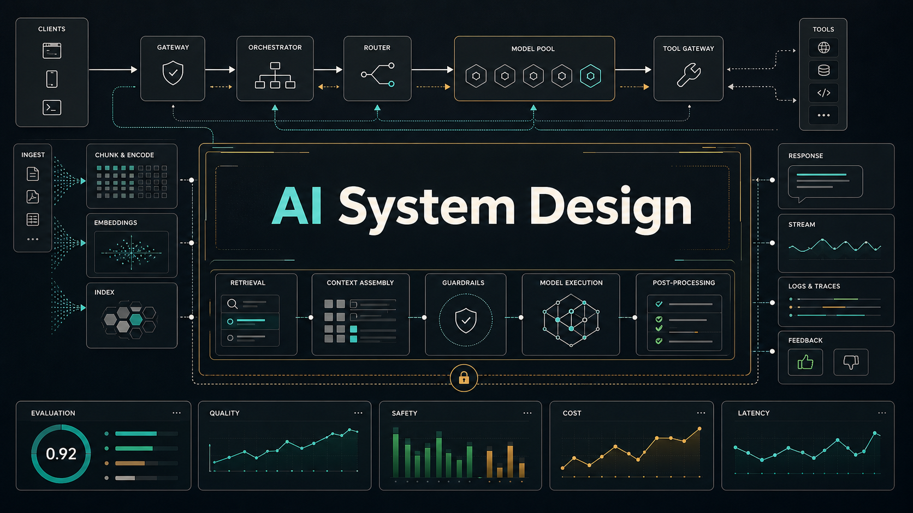

# AI System Design



A practical, open-source course and handbook for designing production AI systems.

Most system design resources teach databases, caches, queues, APIs, replication, sharding, and scaling. Those still matter. But AI-native products add new failure modes and design decisions:

- Probabilistic model behavior
- Hallucinations and unverifiable answers
- Retrieval quality and stale knowledge
- Prompt and model version drift
- Tool misuse and agentic failure loops
- Evaluation pipelines and regression testing
- Latency budgets shaped by model calls and token volume
- Cost controls across prompts, retrieval, reranking, and inference
- Security risks such as prompt injection, data leakage, and unsafe tool execution

This repo exists to map those problems clearly and turn them into a rigorous learning path.

## What This Is

AI System Design is a course-quality field guide for engineers designing real AI products. It focuses on architecture, tradeoffs, failure modes, evaluation, observability, security, and production constraints.

The goal is not to collect AI news. The goal is to explain how to make system design decisions when the core component is a model whose output is useful but not guaranteed.

## Who This Is For

- Backend engineers moving into AI products
- ML engineers who need product and infrastructure architecture context
- Founders building AI-native SaaS products
- Senior engineers preparing for AI system design interviews
- Devtool and platform engineers building internal AI infrastructure

## What This Is Not

- Not an AI news feed
- Not a prompt-hack collection
- Not vendor marketing
- Not a generic ML theory course
- Not an "awesome links" repository
- Not a place for unsourced claims or shallow summaries

## Start Here

1. [Course](./COURSE.md)
2. [Syllabus](./SYLLABUS.md)
3. [Glossary](./GLOSSARY.md)
4. [What Is AI System Design?](./foundations/what-is-ai-system-design.md)
5. [RAG System Design](./patterns/rag.md)
6. [Agent Tool-Use System Design](./patterns/agent-tool-use.md)
7. [Evaluation Pipeline Pattern](./patterns/eval-pipeline.md)
8. [RAG vs Fine-Tuning](./decision-guides/rag-vs-finetuning.md)

## Hands-On Labs

1. [RAG Retrieval Eval Lab](./labs/rag-retrieval-eval/README.md)
2. [Eval Set Runner Lab](./labs/eval-set-runner/README.md)
3. [Tool Policy Simulator Lab](./labs/tool-policy-simulator/README.md)

## High-Value Pages

- [Hybrid RAG And Reranking](./patterns/hybrid-rag-reranking.md)
- [Model Routing](./patterns/model-routing.md)
- [AI Observability](./patterns/ai-observability.md)
- [Cost And Latency Budgeting](./patterns/cost-latency-budgeting.md)
- [MCP And Tool Gateway Pattern](./patterns/mcp-tool-gateway.md)
- [Agents vs Workflows](./decision-guides/agents-vs-workflows.md)
- [Vector DB vs Search Engine vs Hybrid Search](./decision-guides/vector-db-vs-search.md)
- [Long Context vs RAG](./decision-guides/long-context-vs-rag.md)

## Diagrams And Sources

The architecture diagrams in this repo are original Mermaid diagrams written for the course. External references are used as sources for claims, standards, and production guidance; they are not copied as diagrams or visual assets.

Start with the [source map](./resources/source-map.md) for the current evidence base.

## Repo Map

```text
ai-system-design/
├── foundations/             # Core concepts and mental models
├── patterns/                # Reusable architecture patterns
├── decision-guides/         # Tradeoff-driven engineering decisions
├── case-studies/            # Realistic system design walkthroughs
├── labs/                    # Hands-on local exercises
├── assignments/             # Design problems and rubrics
├── design-reviews/          # Worked architecture reviews
├── templates/               # Design doc, capstone, and frontier note templates
├── evals-observability/     # Testing, tracing, monitoring, and feedback loops
├── security/                # AI-specific threat models and mitigations
├── reference-architectures/ # Production-ready blueprints
├── frontier-notes/          # Cutting-edge changes translated into production impact
└── resources/               # Curated source map, not a dumping ground
```

## Content Standard

Every serious page should answer:

- What problem does this solve?
- When should you use it?
- What is the architecture?
- What are the core components?
- What are the tradeoffs?
- What fails in production?
- How do you evaluate it?
- What should you observe?
- What are the cost and latency implications?
- What are the security risks?
- What sources support the claims?

See [CONTENT_STANDARD.md](./CONTENT_STANDARD.md).

## Contributing

This repo should be useful because it is selective. Contributions are welcome, but the bar is intentionally high.

Good contributions include:

- Production architecture patterns
- Clear decision guides
- Case studies with concrete tradeoffs
- Failure modes from real systems
- Evaluation and observability methods
- Primary-source-backed frontier notes

Start with [CONTRIBUTING.md](./CONTRIBUTING.md).

## License

Content is licensed under [CC BY 4.0](./LICENSE.md) unless otherwise noted.
