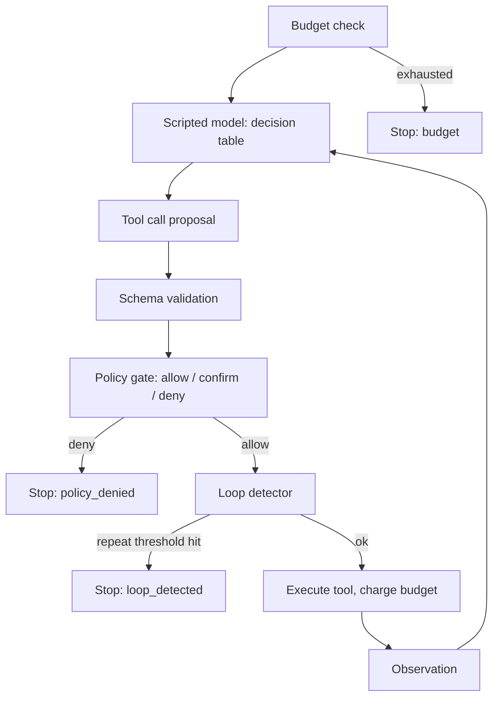

# Agent Tool-Use Loop From Scratch

A complete agent loop in one Python file, with a deterministic mock model so the control plane is the entire program. No API keys, no network, no dependencies.

## Problem

Every agent framework wraps the same loop: the model proposes a tool call, something decides whether the call may run, the tool runs, the observation goes back to the model. Frameworks hide that loop, and with it the parts that actually determine whether an agent is safe to operate: schema validation, policy enforcement, budgets, loop detection, and tracing.

If you cannot write this loop yourself, you cannot review a framework's version of it, and you cannot debug an agent that misbehaves in production.

## What You Build

`agent_loop.py` contains:

- A **scripted mock model**: a decision table mapping (task, last observation) to the next action. It stands in for a real model so runs are deterministic and free.
- A **tool registry** with hand-rolled JSON-schema-style argument validation (required fields, types, rejection of unknown properties).
- A **policy gate** with three tool classes: allow, confirm, deny. Confirm-class calls go through an approver callback. The gate runs outside the model.
- **Budgets**: step and cost limits checked before every iteration.
- A **loop detector** that stops the run when the same tool is proposed with identical arguments N times in a row.
- A **full trace log**: every proposal, policy verdict, execution, and stop reason.

The demo runs three scenarios: a multi-step refund task that succeeds, a deletion task killed by the policy gate before the tool executes, and a retry loop caught by loop detection after two wasted calls instead of twenty.

## How It Works



Each iteration: check budget, ask the model for an action, validate the arguments against the tool's schema, run the policy gate, run the loop detector, execute, record the observation. Every one of those steps writes a trace entry. A run ends with exactly one stop reason: `final`, `policy_denied`, `loop_detected`, or `budget`.

The key observation from the demo: the model produces none of the stop reasons except `final`. Termination, safety, and cost control all live in the loop. Swap the scripted model for a frontier model and nothing about the guarantees changes, because the guarantees were never the model's job. That is why the control plane, not the model, is the real design surface.

## Design Decisions

- **The mock model is a decision table, not a random stub.** Deterministic scripts make the demo reproducible and the asserts meaningful. It also proves the loop's guarantees hold regardless of what generates proposals.
- **Policy classes live in the registry, decisions live in the gate.** The tool declares its risk class once. The gate combines that class with an approver. Neither is visible to the model, so a prompt-injected model still cannot self-approve.
- **Schema errors go back to the model as observations instead of crashing the run.** A real model can often correct its arguments. A crash gives it no chance; an error observation does. The failed attempt still counts against the step budget so a model that never corrects cannot spin forever.
- **Loop detection is exact-match on (tool, canonical args).** This catches the most common pathology cheaply. It deliberately does not catch a model that varies one character per retry; that is what budgets are for. The two mechanisms are layered, not redundant.
- **The loop detector fires before execution, not after.** The third identical call is refused, not observed. Detection after execution would waste one more real side effect.

## Failure Modes

- The model repeats a failing call with cosmetic argument changes. Exact-match loop detection misses it; only the step budget saves you.
- A confirm-class approver that auto-approves everything silently turns confirm into allow. The gate is only as strong as its approver.
- Schema validation accepts semantically wrong but type-correct arguments (`amount: 89000.0` is a valid number). Policy needs value-level rules, not just types.
- Budgets measured only in steps miss expensive single calls; budgets measured only in cost miss cheap infinite loops. You need both.
- Trace entries that omit the policy verdict make post-incident review impossible. If the trace cannot answer "why did this call run", it is decoration.

## What Production Systems Do Differently

- The model is a real LLM behind an API, and proposals arrive as structured tool-use blocks, not table lookups.
- Tool execution runs in a gateway process with timeouts, retries, rate limits, idempotency keys, and per-tenant credentials.
- Policy is a rules engine or a dedicated service, often with human approval queues and audit requirements, not a callback.
- Loop detection uses similarity windows and no-progress heuristics, not just exact repeats.
- Traces stream to an observability backend (OpenTelemetry spans, LangSmith, Braintrust) and support replay without re-executing side effects.
- Budgets include wall-clock time and real dollar cost, enforced per user, per session, and per fleet.

## Run It

```bash
python3 agent_loop.py
```

Runs in under a second. Prints three traced runs and the assertions that validate them.

## Exercises

1. Add a `max_wall_clock_seconds` field to `Budget` and enforce it in the loop.
2. Extend `validate_schema` to support `enum` and `minimum`/`maximum` for numbers, then give `issue_refund` a maximum amount at the schema layer and show the gate and schema catching different bad calls.
3. Make the loop detector windowed: flag when the same call appears 3 times in the last 6 proposals, even with other calls interleaved. Add a scripted task that alternates two calls to prove it.
4. Add an idempotency key to write tools: the same (tool, args) executing twice returns the cached first result instead of re-executing. Prove it with a trace assert.
5. Implement a "no progress" detector: stop when K consecutive observations are identical regardless of which tools produced them. Compare when it fires versus the exact-match detector.

## Further Reading

- [Anthropic: Building effective agents](https://www.anthropic.com/research/building-effective-agents) explains when a workflow beats an agent and why simple loops outperform frameworks.
- [Anthropic tool use documentation](https://docs.claude.com/en/docs/tool-use) is the reference for how real tool-call proposals are structured on the wire.
- [OpenAI Agents SDK guardrails](https://openai.github.io/openai-agents-python/guardrails/) shows a production framework's version of the policy gate built here.
- [OWASP Top 10 for LLM Applications](https://owasp.org/www-project-top-10-for-large-language-model-applications) catalogs what happens when the control plane is missing, especially excessive agency.
