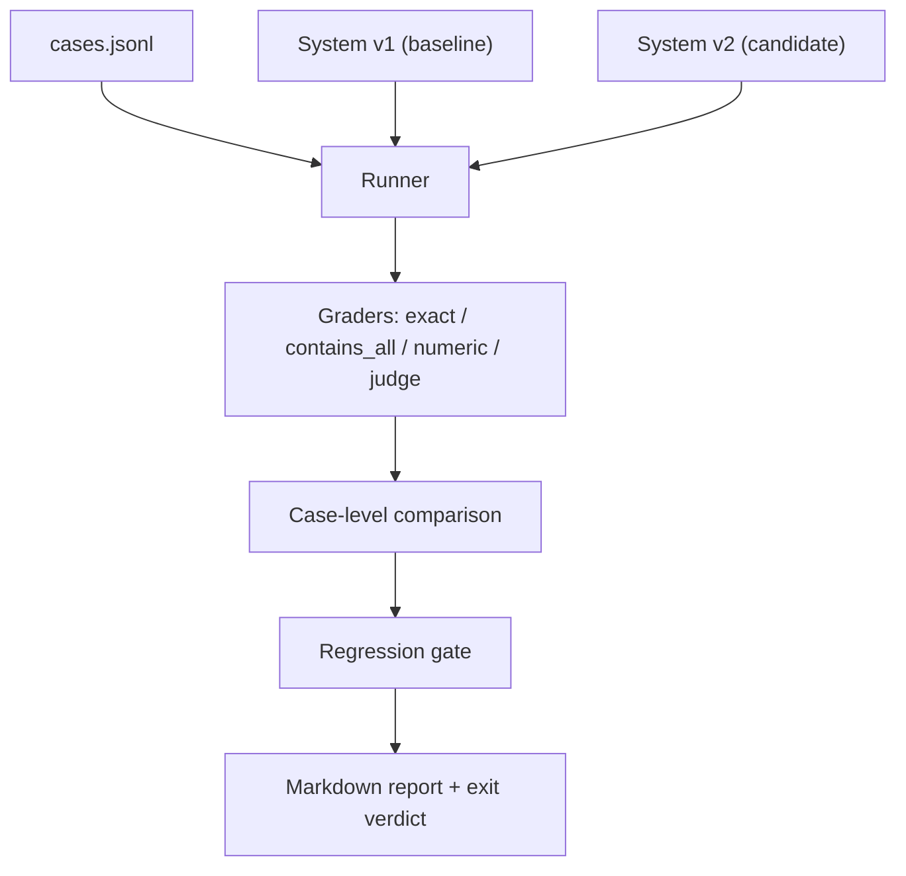

# Evaluation Harness From Scratch

A complete eval pipeline in one Python file plus a 10-case JSONL dataset. Deterministic, offline, stdlib only. The candidate system is a stub with a planted regression, so every line of interesting code is harness, not application.

## Problem

AI systems break in ways unit tests do not catch. Output can be well-formed and wrong. A prompt tweak that fixes one case quietly breaks three others. A model upgrade changes behavior everywhere at once. Teams that cannot measure this ship on vibes and find out from customers.

Eval sets are the unit tests of AI systems. Same discipline, different substrate: instead of asserting on function return values, you assert on system behavior over a curated set of inputs, and you run the whole set on every change. The regression gate is the CI red build. The difference is that AI outputs are graded, not equality-checked, so the harness needs a grader layer that unit tests never needed.

## What You Build

`eval_harness.py` plus `cases.jsonl` contain:

- A **JSONL dataset** of 10 cases: FAQ answers, policy explanations, arithmetic, tone-sensitive replies, and two refusal cases, because "correctly says no" belongs in every eval set.
- Four **graders**: exact match, contains-all (required substrings), numeric tolerance (parse the number, compare within epsilon), and a **mock LLM judge** that scores a rubric with a deterministic function and returns per-criterion verdicts plus a rationale string.
- **Pass/fail thresholds** per case (judge cases carry their own threshold).
- **Baseline comparison** at case level, not just aggregate: a regression is any case that passed on baseline and fails on candidate.
- A **regression gate** that blocks release on any case-level regression.
- A **markdown report** on stdout with per-case results, deltas, and the gate verdict.

The demo runs baseline v1 (green) and candidate v2, which carries two planted bugs: tax applied twice in order totals, and a "tone rewrite" that silently dropped the data-export sentence from the cancellation reply. The gate blocks v2 and names both cases.

## How It Works



The runner executes every case against a pinned system version and hands each output to the grader named in the case. Graders return a uniform shape: score in [0, 1], a boolean pass, and a human-readable detail string. Comparison walks case by case; the gate fails on any pass-to-fail flip or on an aggregate pass-rate drop beyond the allowed budget (zero here).

The mock judge deserves a note. It scores rubric criteria mechanically: keyword criteria pass when a keyword appears, forbid criteria pass when no banned phrase appears. A real LLM judge replaces the scoring function, but the contract stays identical: per-criterion verdicts, a numeric score, a threshold, a rationale. Getting that contract right is the transferable skill; swapping the scorer is a config change.

## Design Decisions

- **Case-level regressions gate, not aggregate scores.** The demo's candidate is at 80% versus 100%, an obvious block. But a candidate at 100% that fixed two cases and broke one different one would show a misleading net improvement. Pass-to-fail flips are the signal.
- **Every grader returns the same shape.** Uniform results make comparison, reporting, and gating grader-agnostic. Adding a fifth grader touches one dict.
- **The judge returns a rationale, not just a number.** The report's regression row quotes exactly which rubric criterion failed. A score without a reason forces a human to rerun the case by hand.
- **Refusal cases sit in the same dataset as capability cases.** A change that makes the system more helpful and less safe should fail the same gate, in the same report.
- **The dataset is JSONL, not Python literals.** Cases are data. Product, support, and safety people should be able to add a case without touching harness code, and diffs should show cases changing, not code.
- **Thresholds live on the case.** The angry-customer rubric tolerates one miss (threshold 0.66); the cancellation rubric does not (0.8). Global thresholds flatten exactly the risk distinctions that matter.

## Failure Modes

- The eval set stops resembling production traffic and goes green while users suffer. Sets need a feedback loop from production failures.
- Exact-match graders on free-form text fail on harmless rephrasing, so people loosen them until they catch nothing. Match the grader to the property.
- Numeric extraction grabs the wrong number from a sentence with several. This harness takes the last number, a heuristic that will eventually lie.
- Keyword judges reward outputs that mention the keywords without doing the thing ("I will not use dark patterns" passes a forbid check trivially, and a model told about the rubric can game it).
- A threshold that exactly equals an achievable degraded score lets regressions through. Building this demo hit that bug: the degraded output scored 0.75 against a 0.75 threshold and passed. Thresholds need margin.
- Baselines that are not pinned (model version, prompt version, dataset version) turn every comparison into an argument.

## What Production Systems Do Differently

- The system under test is a real model behind a real prompt, so runs cost money and time. Teams layer fast smoke evals on every change and full suites before release.
- LLM judges replace the deterministic scorer and are themselves calibrated against human labels, because an uncalibrated judge is a random number generator with a rationale.
- Results, traces, configs, and dataset versions go to a store (LangSmith, Braintrust, Phoenix, or a database) so trends are queryable across months of changes.
- Gates run in CI, block merges, and page someone. A report nobody is forced to read is a dashboard, not a gate.
- Datasets grow continuously from production failure triage, and sampling keeps eval cost sublinear in dataset size.
- Statistical treatment matters at scale: nondeterministic systems need repeated runs and confidence intervals before declaring a regression.

## Run It

```bash
python3 eval_harness.py
```

Runs in under a second. Prints the markdown report, blocks the candidate, and asserts on the exact set of regressed cases.

## Exercises

1. Add a new case to `cases.jsonl` that v2 also fails (hint: any input hitting the tax path) and confirm the gate names it without any code change.
2. Add a `regex` grader (pattern must match the output) and use it to enforce that money amounts always render with two decimals.
3. Make the gate tiered: `hard` cases (refusals, policy) block on any regression, `soft` cases (tone) only warn. Add a `tier` field to cases and change `compare`.
4. The numeric grader takes the last number in the output. Break it with a crafted output ("Order 108 total is $116.64"), then fix extraction to prefer numbers after currency markers.
5. Simulate a noisy system: make `run_system` flip one judge case's output based on a seeded `random.Random`. Run the eval 20 times and change the gate to require a case to fail in at least 3 runs before it counts as a regression.

## Further Reading

- [Anthropic evaluation tool documentation](https://docs.claude.com/en/docs/test-and-evaluate/eval-tool) shows how graders and datasets are structured in a production eval product.
- [OpenAI evaluation best practices](https://platform.openai.com/docs/guides/evaluation-best-practices) covers building eval sets from real failures and choosing grader types.
- [Zheng et al., "Judging LLM-as-a-Judge with MT-Bench and Chatbot Arena" (2023)](https://arxiv.org/abs/2306.05685) is the standard reference on LLM judge agreement with humans and judge biases.
- [Arize Phoenix LLM evals](https://arize.com/docs/phoenix/evaluation/llm-evals) documents an open-source implementation of the judge-with-rubric pattern built here.
