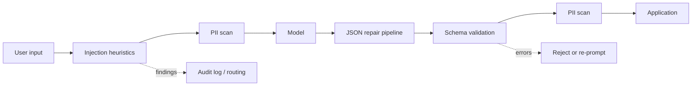

# Input/Output Guardrails From Scratch

Three guardrail layers in one Python file: prompt-injection heuristics, PII detection, and a structured-output validator with repair. Stdlib only, deterministic, offline.

Read this first: the heuristic layers here are a speed bump, not a boundary. They raise the cost of casual attacks, catch accidents, and produce audit signal. They do not make a system safe. Any attacker who reads this file can write a prompt that passes every check in it, because pattern matching on adversarial natural language is a game the defender loses. The security boundary has to live where the attacker's text has no vote: in permissions, policy gates, and blast-radius limits outside the model. Guardrails like these are one layer of defense in depth, and the cheapest one.

## Problem

Text flowing into a model can carry instructions the operator never wrote: override phrases, fake role markers, payloads hidden in base64. Text flowing out can carry PII that should never reach logs or third parties, and "structured" output that is almost JSON but not quite. Every production AI system ends up with a filtering layer on both directions of the pipe. Building one by hand teaches what the commercial versions actually do, and more importantly, what they cannot do.

## What You Build

`guardrails.py` contains:

- **Injection heuristics**: a phrase list for instruction overrides ("ignore previous instructions", "reveal your system prompt"), regexes for role confusion (`system:` line prefixes, `<|im_start|>` chat-template tokens), and encoded-payload detection: base64 runs are decoded and re-scanned so an attacker cannot smuggle the override phrase past the phrase list by encoding it, with a Shannon entropy fallback for undecodable high-entropy blobs.
- **PII detection**: email and phone regexes, plus card detection that requires a passing Luhn checksum, so a random 16-digit reference number is not flagged while a real card number is. Card candidates are masked before the phone regex runs so one number cannot double-match.
- **A structured-output validator**: a hand-written JSON-schema subset (types, required, properties, items, enum, minimum/maximum) behind a repair pipeline that fixes what models actually do to JSON: code fences, surrounding prose, Python literals (`False`, `None`), and trailing commas. Repairs are logged individually so you can see which model failure modes are common.

The demo shows clean traffic passing untouched, four attack shapes flagged with named rules and evidence, PII caught with redacted output, a Luhn-invalid number correctly ignored, a mangled model output repaired through three fixes and then validated, and two outputs correctly rejected (wrong type, no JSON at all).

## How It Works



Each check returns findings, not booleans: a rule name plus evidence. What the application does with a finding is a separate policy decision (block, route to a stricter pipeline, require approval, or just log), which keeps detection and response decoupled.

The output path draws a line the code enforces: **repair syntax, reject semantics**. A trailing comma is a mechanical serialization slip and fixing it loses no information. A confidence of `"high"` where a number belongs means the model did not do the task; silently coercing it would launder a model failure into fake data. The validator repairs the first kind and rejects the second with a path-level error (`$.confidence: expected number, got str`) suitable for a re-prompt.

## Design Decisions

- **Decode base64 and re-scan, do not just flag it.** Flagging every base64 run drowns you in false positives (tokens, hashes, attachments). Decoding and finding "ignore previous instructions" inside is a high-confidence signal. Entropy is the fallback for blobs that will not decode to text.
- **Luhn before flagging cards.** A digit-count regex alone flags order numbers, tracking numbers, and ticket IDs constantly, and a PII detector that cries wolf gets disabled. The checksum costs ten lines and removes most of the noise. The demo proves it with a near-miss number.
- **Masking order for PII.** Card matches are masked before the phone regex runs. Overlapping detectors on raw text produce duplicate and contradictory findings; a mask-as-you-go pipeline makes detector order an explicit, testable decision.
- **Findings carry evidence, redacted.** `****1111 (Luhn valid)` is enough for an audit log without the log itself becoming a PII leak.
- **Each repair is named and logged.** "stripped code fence, replaced Python literals, removed trailing commas" tells you which failure modes your model has, which is exactly the data you need when deciding whether to tighten the prompt or switch to a constrained-decoding API.
- **The schema validator is written by hand, not imported.** Not because jsonschema is bad, but because knowing what those 40 lines do is the difference between debugging a validation failure and staring at one.

## Failure Modes

- Phrase lists are trivially bypassed: synonyms, typos, other languages, "please act contrary to your earlier guidance". This is the core reason heuristics cannot be the boundary.
- Indirect injection does not look like an attack. Instructions hidden in a retrieved document or a tool result arrive with none of these markers unless the attacker is lazy.
- Entropy thresholds misfire in both directions: compressed or non-Latin text scores high, and a short encoded payload scores low. Tune per traffic, expect drift.
- PII regexes miss international formats (phone patterns here are North-America biased) and match lookalikes (a Luhn-valid number can still be a coincidence at scale).
- Repair can be too eager. Replacing `True` inside a legitimate string value would corrupt data; the word-boundary regex here reduces but does not eliminate that risk. Every repair rule is a small parser bug waiting for the right input.
- A validator that only checks structure will happily approve a perfectly-shaped hallucination. Schema validation confirms format, never truth.

## What Production Systems Do Differently

- Defense in depth is the actual architecture: these heuristics run as the cheap first tier, a trained classifier (fine-tuned small model or provider moderation API) runs as the second, and the real boundary is enforced outside the model with least-privilege credentials, policy gates on tool calls, human approval for irreversible actions, and blast-radius limits so a successful injection still cannot do much.
- PII detection uses NER models plus locale-aware validators (Microsoft Presidio is the reference open-source implementation), not three regexes.
- Structured output increasingly comes from constrained decoding (JSON mode, grammar-constrained sampling), which makes the repair pipeline a fallback for edge cases rather than the main path.
- Injection defenses are evaluated adversarially and continuously, with red-team suites and bug bounties, because the attack distribution shifts faster than any static list.
- Findings feed rate limiting, session termination, and abuse pipelines, not just logs.

## Run It

```bash
python3 guardrails.py
```

Runs in under a second. Prints all three parts with per-rule evidence and asserts on every expected outcome.

## Exercises

1. Bypass the phrase list: write an override prompt that `check_injection` passes but a human would obviously flag. Add the pattern you used, then bypass it again. Two rounds of this teaches the core lesson faster than any essay.
2. Add hex and URL-encoding sniffing next to the base64 sniffer, and make all decoders recursive (base64 inside base64) with a depth limit.
3. Extend the PII layer with IBAN detection (format regex plus the mod-97 checksum) and a redaction function that returns the text with all findings masked, not just the findings list.
4. Add a repair rule for single-quoted JSON (`{'intent': 'refund'}`) without breaking apostrophes inside string values. Write the test case that makes the naive quote-swap fail first.
5. Wire this module to the agent-loop module: run `check_injection` on every tool result before it becomes an observation, and show a scripted tool returning an embedded override phrase that gets flagged before the model sees it. Then explain in a comment why this still would not stop a determined attacker.

## Further Reading

- [OWASP Top 10 for LLM Applications](https://owasp.org/www-project-top-10-for-large-language-model-applications) defines prompt injection and insecure output handling, the two risks this module addresses, with mitigation patterns.
- [Simon Willison's prompt injection series](https://simonwillison.net/series/prompt-injection/) is the clearest sustained argument for why detection-based defenses cannot be the boundary.
- [Greshake et al., "Not what you've signed up for: Compromising Real-World LLM-Integrated Applications with Indirect Prompt Injection" (2023)](https://arxiv.org/abs/2302.12173) demonstrates the indirect injection class that phrase lists structurally miss.
- [Microsoft Presidio](https://microsoft.github.io/presidio/) shows what a production-grade PII detection and redaction pipeline looks like beyond regexes.
