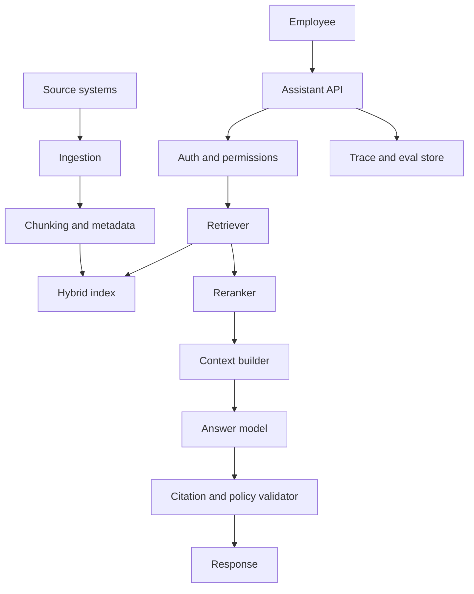

# Capstone Example: Enterprise Knowledge Assistant

Last reviewed: 2026-06-29

## Problem

Design an internal assistant that answers employee questions using company documents while respecting permissions and citing sources.

## Users

- Employees asking policy, engineering, and operations questions
- Document owners maintaining source quality
- Security team auditing access
- Platform team operating the system

## Requirements

- Answer from approved internal documents
- Cite sources
- Enforce user and document permissions
- Refresh changed documents within 24 hours
- Refuse when evidence is missing
- Provide traces for debugging
- Support 1,000 daily active users initially

## Non-Goals

- Fully replacing enterprise search
- Training on all company documents
- Taking actions in internal systems
- Answering from arbitrary internet sources

## Architecture

## Model Strategy

- Use a strong hosted model for answer generation in phase one.
- Use smaller models or deterministic logic for query classification.
- Add model routing after baseline evals exist.
- Version prompts, models, schemas, and retrieval config.

## Retrieval Strategy

- Use hybrid search.
- Enforce permissions before context assembly.
- Add reranking if recall@50 is high but final-context recall is low.
- Track source IDs, chunk IDs, and document version.
- Refuse unsupported answers.

## Tool Strategy

Phase one has no write tools. Read-only source connectors are controlled by service accounts and permission sync.

## Evaluation Plan

Offline:

- Retrieval recall@K
- Citation support
- Answer faithfulness
- Refusal correctness
- Permission-filter tests
- Prompt injection cases

Online:

- User feedback
- Citation validation rate
- Empty retrieval rate
- Human-reviewed samples
- Cost and latency monitoring

## Observability Plan

Trace:

- User scope
- Query
- Retrieved chunk IDs
- Filter decisions
- Reranker scores
- Prompt/model versions
- Output
- Citation validation
- Latency and tokens
- Feedback

## Security Review

- Treat retrieved content as untrusted
- Enforce permissions before context assembly
- Redact traces
- Audit sensitive source access
- Delete embeddings when source docs are deleted
- Add indirect prompt-injection evals

## Cost And Latency Budget

| Step | Target |
| --- | ---: |
| Auth and permission lookup | 150 ms |
| Retrieval | 400 ms |
| Reranking | 700 ms |
| Generation | 2,500 ms |
| Validation | 250 ms |
| Buffer | 1,000 ms |

Target: common queries under 5 seconds.

## Rollout Plan

1. Internal alpha with platform and support teams.
2. Suggestion-only mode for selected departments.
3. Weekly failure review.
4. Add eval failures to regression suite.
5. Expand to more teams after eval gates pass.
6. Company-wide launch after security review.

## Failure Modes

- Restricted source appears in context
- Outdated policy is cited
- Prompt injection in a retrieved document
- Citation does not support answer
- Source connector silently fails
- Trace logs expose sensitive data

## Open Questions

- Which source system is authoritative for conflicting policies?
- What retention policy applies to traces?
- Who owns source document quality?
- Should answers include confidence labels?
