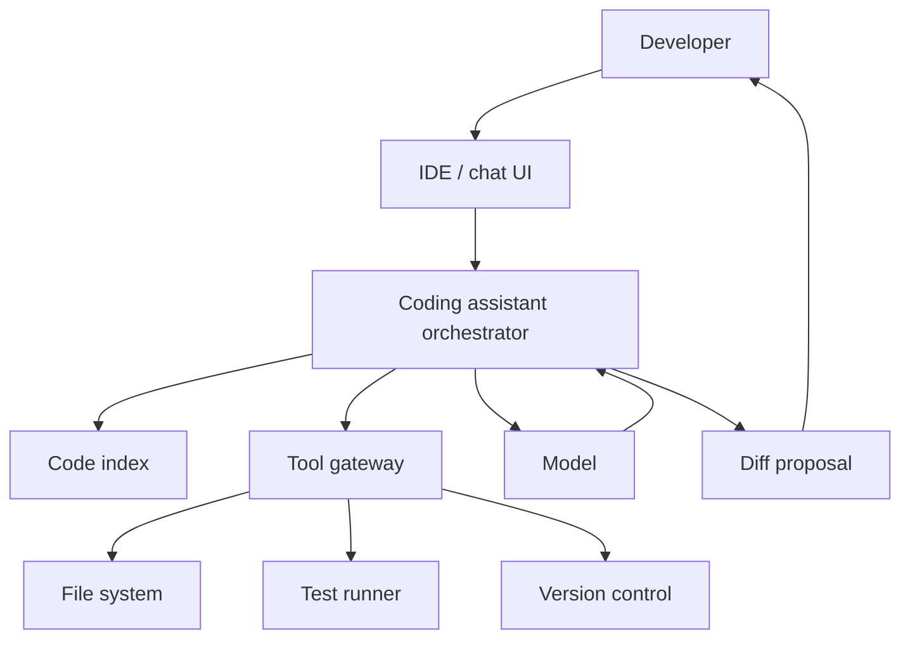

# Case Study: AI Code Assistant

Last reviewed: 2026-06-29

## Problem

Design an AI coding assistant that can answer questions about a codebase, suggest changes, edit files, and validate changes with tests.

## Requirements

- Retrieve relevant code context
- Explain code behavior
- Propose edits
- Apply edits only when approved or explicitly requested
- Run tests or static checks when available
- Preserve developer control
- Avoid leaking private code

## Architecture

## Design Decisions

### Retrieval Over Full Context

For large repositories, use code-aware retrieval and symbol metadata instead of putting the whole repo into context.

### Tool Boundaries

Read tools are lower risk. Write tools, shell commands, and dependency installation require stronger approval and sandboxing.

### Verification

Code agents are valuable because many outputs can be verified by tests, type checks, linters, and build commands.

## Failure Modes

- Retrieves irrelevant code due to lexical mismatch
- Edits wrong file
- Introduces compile error
- Passes visible tests but breaks hidden behavior
- Deletes user changes
- Runs unsafe commands
- Leaks proprietary code in traces
- Hallucinates APIs or dependencies

## Evaluation Strategy

Measure:

- Correct context retrieval
- Patch correctness
- Test pass rate
- Build pass rate
- Human acceptance rate
- Regression rate
- Number of tool steps

Use benchmark-style tasks only as one signal. Product evals should include real repo patterns and developer workflows.

## Observability

Trace:

- User request
- Retrieved files and symbols
- Proposed plan
- File edits
- Commands run
- Test results
- Final diff
- Human accept/reject

## Security Concerns

- Protect source code in traces
- Sandbox shell execution
- Prevent exfiltration through generated commands
- Require approval for destructive file operations
- Preserve user changes and version control state

## Related Reading

- [Agent Tool-Use System Design](../patterns/agent-tool-use.md)
- [Tool Abuse And Excessive Agency](../security/tool-abuse.md)
