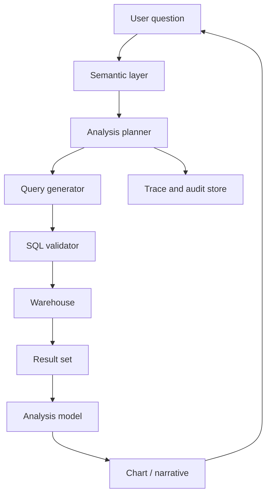

# Case Study: AI Data Analyst

Last reviewed: 2026-06-29

## Problem

Design an AI data analyst that answers business questions by querying governed datasets, generating charts, and explaining results.

## Requirements

- Understand business questions
- Map questions to approved datasets
- Generate safe SQL or analytical queries
- Explain assumptions
- Cite tables, filters, and time ranges
- Prevent unauthorized data access
- Avoid misleading conclusions

## Architecture

## Design Decisions

### Semantic Layer

Do not let the model invent table meanings. Use a semantic layer with approved metrics, dimensions, joins, and definitions.

### SQL Validation

Validate generated SQL before execution. Enforce row limits, allowed tables, tenant filters, and query cost limits.

### Explanation

Answers should show assumptions, filters, time ranges, and data freshness.

## Failure Modes

- Model invents a metric definition
- Query scans too much data
- User accesses unauthorized rows
- Generated SQL is valid but semantically wrong
- Result is statistically misleading
- Chart hides important caveats
- Cached result is stale

## Evaluation Strategy

Measure:

- Correct metric selection
- SQL validity
- SQL semantic correctness
- Permission enforcement
- Explanation quality
- Chart correctness
- Refusal for unsupported questions

Use golden business questions with expected query plans.

## Observability

Trace:

- User question
- Selected metrics and dimensions
- Generated SQL
- Validator decisions
- Query cost
- Result schema
- Explanation
- User feedback

## Security Concerns

- Enforce row-level and column-level permissions
- Block raw PII exposure
- Apply query cost limits
- Audit all executed queries
- Separate model context from unrestricted warehouse access

## Related Reading

- [Tool Abuse And Excessive Agency](../security/tool-abuse.md)
- [Evaluation Pipeline Pattern](../patterns/eval-pipeline.md)
