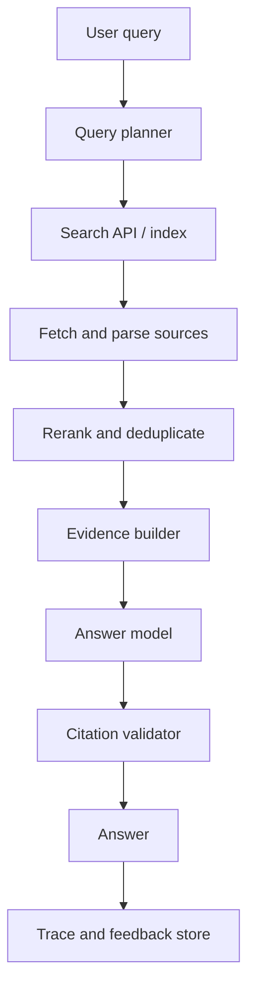

# Case Study: AI Search Engine

Last reviewed: 2026-06-29

## Problem

Design an AI search system that answers user questions using web or enterprise sources, cites evidence, and handles freshness, ambiguity, and conflicting information.

## Requirements

- Retrieve relevant sources
- Generate concise answers with citations
- Support follow-up questions
- Detect insufficient evidence
- Handle source freshness
- Monitor citation quality
- Keep latency acceptable for interactive search

## Architecture

## Design Decisions

### Query Planning

Search queries often need rewriting, decomposition, or freshness constraints. Query planning should be evaluated because bad rewrites can change user intent.

### Source Quality

Not every retrieved page deserves trust. Rank sources by relevance, freshness, authority, and duplication.

### Citation Validation

The answer should cite sources that support the specific claim, not merely sources that were retrieved.

### Freshness

For time-sensitive topics, include source dates and query-time freshness filters. Do not rely on model memory.

## Failure Modes

- Search retrieves SEO spam
- Freshness filter misses older but authoritative sources
- Model combines conflicting sources without saying so
- Citation points to a page that does not support the claim
- Query planner changes user intent
- Long source pages bury the answer
- Follow-up question loses grounding context

## Evaluation Strategy

Measure:

- Source relevance
- Citation support
- Answer correctness
- Freshness correctness
- Refusal when evidence is weak
- Latency by search, fetch, rerank, and generation stage

Include adversarial cases where pages contain instructions to the assistant.

## Observability

Trace:

- Original query
- Planned search queries
- Retrieved URLs or source IDs
- Fetch status
- Reranker scores
- Evidence snippets
- Generated claims
- Citation validation results
- User feedback

## Cost And Latency

AI search latency includes search, fetch, parsing, reranking, and generation. Cache source fetches and run independent fetches in parallel.

## Security Concerns

Web content is untrusted. Treat pages as evidence, not instructions. Never let retrieved pages override system policy.

## Related Reading

- [Hybrid RAG And Reranking](../patterns/hybrid-rag-reranking.md)
- [Prompt Injection Threat Model](../security/prompt-injection.md)
