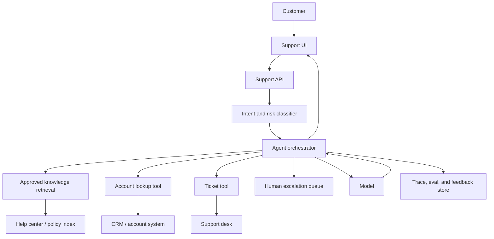

# Case Study: AI Customer Support Agent

Last reviewed: 2026-05-11

## Problem

Design an AI customer support agent that can answer product questions, troubleshoot common issues, and escalate cases to humans when confidence is low or policy requires review.

The system must be helpful, grounded in approved knowledge, safe around account data, and observable enough for support leaders to trust.

## Requirements

- Answer from approved help-center and internal policy documents
- Use customer account state when authorized
- Create or update tickets only after validation
- Escalate billing, legal, safety, and account-sensitive cases
- Cite sources for policy answers
- Track quality and failure modes over time

## Non-Goals

- Fully replacing human support
- Allowing the model to invent policy
- Giving unrestricted access to customer systems
- Training on raw support data without privacy review

## Architecture



## Data Flow

1. Customer submits a support request.
2. Classifier identifies intent, sensitivity, and escalation requirements.
3. Orchestrator retrieves approved policy or help-center content.
4. If needed, read-only account tools fetch authorized customer state.
5. Model generates a grounded answer or proposes an action.
6. Policy layer decides whether the action needs approval.
7. System responds, opens a ticket, or escalates to a human.
8. Trace and user feedback are stored for evaluation.

## Core Components

### Intent And Risk Classifier

Classifies requests into categories such as how-to, troubleshooting, billing, account access, cancellation, legal, safety, or unknown.

This component should be conservative. A false escalation is usually cheaper than an unsafe automated action.

### Knowledge Retrieval

RAG should retrieve only approved, current support content. Draft docs, outdated policy, and internal-only notes should be filtered unless explicitly allowed.

### Tool Gateway

Tools should be separated by risk:

- Read-only account lookup
- Ticket creation
- Refund request
- Plan change
- Account closure

Write tools need stricter validation and approval.

### Escalation Queue

Escalations should include a concise model-generated summary, retrieved sources, user intent, risk label, and trace link. A human should not need to reconstruct the conversation manually.

## Design Decisions

### RAG Before Fine-Tuning

Support policy changes often. Use RAG for current knowledge. Consider fine-tuning only after collecting high-quality examples for consistent style, triage labels, or structured summaries.

### Human Review Boundary

Escalate when:

- The request involves billing disputes
- Account ownership is uncertain
- The answer requires legal interpretation
- Retrieved evidence is weak
- The customer is angry or at risk of churn
- The model proposes an irreversible action

### Action Safety

The model may propose an action, but the system validates whether it can execute.

Example:

```text
Model: refund customer
Policy layer: refunds over threshold require human approval
System: create approval request instead of issuing refund
```

## Failure Modes

- Model invents a policy not present in retrieved sources
- RAG retrieves outdated help-center content
- Customer account data is exposed to the wrong user
- The agent closes a ticket without resolving the issue
- Escalation summary omits critical details
- Tool call updates the wrong customer record
- The system optimizes deflection rate while reducing customer trust
- Support team cannot debug why an answer was given

## Evaluation Strategy

Use scenario-based evals:

- Common how-to questions
- Known policy questions
- Ambiguous account-access cases
- Billing dispute cases
- Questions with no answer in the knowledge base
- Prompt injection attempts inside customer text
- Tool-call scenarios with expected arguments

Score:

- Answer correctness
- Faithfulness to retrieved sources
- Citation support
- Escalation correctness
- Tool-call correctness
- Tone and support quality
- Policy compliance

## Observability

Track:

- Intent label
- Risk label
- Retrieved documents
- Final context
- Model output
- Tool calls
- Escalation decision
- Human resolution
- User satisfaction
- Deflection rate
- Reopen rate
- Cost and latency per conversation

Do not treat deflection as the only success metric. A bad automated answer that avoids a ticket is still a product failure.

## Cost And Latency

Support agents need interactive latency. Keep the critical path tight:

- Use small models for intent/risk classification
- Cache common help-center retrieval
- Avoid reranking for simple high-confidence FAQ queries
- Use larger models only for complex synthesis or escalation summaries

## Security Concerns

- Enforce user identity before account lookup
- Apply least-privilege tool credentials
- Treat customer-provided text as untrusted
- Prevent retrieved content from overriding system instructions
- Redact sensitive fields in traces
- Require approval for financial or irreversible actions

## Launch Plan

1. Start in suggestion mode for human agents.
2. Compare AI suggestions to human final responses.
3. Build evals from accepted and rejected suggestions.
4. Enable direct answers for low-risk categories.
5. Add write tools only after trace quality and approval flows are proven.
6. Review failures weekly and add them to evals.

## Further Reading

- [RAG System Design](../patterns/rag.md)
- [Agent Tool-Use System Design](../patterns/agent-tool-use.md)
- [Evaluation Pipeline Pattern](../patterns/eval-pipeline.md)
- [OWASP Top 10 for LLM Applications](https://owasp.org/www-project-top-10-for-large-language-model-applications)
