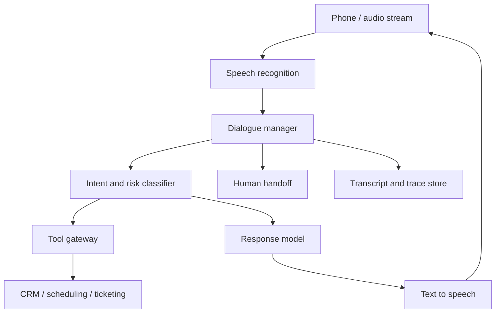

# Case Study: Voice AI Agent

Last reviewed: 2026-06-29

## Problem

Design a voice AI agent that can answer calls, understand spoken requests, use tools, and respond naturally under strict latency constraints.

## Requirements

- Stream audio in and out
- Handle interruptions
- Use business tools safely
- Escalate to humans
- Keep conversational latency low
- Produce transcripts and audit logs
- Avoid unauthorized account actions

## Architecture

## Design Decisions

### Latency Budget

Voice agents need low turn latency. Use streaming ASR/TTS, short responses, and small models for routing or classification.

### Barge-In Handling

Users interrupt. The dialogue manager must stop speech output, update state, and avoid executing stale actions.

### Tool Approval

Read-only tools can often run automatically. High-risk actions require confirmation or human handoff.

## Failure Modes

- ASR mishears account numbers or names
- Model responds too slowly
- Agent talks over the user
- Tool call uses stale dialogue state
- Customer confirms one action while agent executes another
- Transcript misses critical consent
- Agent fails to hand off when user is frustrated

## Evaluation Strategy

Measure:

- Intent recognition
- Turn latency
- Task completion
- Escalation correctness
- Tool-call correctness
- Interruption recovery
- Human satisfaction

Use simulated calls and reviewed real transcripts.

## Observability

Trace:

- Audio session ID
- Transcript segments
- Latency per turn
- Intent labels
- Tool calls
- Confirmation steps
- Handoff reason
- Final resolution

## Security Concerns

- Verify identity before account data access
- Avoid reading sensitive data aloud unnecessarily
- Record consent where required
- Redact transcripts
- Require confirmation for side effects

## Related Reading

- [Cost And Latency Budgeting](../patterns/cost-latency-budgeting.md)
- [Human Review Queue](../patterns/human-review-queue.md)
