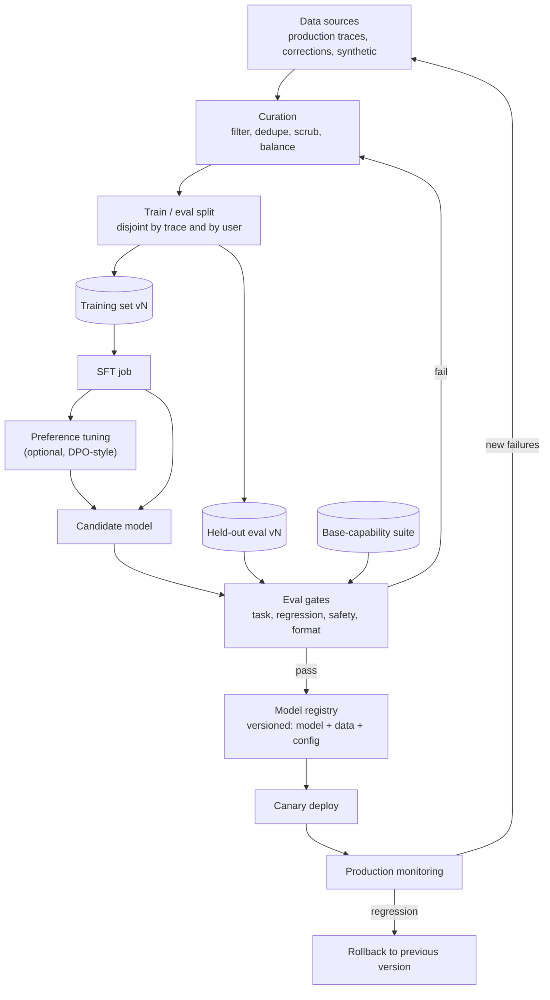

# Fine-Tuning Pipeline

Last reviewed: 2026-09-21

## Problem

Fine-tuning is the most expensive way to change model behavior and the hardest to undo. It is also, for a narrow class of problems, the only thing that works, and for a wider class, the cheapest option at scale once inference savings are counted.

The decision has two layers that teams routinely conflate. First: should we fine-tune at all, versus prompting harder or adding retrieval. Second: if yes, what pipeline turns that decision into something operable, meaning data curation, a training method, eval gates, versioning, and a rollback path. A fine-tune without that pipeline is a one-off artifact that nobody can safely retrain, which is worse than no fine-tune, because the product now depends on a model no one can reproduce.

## When To Use

Fine-tuning wins over prompting and RAG when the failure is behavioral and repeated, not informational:

| Situation | Prompting | RAG | Fine-tuning |
| --- | --- | --- | --- |
| Model lacks facts | Sometimes | Yes | No |
| Facts change weekly | No | Yes | No |
| Wrong output format despite few-shot examples | First try | No | Yes |
| Domain style or terminology, consistently | Partially | No | Yes |
| Narrow task where a small model must match a large one | No | No | Yes |
| Prompt has grown to thousands of tokens of instructions and examples | No | No | Yes, to internalize it |
| Latency floor requires a smaller model | No | No | Yes |
| Behavior must survive across every request without prompt discipline | No | No | Yes |

Preconditions that gate the decision regardless of the table:

- You have exhausted prompting. A day of prompt iteration costs less than the first data-curation meeting. If nobody has tried ten serious prompt variants with few-shot examples against an eval set, the fine-tuning conversation is premature
- You have an eval set that reproduces the failure. Without one, you cannot demonstrate the base model fails, cannot gate the tuned model, and cannot detect regressions. The eval set comes first, always
- You can assemble hundreds to thousands of high-quality examples of the desired behavior. Below a few hundred, few-shot prompting usually matches the fine-tune; quality dominates quantity throughout
- The task is stable. Fine-tuning bakes behavior into an artifact with a retraining cycle measured in days; behavior that changes weekly belongs in prompts

Do not fine-tune to inject knowledge. Facts learned through fine-tuning cannot be updated without retraining, cannot be permissioned per user, cannot be cited, and cannot be reliably deleted. Knowledge goes in retrieval; behavior goes in weights.

## Architecture



The loop at the bottom is the point: production failures become curated examples for the next version. A fine-tuning pipeline is a cycle, not a project.

## Data Flow

1. Candidate examples arrive from production traces (especially user-corrected outputs), expert authoring, and synthetic generation from a stronger model.
2. Curation filters for correctness, deduplicates near-identical examples, scrubs PII, and balances the distribution across intents and difficulty.
3. Data splits into training and held-out eval sets, disjoint by trace ID and by user, so no user's phrasing patterns leak across the boundary.
4. SFT runs on the training set; optionally a preference-tuning stage follows on comparison pairs.
5. The candidate model runs the full gate suite: task evals, regression evals against the current production model, base-capability checks, safety and refusal checks, and format-adherence checks.
6. A passing candidate is registered with its full lineage: base model, dataset version, training config, eval scores.
7. Canary deployment routes a slice of traffic to the candidate; production metrics are compared against the incumbent.
8. Promotion or rollback. Failures observed in production feed the next dataset version.

## Core Components

### Data Curation

Curation is where fine-tunes are won or lost, and it consumes most of the pipeline's human effort.

- Source hierarchy: user-corrected production outputs are the best examples available, because they carry the true input distribution plus a human-preferred output. Expert-authored examples are second. Synthetic examples from a stronger model scale cheaply but import that model's biases and require human audit sampling
- Every example teaches. An example with a subtle error teaches that error at scale; a fifth of your dataset being mediocre puts a ceiling on the result. Review processes that would be overkill for evals are appropriate here
- Deduplicate hard: repeated or near-repeated examples cause memorization and distort the learned distribution. Cluster by embedding and cap examples per cluster
- Balance deliberately: the training distribution defines the model's priors. If 90 percent of examples are the easy case, the model gets worse at the hard case relative to its share of attention. Oversample the failure modes that motivated the fine-tune
- Include refusal and boundary examples: what the model should decline, and how. Fine-tunes that only see happy paths erode the base model's refusal behavior

Dataset versions are immutable artifacts. Training set v7 is a frozen, hash-identified thing; the next iteration is v8. Mutable datasets make every past training run unreproducible.

### SFT vs Preference Tuning

At a design level, the two stages answer different questions.

SFT (supervised fine-tuning) teaches from demonstrations: here is the input, here is the output to imitate. It is the workhorse. Use it when you can write down what correct output looks like: formats, schemas, style, taxonomies, tool-use patterns. It is simpler, needs less data, and is what provider fine-tuning APIs mostly offer.

Preference tuning (DPO and its relatives) teaches from comparisons: output A is better than output B for this input. Use it when correctness is easy to rank but hard to demonstrate exhaustively: tone tradeoffs, helpfulness versus verbosity, choosing among several valid answers. It requires pairwise-labeled data, which the flywheel can supply from regeneration events and side-by-side ratings.

The design-level rule: if your labelers can write the right answer, use SFT. If they can only say which of two answers is better, use preference tuning. Many production pipelines run SFT first for capability and format, then a light preference pass for quality of judgment. Preference tuning without a solid SFT base optimizes rankings over outputs the model cannot yet produce.

Parameter-efficient methods (LoRA-style adapters) versus full fine-tuning is mostly an infrastructure decision when self-hosting: adapters train faster, cost less, and allow many task-specific variants over one base, at some quality cost on tasks far from the base distribution. Hosted fine-tuning APIs make this choice for you.

### Eval Gates Before Deploy

No tuned model reaches traffic without passing, in order of importance:

1. Target-task evals on the held-out set: the failure that justified the project must be measurably fixed, against a threshold set before training, not after
2. Regression evals: the full eval suites of every other workload this model serves; a fine-tune that fixes formatting and breaks summarization is a net loss discovered here or in production
3. Base-capability checks: a general suite catching catastrophic forgetting, the tendency of narrow fine-tunes to degrade broad competence
4. Safety and refusal evals: fine-tuning on benign data can still erode safety behavior; test jailbreak resistance and refusal calibration explicitly rather than assuming inheritance from the base model
5. Format and contract checks: schema validity rates, length distributions, latency at target quantization

Set the thresholds in writing before the training run. Post-hoc thresholds migrate toward whatever the candidate scored.

### Versioning And Rollback

A tuned model version is the triple (base model, dataset version, training config), and the registry must store all three plus eval scores. Practices that make rollback real rather than aspirational:

- The previous production model stays deployed and warm during the entire canary and for a defined soak period after promotion; rollback is a routing change, not a redeploy
- Prompts are versioned jointly with models. Tuned models often use slimmer prompts, so rolling back the model without rolling back the prompt yields a configuration nobody tested. Version the pair
- Base model deprecation is a scheduled risk: when a provider retires the base, every fine-tune on it dies with it. Track deprecation timelines and treat "retrain on new base" as recurring planned work with its own gate run, not an emergency
- Keep the dataset and config under the same retention as the model, or the version cannot be rebuilt

## Design Decisions

### Hosted Fine-Tuning API vs Self-Managed Training

Provider fine-tuning APIs remove all training infrastructure and serve the tuned model on the same platform, but constrain method choice, hyperparameters, and base models, and the tuned weights typically cannot leave. Self-managed training on open-weight models offers full control and portable artifacts, and drags in the entire self-hosting question, covered in [self-host vs API serving](self-host-vs-api-serving.md). Deciding factors: whether your target base is open-weight, whether weights portability matters contractually, and whether the team can operate training jobs.

### One Tuned Model vs Adapters Per Task

Consolidating tasks into one fine-tune simplifies serving but couples release cycles: retraining for task A forces regression risk on task B. Per-task adapters decouple releases and enable independent rollback, at the cost of routing logic and, when self-hosting, adapter-swapping serving infrastructure. Coupling is the hidden cost of consolidation, and it grows with each task added.

### How Much Synthetic Data To Allow

Synthetic data from a stronger model bootstraps volume quickly and works well for format and coverage. Risks: distribution narrowing, imported biases, and, when the generator shares lineage with the eval judge, silently inflated scores. Cap the synthetic fraction, audit samples by hand, and keep the held-out eval set free of synthetic examples entirely.

### Retraining Cadence

Continuous retraining maximizes freshness and maximizes the number of gate runs, canaries, and opportunities for regression. Scheduled retraining (monthly, quarterly) batches risk into planned events. Fine-tunes should retrain on a schedule or on trigger (eval drift beyond threshold, base deprecation), not continuously; the gate suite is the expensive step and it does not amortize.

## Failure Modes

- Eval contamination: training and eval sets overlap by trace, user, or template, and gate scores are fiction; enforce disjointness in the pipeline, not by convention
- Catastrophic forgetting: the narrow task improves while general capability quietly drops, caught only if base-capability gates exist
- Bad examples at scale: a systematic labeling error becomes a systematic model behavior, now much harder to remove than a bad prompt line
- Distribution lock-in: the model overfits last quarter's traffic and degrades as usage shifts, with no one retraining because "it passed evals"
- Safety erosion from benign-looking training data, discovered by red-teaming or by incident
- Prompt-model version skew after a rollback, producing an untested configuration in production
- Orphaned artifacts: the dataset or config for the production model was lost, so it can be neither reproduced nor safely iterated
- Base model deprecated with no retraining budget reserved, forcing a rushed migration
- Sunk-cost promotion: the candidate barely misses gates and ships anyway because training was expensive; gates that bend are decoration

## Evaluation Strategy

The gate suite above is the core. Beyond it:

- Pre-training baseline: run the full suite on the base model with the best prompt first. This is the number fine-tuning must beat, and it doubles as the go/no-go evidence for the project
- Delta analysis, not just scores: examine the specific examples that flipped from fail to pass and from pass to fail; a net-positive score can hide an unacceptable new failure class
- Canary as an eval: the candidate serves a traffic slice with full flywheel instrumentation, and promotion criteria are production metrics (correction rates, regeneration rates, task success), not offline scores alone
- Memorization probes: prompt the tuned model with training-example prefixes and near-duplicates, checking for verbatim regurgitation, which is both a quality and a privacy signal
- Re-run gates on every serving change that touches the model: new quantization, new base version, new inference stack. The model artifact is only one input to production behavior

## Observability

- Registry lineage: every production request logs the tuned-model version, joining production metrics to training runs
- Per-version dashboards: task metrics, format validity, refusal rates, latency, all comparable across versions and against the base
- Drift monitors on input distribution versus training distribution; drift is the retraining trigger
- Canary comparison views: candidate versus incumbent on identical traffic slices
- Training-job telemetry: loss curves, data version hashes, config, retained with the run
- Audit trail from any model version back to the trace IDs in its training set, for debugging and for data-deletion compliance

## Cost And Latency

Training cost is usually the small number. A LoRA-style SFT run on an 8B open model over a few thousand examples is a few GPU-hours; hosted fine-tuning APIs price per training token, and a 5,000-example dataset averaging 1,000 tokens over 3 epochs is 15M training tokens, typically tens of dollars at current provider rates. The expensive inputs are human: curation, labeling, and eval authoring routinely cost 10x the compute.

The economic case is almost always inference-side, from three effects:

- Prompt compression: internalizing 3,000 tokens of instructions and few-shot examples into weights removes those tokens from every request. At 1M requests per month, 3,000 saved input tokens per request is 3B tokens per month; at typical mid-tier pricing near 1 dollar per million input tokens, roughly 3,000 dollars per month, against a training cost recovered in days. Prompt caching shrinks this saving substantially, so compute it against your cached price, not list price
- Model downsizing: a tuned small model matching a large model on a narrow task captures the per-token price gap, often 5x to 20x, and cuts latency
- Latency: fewer prompt tokens means less prefill, and smaller models decode faster; fine-tuning is one of the few levers that improves cost and latency together

Run the arithmetic per workload: (tokens saved per request + price delta from downsizing) times volume, minus training cost amortized over the retraining cadence, minus the pipeline's standing human cost. Low-volume workloads rarely clear the bar; high-volume narrow workloads clear it easily.

## Security Concerns

- Training data is a copy of user data with a long shelf life; it needs consent basis, PII scrubbing, access control, and a deletion path that cascades from trace ID through dataset versions to a documented position on models trained from deleted data (retraining, or a defensible retention justification)
- Memorization and extraction: tuned models can regurgitate training examples, leaking one tenant's data to another; deduplication reduces it, probes detect it, and per-tenant models eliminate the cross-tenant path at real operational cost
- Data poisoning: anyone who can influence training data can influence the model, and the flywheel makes users upstream contributors; keep human review between production-sourced data and the training pool, and audit synthetic generators as suppliers
- Safety regression is a security property, not only a quality one: a fine-tune that weakens refusals widens the abuse surface, so jailbreak and injection suites belong in the gates
- The registry and dataset store are high-value targets: whoever writes there ships behavior to production; protect with the same rigor as a deployment pipeline, including signed artifacts and reviewed promotion

## Implementation Sketch

```text
build_dataset(version):
  raw = collect(prod_corrections, expert_authored, synthetic_capped(MAX_SYN_FRAC))
  clean = scrub_pii(dedupe_by_embedding(filter_quality(raw)))
  train, hold = split_disjoint(clean, by=[trace_id, user_id])
  assert overlap(train, eval_registry.all_sets()) == 0
  return freeze(train, version), freeze(hold, version)

train_candidate(base, train_v, config):
  m_sft = sft(base, train_v, config)
  if preference_pairs.available():
    return dpo(m_sft, preference_pairs, config.pref)
  return m_sft

gate(candidate, hold_v):
  scores = {
    task:      run(hold_v, candidate),
    regression: run(eval_registry.all_other_workloads(), candidate),
    base_cap:  run(general_suite, candidate),
    safety:    run(refusal_and_jailbreak_suite, candidate),
    contract:  run(format_latency_suite, candidate.quantized),
  }
  return all(scores[k] >= thresholds_set_before_training[k] for k in scores)

release(candidate, incumbent):
  registry.register(candidate, lineage={base, train_v, config, scores})
  canary(candidate, traffic=0.05, compare_to=incumbent, days=SOAK)
  if prod_metrics(candidate) >= prod_metrics(incumbent):
    promote(candidate); keep_warm(incumbent, days=ROLLBACK_WINDOW)
  else:
    route_all(incumbent); feed_failures_to(next_dataset)
```

## Further Reading

- [Training language models to follow instructions with human feedback (InstructGPT)](https://arxiv.org/abs/2203.02155)
- [Direct Preference Optimization: Your Language Model is Secretly a Reward Model](https://arxiv.org/abs/2305.18290)
- [LoRA: Low-Rank Adaptation of Large Language Models](https://arxiv.org/abs/2106.09685)
- [QLoRA: Efficient Finetuning of Quantized LLMs](https://arxiv.org/abs/2305.14314)
- [OpenAI fine-tuning guide](https://platform.openai.com/docs/guides/fine-tuning)
