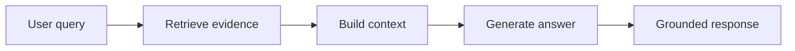
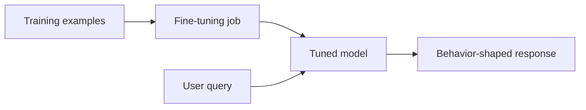

# RAG vs Fine-Tuning

Last reviewed: 2026-05-11

## Problem

Teams often ask whether they should use retrieval-augmented generation or fine-tuning. The question is usually framed incorrectly.

RAG and fine-tuning solve different problems.

RAG changes what information the model can access at request time. Fine-tuning changes how the model behaves.

## Short Answer

Use RAG when the system needs external knowledge.

Use fine-tuning when the system needs a different behavior pattern, output style, task skill, or domain-specific response format that cannot be reliably achieved with prompting and examples.

Use both when the system needs grounded knowledge and specialized behavior.

## Decision Table

| Requirement | Prefer RAG | Prefer fine-tuning |
| --- | --- | --- |
| Fresh or frequently changing knowledge | Yes | No |
| Private enterprise documents | Yes | Usually no |
| Citations and evidence | Yes | No |
| Access control by user or tenant | Yes | No |
| Consistent output format | Sometimes | Yes |
| Domain-specific writing style | Sometimes | Yes |
| Reducing prompt length | Sometimes | Yes |
| Teaching new facts | Yes | Usually no |
| Teaching behavior | Sometimes | Yes |
| Low-latency fixed task | Maybe | Yes |

## Architecture: RAG

RAG keeps knowledge outside the model and retrieves it when needed.

## Architecture: Fine-Tuning

Fine-tuning changes model behavior based on examples.

## Use RAG When

- Knowledge changes regularly
- You need source citations
- The answer depends on user-specific permissions
- You need to remove or update knowledge quickly
- The knowledge base is too large for prompt context
- The model must answer from specific documents

Example: enterprise document Q&A, customer support knowledge base, legal policy search, internal wiki assistant.

## Use Fine-Tuning When

- You need consistent structure across many outputs
- You need domain-specific tone or formatting
- The base model repeatedly fails a narrow task
- Prompt examples are too long or expensive
- You need lower latency for a repeated behavior
- You have high-quality labeled examples

Example: classifying support tickets into internal taxonomy, producing a strict report format, extracting fields in a domain-specific schema.

## Use Both When

Use RAG plus fine-tuning when the system needs both grounded information and specialized behavior.

Example: a medical support assistant might retrieve approved policy documents at request time, while a tuned model learns the organization's required response structure and escalation behavior.

## Design Decisions

### Knowledge vs Behavior

Ask whether the failure is due to missing knowledge or wrong behavior.

If the model lacks facts, use retrieval. If the model has the facts but responds in the wrong way, consider fine-tuning.

### Update Frequency

If the information changes often, do not put it into model weights. Update the index instead.

### Auditability

RAG is easier to audit because the system can show retrieved evidence. Fine-tuned behavior is harder to inspect.

### Data Quality

Fine-tuning requires high-quality examples. Bad examples teach bad behavior. RAG requires high-quality documents and chunking. Bad documents produce bad context.

## Failure Modes

### RAG Failure Modes

- Retrieves the wrong documents
- Retrieves the right documents but the model ignores them
- Citations do not support claims
- Chunking loses important context
- Permission filters leak data
- Retrieval latency becomes unacceptable

### Fine-Tuning Failure Modes

- Training data encodes outdated or incorrect behavior
- Model memorizes sensitive examples
- Fine-tune improves style but not correctness
- Evaluation set is too similar to training data
- Tuned model becomes harder to update
- Teams use fine-tuning to hide missing product logic

## Evaluation Strategy

Evaluate the actual failure you are trying to fix.

For RAG:

- Retrieval recall
- Context relevance
- Answer faithfulness
- Citation support
- Refusal when sources are missing
- Access-control correctness

For fine-tuning:

- Task success
- Format adherence
- Behavior consistency
- Regression against base model
- Performance on held-out examples
- Safety and refusal behavior

For combined systems:

- Evaluate retrieval and behavior separately
- Then evaluate end-to-end outcomes

## Observability

For RAG, trace retrieved documents, scores, prompt context, citations, and answer faithfulness.

For fine-tuning, track model version, training dataset version, eval dataset version, output drift, and failure examples.

## Cost And Latency

RAG adds retrieval, reranking, and context tokens. Fine-tuning can reduce prompt size and latency for repeated tasks, but introduces training cost and model management overhead.

The cheapest architecture is not always the one with the cheapest model call. Measure the full path.

## Security Concerns

RAG risks:

- Unauthorized retrieval
- Prompt injection through retrieved content
- Sensitive context stored in traces

Fine-tuning risks:

- Training on sensitive data
- Memorization
- Difficult deletion
- Harder behavior audit

## Practical Rule

Start with prompting and RAG when the problem is knowledge grounding. Move to fine-tuning only when you can show repeated behavior failures and have a high-quality training and eval dataset.

## Further Reading

- [OpenAI evaluation best practices](https://platform.openai.com/docs/guides/evaluation-best-practices)
- [Google Cloud RAG reference architectures](https://docs.cloud.google.com/architecture/rag-reference-architectures)
- [Anthropic prompt engineering overview](https://docs.anthropic.com/en/docs/prompt-engineering)
- [LlamaIndex RAG documentation](https://docs.llamaindex.ai/en/stable/understanding/rag/)
