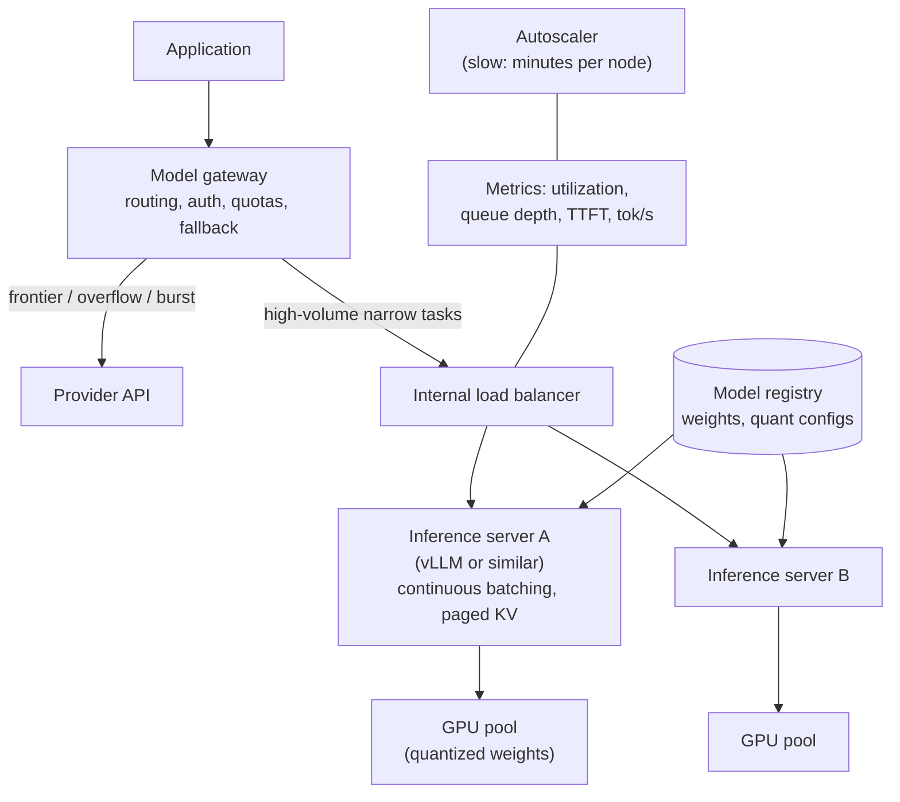

# Self-Host vs API Serving

Last reviewed: 2026-09-21

## Problem

Every LLM product eventually faces the question: keep paying per token to a provider API, or run open-weight models on your own GPUs.

The question gets answered badly in both directions. Teams self-host for reasons that do not survive arithmetic (a vague sense that APIs are expensive) and teams stay on APIs past the point where their volume, latency floor, or data constraints clearly justify owning the serving stack. The decision has five real inputs: volume, latency requirements, data residency, model capability requirements, and the team's operational capacity. Everything else, including most cost intuitions, follows from those.

This page assumes the model choice itself (open-weight versus frontier proprietary) is treated as part of the decision, because it is: self-hosting means serving open-weight models, and if the task needs frontier capability, the decision is made for you.

## When To Use

Prefer API serving when:

- The task needs frontier-model capability that open weights do not match; no infrastructure argument overcomes a capability gap
- Volume is low or spiky; per-token pricing converts idle time into zero cost, and GPUs convert it into pure waste
- The team has no one on call for infrastructure; a serving stack is a production service with pages
- You are pre-product-market-fit and iteration speed dominates unit cost
- Traffic is bursty beyond what you can overprovision for, since providers absorb bursts that would require you to own peak capacity

Prefer self-hosting when:

- Sustained volume is high enough that owned or reserved GPU cost undercuts per-token pricing at your achieved utilization (arithmetic below)
- Data may not leave your network or jurisdiction, and no provider deployment option (VPC, regional endpoints, zero-retention terms) satisfies the requirement; this is the one input that can force the decision alone
- You need latency floors that shared multi-tenant APIs cannot promise: single-digit-millisecond networking, no queueing behind other tenants' traffic, no cross-region hops
- You depend on capabilities APIs do not expose: custom quantization, logit-level access, exotic decoding, per-request adapter swapping for many fine-tunes
- Model stability is contractual: you must serve exactly this artifact, unchanged, for years

A tuned small open model on your own GPUs versus a large model behind an API is the common real matchup, and it couples this decision to the [fine-tuning pipeline](fine-tuning-pipeline.md) decision: fine-tuning makes self-hosting more attractive by closing the capability gap on narrow tasks, and self-hosting makes fine-tuning more attractive by making tuned-model serving free at the margin.

## Architecture



The gateway is the load-bearing component of the hybrid pattern: applications call one interface, and routing policy, not application code, decides which requests go to owned capacity and which to the API. This makes the self-host decision reversible per workload, which is the property that de-risks the whole thing.

## Data Flow

1. The application sends a request to the model gateway with a workload tag.
2. The gateway routes by policy: workload class, current internal queue depth, data-sensitivity label, and cost budget.
3. Self-hosted path: the load balancer picks an inference server; the server admits the request into its continuous-batching scheduler; prefill runs, then decode streams tokens back.
4. API path: the gateway forwards to the provider with tenant-appropriate keys and streams the response.
5. Overflow and failure: when internal queue depth exceeds the latency budget, or a GPU pool degrades, the gateway spills traffic to the API path if the request's data label permits.
6. All paths emit the same trace schema, so cost and quality are comparable per workload regardless of where inference ran.

## Core Components

### Inference Server

Never serve raw model.generate() behind Flask. Production throughput comes from an inference server (vLLM, TensorRT-LLM, TGI) providing continuous batching, which interleaves many requests' decode steps on the same weights, and paged KV-cache management, which stops long contexts from fragmenting GPU memory. The difference between naive serving and a proper server is commonly 5x to 20x throughput on the same hardware, which means the inference server choice moves the cost math more than the GPU choice does.

### GPU Capacity Math

The estimate everyone should be able to do on a whiteboard. Stated assumptions: an 8B-parameter model, 8-bit quantized weights (about 8 GB, plus KV cache and activations), served with continuous batching on one 80 GB-class GPU (A100/H100 tier).

- Throughput: with continuous batching at moderate context lengths, a served 8B model on one such GPU sustains on the order of 2,000 to 5,000 output tokens per second aggregate across the batch. Take 3,000 tok/s as a working number; measure your own workload before believing it
- Capacity per GPU-month: 3,000 tok/s x 86,400 s x 30 days is about 7.8B output tokens per month at 100 percent utilization. At a realistic 40 percent average utilization (diurnal traffic, headroom for p95), call it 3B tokens per GPU-month
- GPU cost: 2 to 4 dollars per hour for this class on major clouds in 2026, so roughly 1,500 to 3,000 dollars per GPU-month, before the engineer time
- Result: about 0.50 to 1.00 dollars per million output tokens self-hosted at 40 percent utilization, for a model whose API-hosted open-weight equivalents price in a comparable range and whose frontier alternatives price several times higher

Two readings of that result. Against APIs serving the same open model, self-hosting wins modestly at best, and only at good utilization; the providers run the same math with better economies. Against a frontier API at 10 to 15 dollars per million output tokens, a tuned 8B that matches it on your narrow task wins by an order of magnitude, but the saving comes from the model downsizing, which an open-model API would also capture without any of the operations. The honest conclusion from the arithmetic: utilization is the whole game, capability parity is the precondition, and "self-host to save money" usually decomposes into "downsize the model" (real) plus "own the serving" (marginal unless utilization is high or another input forces it).

Scale the same arithmetic for larger models: a 70B-class model needs 2 to 4 such GPUs per replica depending on quantization and context, cutting per-GPU throughput sharing accordingly; per-token costs rise roughly with parameter count served.

### Quantization

Quantization trades model quality for memory and speed, and it is the lever that makes self-hosting economics work at all.

- 8-bit weights (FP8/INT8): near-lossless on most tasks, halves memory versus 16-bit, the sensible default
- 4-bit weights (GPTQ, AWQ class): halves memory again and fits bigger models on smaller GPUs; quality loss is task-dependent, often negligible on general chat, more visible on math, code edge cases, and long-tail knowledge
- KV-cache quantization: separate decision, cuts the memory that scales with context length and batch size, which is often the real constraint at high concurrency

The governing rule: quantization is a model change and must pass the same eval gates as a new model version. A quantized model that saves 40 percent on hardware and silently drops 3 points on your task eval was not a savings decision, it was an unreviewed quality regression. Evaluate at the exact quantization you serve.

### Data Residency And Deployment Modes

Residency requirements come in strengths, and the decision differs by strength:

- "Data stays in region X": major providers offer regional endpoints and cloud-marketplace deployments (Bedrock, Vertex, Azure) that often satisfy this without self-hosting
- "Data stays in our VPC / our tenancy": marketplace-hosted models in your cloud account may qualify; check who can access what under the shared-responsibility fine print
- "Data never leaves hardware we control" (defense, some healthcare, air-gapped): self-hosting is mandatory and the cost math is irrelevant

Zero-retention API terms answer a different question (storage) than residency (transit and processing). Map the actual legal requirement before concluding that self-hosting is required; it is the most common false forcing function.

### Operational Burden

The line items that do not appear in the GPU math:

- An on-call rotation that understands CUDA errors, driver and firmware updates, and inference-server upgrades
- Capacity planning as a standing activity: traffic forecasting, reservation negotiations, quota management, and GPU procurement lead times measured in weeks or months
- Model lifecycle: pulling, converting, quantizing, evaluating, and registering each new open-weight release, which arrive quarterly and are the source of your capability improvements now that no provider does it for you
- Multi-node concerns at scale: tensor-parallel serving, topology-aware scheduling, node failure draining
- Security patching of the entire stack down to the driver

A realistic floor is a meaningful fraction of one senior engineer for a small deployment and a small team beyond a few dozen GPUs. At fully loaded engineer cost, half an engineer is roughly 10,000 to 15,000 dollars per month, which buys a lot of API tokens; the burden line item alone sets a volume floor below which self-hosting cannot win on cost.

### Hybrid Architectures

Most mature deployments are hybrid, and the pattern is stable:

- Narrow, high-volume, latency-sensitive, or residency-bound workloads on owned capacity, usually with tuned small models
- Frontier-capability workloads, long-tail tasks, and experiments on APIs
- Overflow spilling: owned capacity sized to baseline load, bursts routed to the API, which converts the utilization problem (own the peak, waste the trough) into a routing policy
- Failover in both directions: API outage falls back to a degraded self-hosted model, GPU pool failure falls back to the API, subject to data labels

The gateway enforces one non-negotiable rule in hybrid designs: data-sensitivity labels travel with requests, and residency-bound requests can never spill to external endpoints, including under incident pressure, because failover is exactly when that rule will be tested.

## Design Decisions

### The Volume Threshold

Compute it rather than feel it: monthly tokens at which (GPU cost + amortized ops burden) / achievable tokens undercuts your blended API price at equal quality. With the assumptions above, a workload must sustain on the order of billions of tokens per month before owned capacity plus half an engineer beats open-model API pricing; against frontier API pricing the threshold is far lower but conflates the downsizing decision with the hosting decision. Redo the math whenever API prices move, which is often, and downward.

### Latency Floor

Self-hosting removes provider-side queueing and cross-network hops, and enables tricks APIs will not do for you (dedicated batches for premium traffic, speculative decoding tuned to your workload, guaranteed warm KV caches). If your product needs p99 TTFT under a few hundred milliseconds at high percentiles, shared APIs will fight you; dedicated-capacity offerings from providers are the middle option worth pricing before committing to full self-hosting.

### Capability Tracking

APIs deliver model improvements continuously for free; a self-hosted stack improves only when you do the work. Budget the recurring cost of evaluating and adopting new open-weight releases, and expect the gap to frontier models to be re-opened repeatedly. A self-hosting decision that was capability-neutral at commitment time degrades silently unless model refresh is planned work.

### Reversibility

Whatever is chosen, keep the application coded against the gateway abstraction and keep eval suites provider-neutral, so the decision can be revisited per workload each year without a rewrite. The largest hidden cost of self-hosting is not the GPUs, it is organizational lock-in to the sunk cost.

## Failure Modes

- Utilization fantasy: the plan assumed 70 percent utilization, production delivers 15 percent, and the per-token cost is 4x the API you left
- Quality regression via quantization or via serving-stack defaults (different sampling, different chat template) that no eval gate covered because "the model didn't change"
- Capacity cliff: traffic grows past owned capacity, procurement takes eight weeks, and there is no spill path because residency labeling was never built
- Single-pool fragility: one bad driver update or one AZ event takes down all inference with no API fallback wired
- Frontier drift: the self-hosted model was competitive at commitment time, two API model generations later the product is visibly worse and the team defends the infrastructure instead of the product
- Ops burden landed on people hired to build product, silently taxing roadmap until the GPUs are resented
- Hybrid spill leaks residency-bound data to an external endpoint during an incident, converting an outage into a breach
- The gateway becomes a bottleneck or single point of failure because it was built as an afterthought

## Evaluation Strategy

- Capability parity first: before any infrastructure work, run your full eval suite on the candidate open model (at serving quantization, on the actual inference stack, with the actual chat template) against the incumbent API model. The comparison at equal quality is the only cost comparison that means anything
- Load-test with production-shaped traffic: real context-length distributions and real concurrency, not synthetic 512-token prompts; measure aggregate tok/s, TTFT, and p99 under mixed load, and feed the measured numbers back into the capacity math
- Gate every stack change: model version, quantization, inference-server upgrade, and GPU type each rerun evals, because each has changed output distributions in practice
- Failover drills: kill the GPU pool in staging and verify spill behavior, including that residency-labeled traffic fails closed rather than spilling
- Quarterly decision review: re-run the parity evals against current API models and reprice both paths; the decision is an ongoing bet, not a one-time verdict

## Observability

- GPU utilization, memory headroom, and KV-cache occupancy per server; utilization is the metric the entire economic case rests on, so it goes on the primary dashboard
- Queue depth and admission latency at the batching scheduler, the early-warning signal for capacity exhaustion
- TTFT and inter-token latency percentiles per workload, compared side by side with the API path in the same units
- Cost per million tokens computed continuously from actual utilization, not the plan, and reviewed against current API pricing
- Spill rates and reasons in the hybrid gateway, plus alerts on any residency-label routing violation, which should page as a security event
- Model and stack version on every trace, so quality shifts join to the exact serving change that caused them

## Cost And Latency

Cost structure is the fundamental difference: APIs are pure variable cost, self-hosting is mostly fixed cost. Variable cost scales down to zero and up without capital; fixed cost rewards steady volume and punishes everything else. The capacity math above gives the crossover; the qualitative summary is that self-hosting economics are dominated by utilization, and utilization is dominated by traffic shape. Steady 24/7 enterprise workloads are the good case; spiky consumer traffic is the bad case unless overflow spilling absorbs the peaks.

Latency: self-hosting can beat APIs on TTFT (no external hop, no multi-tenant queue, warm caches) and on tail behavior, but only after the serving stack is tuned; an untuned self-hosted deployment is routinely slower than a good API. Quantization and smaller models improve decode speed; continuous batching trades a little per-request latency for large throughput gains, and the scheduler's max-batch settings are the knob balancing the two.

Include in every comparison: engineer time, idle capacity, model refresh work, and the API prices you would actually pay with committed-use discounts, not list price on either side.

## Security Concerns

- Self-hosting moves the entire model-serving attack surface in-house: weights theft (weights are valuable IP and, if fine-tuned on user data, a data asset), inference-server CVEs, GPU driver vulnerabilities, and the registry as a supply chain (a poisoned or trojaned checkpoint pulled from a public hub ships straight to production; pin hashes and scan artifacts)
- Multi-tenancy on shared GPUs is weaker isolation than process isolation; cross-request leakage bugs in serving stacks have occurred, so tenants with hard isolation requirements may need pool-level separation
- The gateway holds provider keys, routing policy, and data labels, making it the choke point where auth, quota, and residency are enforced; it needs the scrutiny of an auth service, not a proxy
- API-side risks do not vanish in hybrid: provider retention terms, subprocessor lists, and key management still apply to every request that spills
- Logging parity: self-hosted stacks default to verbose logs that happily capture full prompts on local disks outside your normal data-governance perimeter; bring trace redaction and retention rules with you
- Residency enforcement must fail closed, and the failure path must be tested, because the incident that triggers spill is also the moment of maximum temptation to relax the rule

## Implementation Sketch

```text
# Capacity plan (redo with measured numbers)
plan(workload):
  tps_per_gpu   = measured_aggregate_tokens_per_sec      # from load test, not vendor slides
  monthly_cap   = tps_per_gpu * 86400 * 30 * target_util # e.g. util = 0.4
  gpus_needed   = workload.monthly_tokens / monthly_cap
  fixed_cost    = gpus_needed * gpu_month_cost + ops_burden_month
  self_per_MTok = fixed_cost / (workload.monthly_tokens / 1e6)
  decide(self_per_MTok vs api_committed_price, at_equal_eval_quality)

# Gateway routing
route(request):
  label = request.data_sensitivity          # travels with the request
  if label == RESIDENCY_BOUND:
    return internal_pool.serve_or_queue(request)   # never spills, fails closed
  if request.workload in TUNED_NARROW_TASKS:
    if internal_pool.queue_delay() < LATENCY_BUDGET:
      return internal_pool.serve(request)
    return provider_api.serve(request)      # overflow spill
  return provider_api.serve(request)        # frontier / long-tail default

# Serving change gate (model, quant, server version, GPU type)
on_stack_change(change):
  candidate = deploy_staging(change)
  require run_evals(candidate, full_suite) >= production_baseline
  require load_test(candidate, prod_traffic_shape).p99_ttft <= SLO
  canary(candidate, traffic=0.05)
```

## Further Reading

- [Efficient Memory Management for Large Language Model Serving with PagedAttention (vLLM)](https://arxiv.org/abs/2309.06180)
- [vLLM documentation](https://docs.vllm.ai/)
- [NVIDIA TensorRT-LLM](https://github.com/NVIDIA/TensorRT-LLM)
- [GPTQ: Accurate Post-Training Quantization for Generative Pre-trained Transformers](https://arxiv.org/abs/2210.17323)
- [AWQ: Activation-aware Weight Quantization for LLM Compression and Acceleration](https://arxiv.org/abs/2306.00978)
- [Hugging Face Text Generation Inference](https://github.com/huggingface/text-generation-inference)
