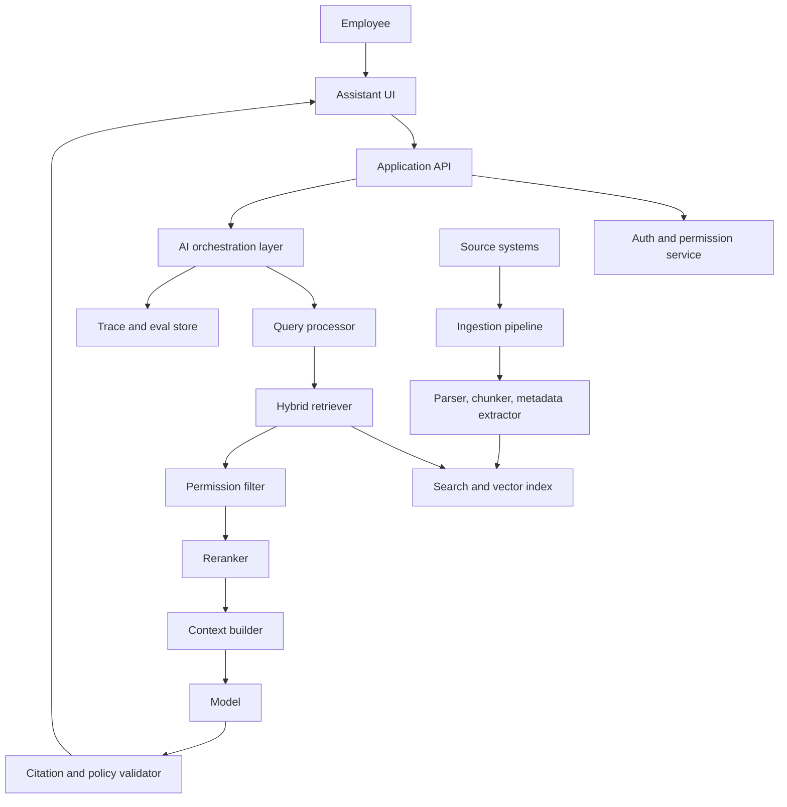

# Design Review: Enterprise Document Q&A

## Scenario

A company wants an internal assistant that answers employee questions using internal documents. The assistant must cite sources and respect permissions.

This review shows one reasonable production design. It is not the only valid design.

## Requirements

- Answer questions over internal documents
- Cite supporting sources
- Respect document permissions
- Refresh changed documents within 24 hours
- Refuse when evidence is missing
- Provide traces for debugging
- Start with 1,000 daily active users

## Architecture

## Data Flow

1. User authenticates through the company identity provider.
2. Query reaches the application API.
3. Permission service resolves user, groups, roles, and allowed document scopes.
4. Query processor normalizes the query and optionally creates variants.
5. Hybrid retriever searches keyword and vector indexes.
6. Permission filter removes documents the user cannot access.
7. Reranker orders candidates by relevance.
8. Context builder selects chunks, preserves citation metadata, and applies token limits.
9. Model generates an answer grounded in the selected chunks.
10. Validator checks citations, refusal policy, and output format.
11. Trace store records the request path with redaction.

## Design Decisions

### Use RAG, Not Fine-Tuning, For Knowledge

Company documents change frequently and access differs by employee. RAG keeps knowledge outside model weights and allows permission enforcement before context assembly.

### Use Hybrid Retrieval

Enterprise queries often include exact project names, error codes, customer names, and policy terms. Keyword search handles exact matching while vector search helps semantic matching.

### Enforce Permissions Outside The Model

The model should never receive chunks the user is not allowed to see. Permission filtering must happen before context building.

### Add Reranking After Baseline Evals

Do not add reranking by default. First measure retrieval recall and ranking quality. Add reranking if relevant chunks appear in top 50 but not top 5 often enough to justify the latency.

### Require Evidence For Answers

The assistant should refuse or ask for clarification when retrieved sources do not support an answer. It should not fill gaps from general model knowledge.

## Alternatives Considered

### Vector-Only Search

Rejected as the default because exact enterprise terms matter. It may miss names, IDs, and acronyms.

### Fine-Tuning On Internal Documents

Rejected for phase one because it complicates freshness, deletion, and permission boundaries.

### Post-Generation Permission Filtering

Rejected because sensitive information could already have been exposed to the model context.

## Failure Modes

- Wrong document retrieved because of ambiguous query
- Correct document retrieved but ranked too low
- Stale document used after policy change
- User receives answer from a restricted document
- Citations point to sources that do not support the claim
- Retrieved document contains prompt injection
- Source connectors silently fail
- Model answers from prior knowledge instead of evidence
- Trace logs store sensitive document content too broadly

## Evaluation Plan

### Retrieval Evals

Create a dataset of questions with expected source document IDs.

Measure:

- Recall@5
- Recall@20
- Mean reciprocal rank
- Permission-filter correctness
- Stale document exclusion

### Generation Evals

Measure:

- Answer correctness
- Faithfulness to sources
- Citation support
- Refusal when evidence is missing
- Format adherence

### Security Evals

Include:

- Direct prompt injection
- Indirect prompt injection inside retrieved documents
- Questions asking for restricted information
- Conflicting policy documents

## Observability Plan

Each request trace should include:

- User role and permission scope, not raw secrets
- Original query
- Query rewrite, if used
- Retrieved chunk IDs and scores
- Permission filter decisions
- Reranker scores
- Context chunk IDs sent to the model
- Model and prompt versions
- Output
- Citations
- Validator result
- Latency and token usage by stage
- User feedback

Sensitive document text should be redacted or access-controlled in traces.

## Security Review

Controls:

- Enforce identity and group membership before retrieval
- Apply document-level and chunk-level permissions
- Treat retrieved text as untrusted data
- Separate system instructions from retrieved content
- Validate that citations support claims
- Redact sensitive traces
- Audit access to sensitive documents
- Maintain deletion and reindexing workflows

## Cost And Latency Budget

Target: common queries under 5 seconds.

Example budget:

| Step | Target |
| --- | ---: |
| Auth and permission lookup | 150 ms |
| Query processing | 200 ms |
| Hybrid retrieval | 400 ms |
| Reranking | 700 ms |
| Context assembly | 100 ms |
| Model generation | 2,500 ms |
| Validation and tracing | 300 ms |
| Buffer | 650 ms |

If latency exceeds budget, first inspect reranking and generation time. Do not remove permission checks to save latency.

## Rollout Plan

1. Internal alpha with engineering and support teams.
2. Suggestion mode where answers are visible only to pilot users.
3. Weekly failure review and eval-set updates.
4. Expand to low-risk departments.
5. Add feedback buttons and source dispute workflow.
6. Enable company-wide access after security review and eval gates pass.

## Open Questions

- Which source system is authoritative when documents conflict?
- How should deleted documents be removed from indexes and traces?
- Should the system show confidence labels?
- Which teams require stricter logging controls?
- How will document owners fix bad or outdated source content?
