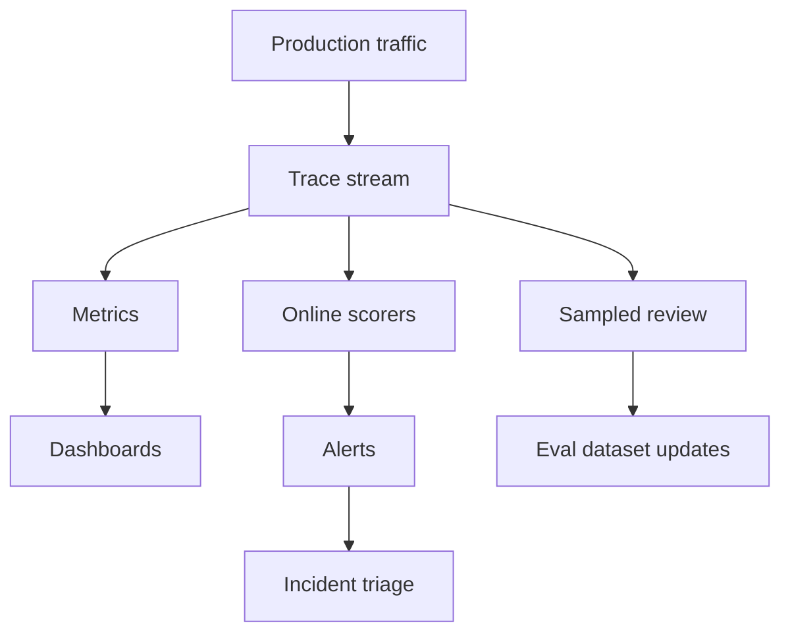

# Online Monitoring For AI Systems

Last reviewed: 2026-06-29

## Problem

Offline evals catch known failure modes before release. Online monitoring detects behavior changes and new failures in production.

AI systems need both.

## What To Monitor

### Reliability

- Error rate
- Timeout rate
- Retry rate
- Fallback rate
- Tool failure rate

### Quality

- User feedback
- Human review labels
- Eval-on-trace scores
- Citation support rate
- Refusal correctness
- Task completion

### Safety

- Prompt injection attempts
- Policy violations
- Sensitive-data filter hits
- Unsafe tool-call blocks
- Human escalation rate

### Cost And Latency

- p50/p95/p99 latency
- Token usage
- Cost per request
- Cost per successful task
- Cache hit rate
- Agent step count

## Architecture

## Alert Examples

- Citation validation drops below threshold
- Prompt injection detections spike
- p95 latency exceeds budget
- Fallback rate doubles
- Cost per successful task exceeds budget
- Human rejection rate increases
- Retrieval empty-result rate increases

## Failure Modes

- Monitoring only tracks API success
- Dashboards average away high-risk segments
- User feedback is collected but not reviewed
- Online LLM judges drift or become noisy
- Alerts fire without actionable traces
- No owner responds to quality regressions

## Evaluation Strategy

Online monitoring should feed offline evals.

For each serious production failure:

1. Label the trace.
2. Add it to a regression dataset.
3. Add a scorer or rule if possible.
4. Update release gates.
5. Verify the fix on the dataset.

## Further Reading

- [Trace Schema For AI Applications](./trace-schema.md)
- [Evaluation Pipeline Pattern](../patterns/eval-pipeline.md)
- [AI Incident Response](../patterns/ai-incident-response.md)
