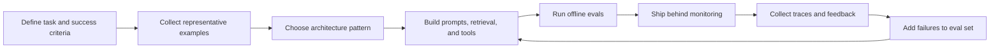
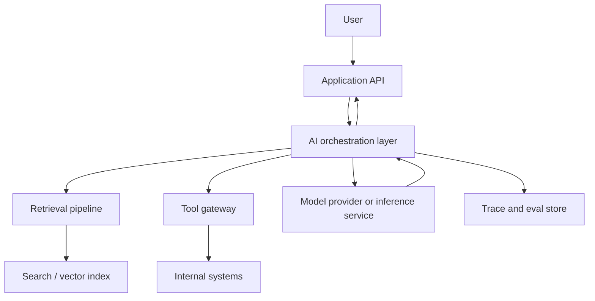

# What Is AI System Design?

Last reviewed: 2026-05-11

## Problem

Traditional system design assumes most core components are deterministic: APIs return defined schemas, databases store committed state, caches expire predictably, and queues process known payloads.

AI systems break that assumption. A model can produce useful output, but the output is probabilistic, sensitive to context, difficult to test exhaustively, and sometimes confidently wrong.

AI system design is the discipline of designing reliable products around uncertain model behavior.

## How It Differs From Traditional System Design

Traditional system design asks:

- How do we scale reads and writes?
- How do we handle failures?
- How do we keep latency low?
- How do we preserve consistency?
- How do we monitor infrastructure health?

AI system design adds:

- How do we measure answer quality?
- How do we prevent hallucinations from becoming product behavior?
- How do we decide between prompting, retrieval, fine-tuning, tools, and workflows?
- How do we control model cost and token growth?
- How do we detect prompt injection and data leakage?
- How do we version prompts, models, datasets, and evals together?
- How do we debug failures when the same input may produce different outputs?

The old problems do not disappear. AI systems still need APIs, queues, caches, auth, rate limits, storage, observability, and incident response. The new challenge is that correctness now depends on both software behavior and model behavior.

## Core Design Dimensions

### Context

Most LLM applications are context engineering systems. They decide what information the model should see, in what order, and with what constraints.

Context can come from:

- User input
- Conversation history
- Retrieved documents
- Tool results
- System instructions
- Product state
- User permissions
- Memory

Bad context design creates hallucinations, leakage, latency, and cost issues.

### Retrieval

Retrieval connects models to external knowledge. It often includes indexing, chunking, embedding, keyword search, vector search, hybrid retrieval, reranking, and citation handling.

Retrieval quality is usually more important than model choice for knowledge-heavy applications.

### Tool Use

Tools let models call APIs, databases, code execution environments, browsers, or internal services. Tool use turns a language model into a controller inside a larger system.

This increases capability and risk. Tool access needs permission boundaries, validation, tracing, and rollback strategy.

### Evaluation

AI systems need evals because manual testing does not scale and production failures are often semantic rather than syntactic.

Evaluation should test:

- Task success
- Faithfulness to sources
- Retrieval relevance
- Format correctness
- Safety policy compliance
- Tool-call correctness
- Regression against known failures

### Observability

AI observability includes normal application telemetry plus model-specific traces:

- Prompts
- Retrieved context
- Model responses
- Tool calls
- Token usage
- Latency per step
- Eval scores
- User feedback
- Failure labels

Without traces, most AI failures are hard to reproduce.

### Security

AI systems introduce new attack paths:

- Prompt injection
- Indirect prompt injection through retrieved content
- Data exfiltration through model output
- Unsafe tool execution
- Excessive agency
- Training or memory poisoning
- Sensitive data leakage into logs or prompts

Security is not a wrapper around the model. It is a design property of the whole system.

## AI System Lifecycle

The key loop is not prompt iteration. It is eval-driven system improvement.

## Common Architecture Components

The orchestration layer usually owns prompt assembly, routing, tool policies, retries, fallbacks, structured output validation, and trace emission.

## Design Questions

For any AI feature, ask:

- What is the user-visible task?
- What would a correct answer require?
- What sources of truth exist?
- Can the answer be verified?
- What context should the model see?
- What must the model never see?
- What actions can the model trigger?
- What should happen when confidence is low?
- What will be measured before release?
- What traces are needed to debug failures?
- What is the acceptable cost and latency budget?

## Failure Modes

Common AI system failures include:

- The model answers without enough evidence
- Retrieval returns irrelevant but plausible context
- The prompt grows until latency and cost become unacceptable
- A model upgrade changes behavior silently
- The system passes demos but fails long-tail production cases
- Tool calls execute with too much authority
- User data appears in prompts, logs, or responses unexpectedly
- Evals reward style while missing correctness
- Human review happens too late to prevent harm

## Evaluation Strategy

Start with a small but representative eval set:

- Golden examples for expected behavior
- Known bad examples from manual testing
- Edge cases for ambiguous inputs
- Adversarial examples for security and safety
- Regression examples from production failures

Use a mix of deterministic checks and model-graded checks. Deterministic checks are better for schemas, citations, exact policy violations, and tool-call constraints. LLM judges can help with semantic quality, but they need rubrics and calibration.

## Observability

Minimum useful trace:

- User request
- System and developer instructions
- Retrieved chunks and scores
- Final assembled prompt or message list
- Model name and version
- Tool calls and tool results
- Output
- Token usage and latency
- Error or fallback path
- User feedback or reviewer label

Redact secrets and sensitive data before storing traces.

## Cost And Latency

AI systems often spend latency in multiple places:

- Query rewriting
- Embedding
- Search
- Reranking
- Model generation
- Tool calls
- Guardrail checks
- Post-processing

Design the system around a latency budget, not around a single model call.

## Further Reading

- [OpenAI evaluation best practices](https://platform.openai.com/docs/guides/evaluation-best-practices)
- [Anthropic prompt engineering overview](https://docs.anthropic.com/en/docs/prompt-engineering)
- [OWASP Top 10 for LLM Applications](https://owasp.org/www-project-top-10-for-large-language-model-applications)
- [Google Cloud RAG reference architectures](https://docs.cloud.google.com/architecture/rag-reference-architectures)
