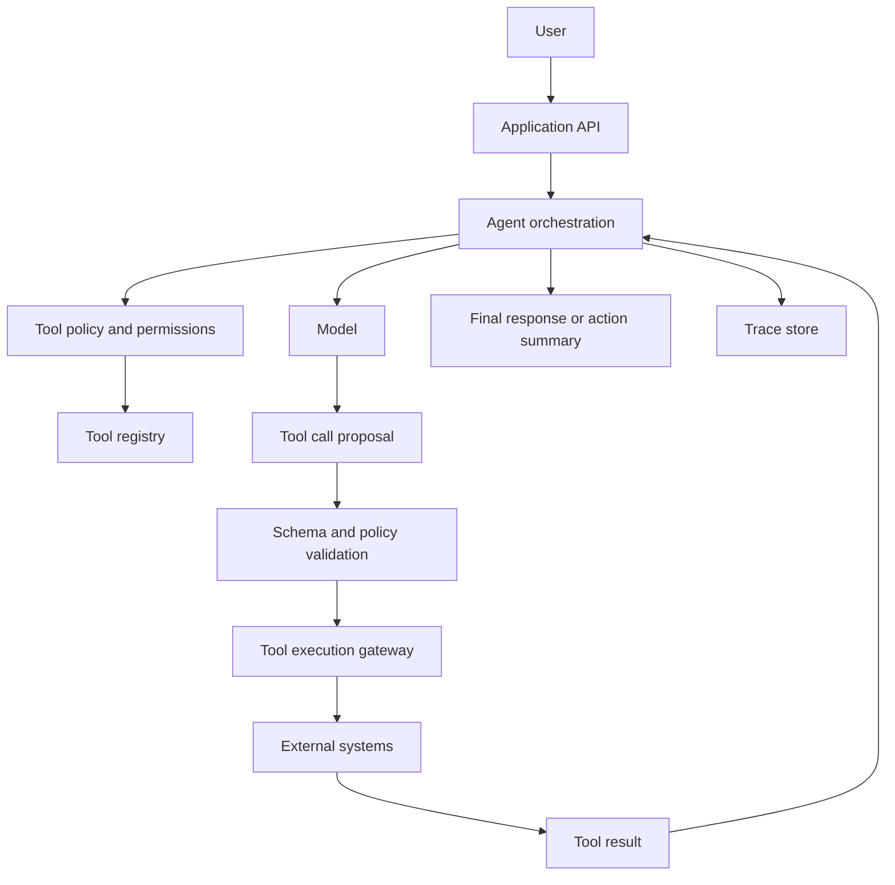

# Agent Tool-Use System Design

Last reviewed: 2026-05-11

## Problem

Tool use lets a model call external functions, APIs, databases, browsers, code execution environments, or internal services. This makes AI systems more capable because they can inspect state and take actions.

It also changes the risk profile. A model that can only write text can be wrong. A model that can call tools can be wrong and cause side effects.

## When To Use

Use tool use when:

- The model needs fresh state from an API or database
- The task requires action, not just text
- The system must operate across multiple services
- The model needs calculation, code execution, search, or structured lookup
- The workflow benefits from iterative planning and observation

Avoid agentic tool use when:

- A deterministic workflow is enough
- Tool calls have high-risk side effects
- The task can be solved with retrieval plus generation
- You cannot trace or review tool decisions
- The model has no clear success criteria

## Architecture



## Data Flow

1. User asks for an outcome.
2. Orchestrator provides task, tools, constraints, and state to the model.
3. Model proposes a tool call.
4. System validates schema, permissions, and side-effect policy.
5. Tool gateway executes approved call.
6. Tool result is returned to the model.
7. Model decides whether to continue, ask for approval, or finish.
8. Trace captures every step.

## Core Components

### Tool Registry

The tool registry defines available tools, schemas, descriptions, permissions, and side-effect level.

Good tool descriptions say what the tool does, when to use it, and what constraints apply. They do not expose secrets or implementation details.

### Policy Layer

The policy layer decides whether a tool call is allowed. It should be separate from the model's own reasoning.

Policy examples:

- Read-only tools can run automatically
- External writes require user approval
- Financial actions require deterministic validation
- Admin-only tools require user role checks
- Dangerous arguments are blocked before execution

### Execution Gateway

The gateway executes tools and normalizes errors. It should apply timeouts, retries, rate limits, idempotency keys, and audit logging.

### Human Review

Human-in-the-loop is not just an approve button at the end. Useful review can happen before high-risk tool calls, after uncertainty detection, or when policy requires business judgment.

## Design Decisions

### Workflow vs Agent

Prefer deterministic workflows when the steps are known. Use an agent when the system must decide which steps to take based on intermediate observations.

### Read Tools vs Write Tools

Read tools are lower risk and often safe to automate. Write tools need approval, authorization, idempotency, and rollback strategy.

### Single Agent vs Multi-Agent

Start with one orchestrator. Multi-agent designs add coordination overhead and more failure modes. Use multiple agents only when there are clearly separated roles, state boundaries, and evals proving the benefit.

### Autonomy Budget

Set limits on:

- Number of tool calls
- Wall-clock runtime
- Cost
- Number of retries
- Side-effect scope
- Required approval points

## Failure Modes

- Model calls the right tool with wrong arguments
- Model repeats failing tool calls in a loop
- Tool result is misread or ignored
- Tool descriptions cause the model to overuse a tool
- Prompt injection causes unauthorized tool use
- A write tool performs an irreversible action
- Errors leak internal details to the user
- The model fabricates tool results instead of using the tool
- Human approval is requested without enough context

## Evaluation Strategy

Evaluate tool use with scenario traces, not just final answers.

Measure:

- Correct tool selection
- Correct argument construction
- Correct handling of tool errors
- Whether approval was requested at the right point
- Whether the final answer reflects tool results
- Whether the agent stops within budget
- Whether policy blocks unsafe calls

Use golden traces for critical workflows. A final answer can look good while the internal tool path is unsafe.

## Observability

Log:

- Tool list shown to the model
- Model reasoning summary, if available
- Proposed tool call
- Validation result
- Tool execution request and response
- Latency and cost per step
- Approval decisions
- Final output
- Stop reason

Traces should make it possible to replay the workflow without rerunning side-effecting tools.

## Cost And Latency

Agent systems can multiply model calls. Latency grows with each think-call-observe loop.

Control it with:

- Step limits
- Smaller models for classification or routing
- Parallel read-only tool calls when possible
- Cached tool results
- Early exits
- Clear stop criteria

## Security Concerns

Tool use expands the attack surface.

Required controls:

- Treat user input and retrieved content as untrusted
- Validate every tool argument
- Apply permission checks outside the model
- Use least-privilege credentials
- Require approval for sensitive writes
- Log all side effects
- Prevent tools from returning secrets into model-visible context unless necessary

## Implementation Sketch

```text
run_agent(user, task):
  budget = { max_steps: 8, max_cost: 1.00 }
  tools = allowed_tools_for(user)

  for step in range(budget.max_steps):
    proposal = model.next_action(task, tools, state)

    if proposal.type == "final":
      return proposal.message

    if proposal.type == "tool_call":
      validate_schema(proposal)
      enforce_policy(user, proposal)

      if requires_approval(proposal):
        approval = request_approval(user, proposal, state)
        if not approval:
          return explain_cancelled()

      result = execute_tool(proposal)
      state.add_observation(result)
      trace(step, proposal, result)

  return stop_with_budget_message()
```

## Further Reading

- [Anthropic tool use documentation](https://docs.claude.com/en/docs/tool-use)
- [OpenAI Agents SDK documentation](https://platform.openai.com/docs/guides/agents-sdk/)
- [OpenAI Agents SDK guardrails](https://openai.github.io/openai-agents-python/guardrails/)
- [LangGraph documentation](https://docs.langchain.com/langgraph)
- [OWASP Top 10 for LLM Applications](https://owasp.org/www-project-top-10-for-large-language-model-applications)
