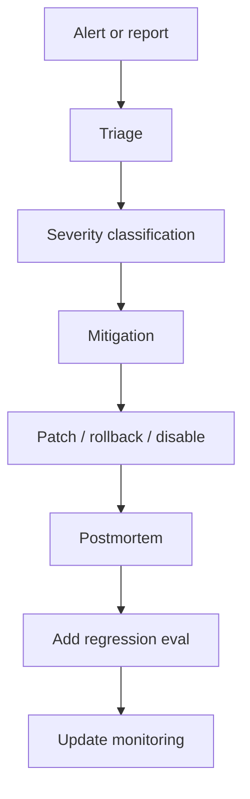

# AI Incident Response

Last reviewed: 2026-06-29

## Problem

AI incidents often look different from normal software incidents. The service may return HTTP 200 while producing unsafe, wrong, leaked, unsupported, or costly behavior.

AI incident response defines how teams detect, triage, mitigate, and learn from failures in model-driven systems.

## Incident Types

- Hallucinated answer causes user harm
- Restricted data appears in output
- Prompt injection bypasses policy
- Agent executes unsafe tool call
- Model upgrade causes regression
- Retrieval index serves stale or deleted data
- Cost spike from loops or retries
- Eval gate misses critical failure

## Response Flow

## Immediate Mitigations

Options:

- Disable feature
- Roll back prompt/model/config
- Disable tool
- Tighten retrieval filters
- Add temporary refusal rule
- Route to human review
- Lower autonomy budget
- Block affected tenant or source

## Triage Questions

- What user or tenant was affected?
- Was restricted data exposed?
- Was a tool or side effect involved?
- Which prompt, model, retrieval, and policy versions ran?
- Can the trace reproduce the issue?
- Was this caught by evals?
- Is the issue isolated or systemic?

## Failure Modes

- Incident response treats AI failure as ordinary API error
- Traces lack enough data to reproduce issue
- Mitigation fixes one prompt but not root cause
- Failure is not added to eval set
- Security and legal are notified too late
- Cost incident continues during investigation

## Evaluation Strategy

Every confirmed incident should produce:

- A regression example
- A monitoring rule or dashboard update
- A release-gate improvement
- A postmortem action item

## Further Reading

- [AI Incident Postmortem Template](../templates/ai-incident-postmortem-template.md)
- [Prompt And Model Versioning](./prompt-model-versioning.md)
- [AI Observability](./ai-observability.md)
