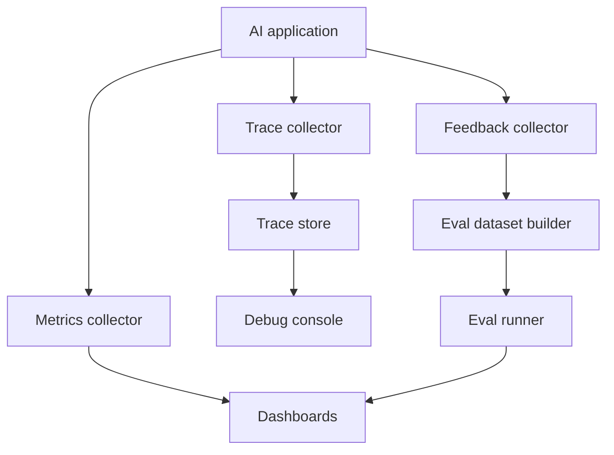

# AI Observability

Last reviewed: 2026-06-29

## Problem

Normal application logs tell you whether a request succeeded. They rarely explain why an AI answer was wrong.

AI observability captures prompts, retrieved context, tool calls, model versions, token usage, eval scores, and feedback so teams can debug semantic failures.

## When To Use

Use this pattern for every production AI system.

Minimum observability is required when:

- Answers must be trusted
- Retrieval or tools are involved
- Model, prompt, or index versions change
- User feedback affects future behavior
- Security and privacy review matter

## Architecture

## What To Observe

### Request Context

- User request
- User segment or role
- Tenant or workspace
- Feature entry point
- Risk label

### AI Execution

- Prompt or message version
- Model name and version
- Retrieval query
- Retrieved chunk IDs and scores
- Reranker scores
- Tool calls
- Tool results
- Final output
- Validation result

### Operational Metrics

- Latency by stage
- Token usage
- Cost estimate
- Retry count
- Error rate
- Fallback rate
- Human escalation rate

### Quality Signals

- Eval scores
- User feedback
- Human review labels
- Citation support
- Refusal correctness
- Task completion rate

## Design Decisions

### Store Full Prompts Or References

Full prompts are easier to debug but risk exposing sensitive data. Source references are safer but may not reproduce failures.

Use tiered trace storage:

- Metadata for broad access
- Redacted context for debugging
- Sensitive raw traces with restricted access and retention limits

### Real-Time vs Batch

Real-time metrics catch incidents. Batch analysis finds quality regressions and long-tail failures.

You need both.

### Vendor Tool vs Internal System

Vendor tools can accelerate setup. Internal systems may be needed for privacy, compliance, or cross-provider tracing.

## Failure Modes

- Logs capture outputs but not retrieved context
- Prompt changes are not versioned
- Trace data leaks sensitive documents
- Teams cannot reproduce failed generations
- Feedback is collected but never connected to evals
- Cost is measured per model call but not per successful task
- Dashboards show averages while critical slices regress

## Evaluation Strategy

Observability should improve evals.

Use traces to:

- Build regression sets
- Find failing user segments
- Compare model versions
- Identify retrieval failures
- Detect prompt injection attempts
- Measure cost per useful answer

## Security Concerns

Trace data can contain:

- User secrets
- Private documents
- System prompts
- Tool outputs
- Customer records

Controls:

- Redaction before storage
- Field-level access control
- Retention limits
- Audit logs
- Separate public examples from production traces

## Standards

OpenTelemetry is developing GenAI semantic conventions for spans, events, metrics, model calls, agents, and MCP. Use standards where they fit, but keep product-specific fields for evals and debugging.

## Further Reading

- [OpenTelemetry GenAI semantic conventions](https://github.com/open-telemetry/semantic-conventions/tree/main/docs/gen-ai)
- [Evaluation Pipeline Pattern](./eval-pipeline.md)
