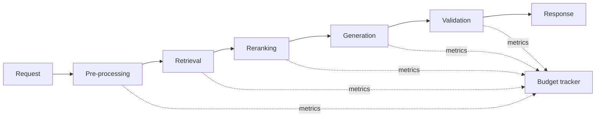

# Cost And Latency Budgeting

Last reviewed: 2026-06-29

## Problem

AI systems often fail economically before they fail technically. A design that works in a demo may be too slow or expensive in production.

Cost and latency budgeting forces teams to account for every step in the AI request path.

## When To Use

Use this pattern before launching any user-facing AI feature.

It is especially important when:

- Requests call multiple models
- RAG uses reranking or long context
- Agents can loop through tools
- Traffic is expected to grow quickly
- The feature has strict interaction latency

## Architecture

## Budget Dimensions

Track:

- End-to-end latency
- Latency by stage
- Input tokens
- Output tokens
- Tool-call count
- Retrieval count
- Reranking count
- Retry count
- Cost per request
- Cost per successful task

## Example Budget

| Stage | Target latency | Cost driver |
| --- | ---: | --- |
| Intent classification | 150 ms | Small model call |
| Retrieval | 300 ms | Search infra |
| Reranking | 500 ms | Reranker model |
| Generation | 2,000 ms | Large model tokens |
| Validation | 250 ms | Rules or small model |
| Tracing | 100 ms | Storage |
| Buffer | 700 ms | Variance |

Total target: 4 seconds.

## Design Decisions

### Optimize Per Successful Task

Cheap requests are not useful if they fail more often. Measure cost per successful task, not just cost per call.

### Use Cascades Carefully

Model cascades can reduce cost, but failed cheap attempts add latency. Use cascades when early exits are common.

### Streaming

Streaming improves perceived latency but does not reduce total compute. It is useful for long answers but not a substitute for budget control.

### Caching

Cache:

- Embeddings for repeated queries
- Retrieval results for common queries
- Static policy answers
- Tool results with safe TTLs

Do not cache permission-sensitive responses without tenant and user boundaries.

## Failure Modes

- Long context makes every request expensive
- Agents loop until cost limit is hit
- Reranking added without eval justification
- Retries hide provider instability while increasing cost
- Streaming masks slow total completion
- Cost dashboards ignore failed tasks
- Latency p95 is unacceptable despite good averages

## Evaluation Strategy

Run load and quality tests together.

Measure:

- Quality vs cost
- Quality vs latency
- p50, p95, and p99 latency
- Token growth over conversation length
- Cost per tenant or feature
- Cost per resolved case

## Observability

Log:

- Stage-level latency
- Token usage
- Model route
- Cache hit/miss
- Retry/fallback reason
- Tool-call count
- Cost estimate
- User-visible completion time

## Security Concerns

Cost controls are also safety controls. Unbounded context, tool loops, and repeated retries can become denial-of-wallet failures.

Set hard limits:

- Max tokens
- Max tool calls
- Max retries
- Max wall-clock time
- Max cost per request

## Further Reading

- [Model Routing](./model-routing.md)
- [Agent Tool-Use System Design](./agent-tool-use.md)
