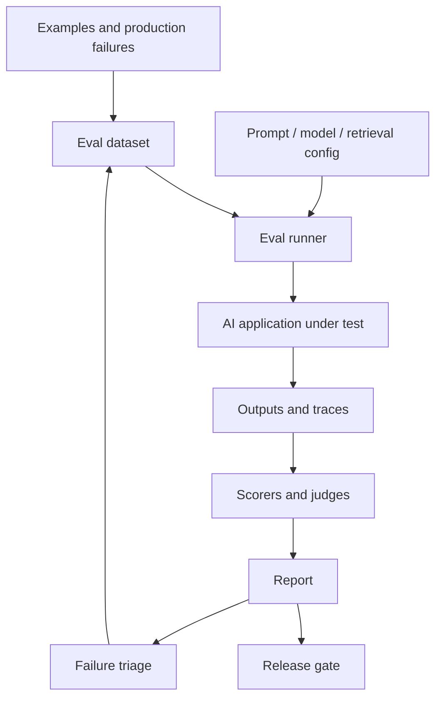

# Evaluation Pipeline Pattern

Last reviewed: 2026-05-11

## Problem

AI systems fail in ways normal tests do not catch. The output can be valid JSON but wrong. It can sound confident but ignore evidence. It can pass a demo and fail a real customer edge case.

An evaluation pipeline turns quality into a repeatable engineering process.

## When To Use

Use an eval pipeline when:

- Model output affects user trust, money, safety, or business workflows
- You are changing prompts, models, retrieval, tools, or policies
- The system has known failure cases
- You need to compare architecture variants
- You want to prevent regressions after model upgrades

Do not wait for a large eval platform. Start with a small dataset and clear rubrics.

## Architecture



## Data Flow

1. Collect representative examples.
2. Define expected behavior or scoring rubric.
3. Run the AI system with a fixed configuration.
4. Capture outputs and traces.
5. Score outputs using deterministic checks, human review, or LLM judges.
6. Compare against baseline.
7. Block release or route failures to triage.
8. Add confirmed failures back to the eval set.

## Core Components

### Eval Dataset

The dataset should include:

- Common successful cases
- Known failure cases
- Ambiguous inputs
- Security or adversarial cases
- Cases where the correct answer is refusal
- Edge cases from production traces

Small, high-quality eval sets are better than large noisy ones.

### Eval Runner

The runner executes the application under a pinned configuration. It should record prompt version, model version, retrieval config, tool config, and code version.

### Scorers

Use multiple scoring methods:

- Exact match
- Schema validation
- Regex or rule checks
- Citation checks
- Retrieval relevance checks
- LLM-as-judge
- Human review

### Report

Reports should show aggregate metrics and concrete failures. A score without examples is not enough for engineering decisions.

## Design Decisions

### Offline vs Online Evals

Offline evals run before release on curated examples. Online evals monitor production traffic. You need both.

Offline evals catch regressions before shipping. Online evals reveal new failure modes.

### Deterministic Checks vs LLM Judges

Use deterministic checks when the property is objective. Use LLM judges for semantic assessment, but define rubrics and calibrate against human labels.

### Golden Answers vs Rubrics

Golden answers work for narrow tasks. Rubrics work better when multiple answers can be acceptable.

### Pass/Fail Gates

Not every eval should block release. High-risk dimensions such as policy compliance, permissions, and tool safety should have hard gates. Style and helpfulness may be monitored as softer signals.

## Failure Modes

- Eval set does not represent real traffic
- Evals reward verbosity instead of correctness
- LLM judge agrees with model hallucinations
- Scores improve while critical examples regress
- Prompt changes are shipped without eval baseline
- Retrieval and generation are evaluated only end to end, hiding root cause
- Production failures are not added back into evals
- Test data leaks into prompts or few-shot examples

## Evaluation Strategy

The eval pipeline itself needs validation.

Ask:

- Do scores correlate with human judgment?
- Do evals catch known historical failures?
- Are examples balanced across user intents?
- Are refusal cases included?
- Are security cases included?
- Are model, prompt, and retrieval configs pinned?
- Are failure examples reviewed and labeled?

## Observability

Each eval run should store:

- Dataset version
- Application version
- Prompt version
- Model name and version
- Retrieval/index version
- Tool config
- Output
- Trace
- Scores
- Judge rationale, if used
- Human label, if available

This lets teams compare changes over time instead of arguing from anecdotes.

## Cost And Latency

Evals can become expensive if every change runs every test through large models. Control cost with:

- Fast smoke evals on every change
- Full evals before release
- Smaller models for simple judges
- Cached retrieval and tool results
- Stratified sampling
- Nightly runs for expensive suites

## Security Concerns

Eval datasets often contain real user inputs. Treat them as sensitive.

Controls:

- Redact personal or secret data
- Restrict access to production traces
- Avoid sending sensitive eval cases to unapproved providers
- Track data retention rules
- Separate public example datasets from internal evals

## Implementation Sketch

```text
eval_run(config, dataset):
  results = []

  for example in dataset:
    output, trace = app.run(example.input, config)
    scores = []

    scores.append(validate_schema(output))
    scores.append(score_task_success(example, output))
    scores.append(score_policy_compliance(example, output))

    if example.requires_sources:
      scores.append(score_citation_support(trace.retrieved_chunks, output))

    results.append({
      example_id: example.id,
      output,
      trace,
      scores
    })

  report = aggregate(results)
  compare_to_baseline(report)
  return report
```

## Further Reading

- [OpenAI evaluation best practices](https://platform.openai.com/docs/guides/evaluation-best-practices)
- [Anthropic evaluation tool documentation](https://docs.claude.com/en/docs/test-and-evaluate/eval-tool)
- [Arize Phoenix LLM evals](https://arize.com/docs/phoenix/evaluation/llm-evals)
- [LangSmith evaluation concepts](https://docs.langchain.com/langsmith/evaluation-concepts)
