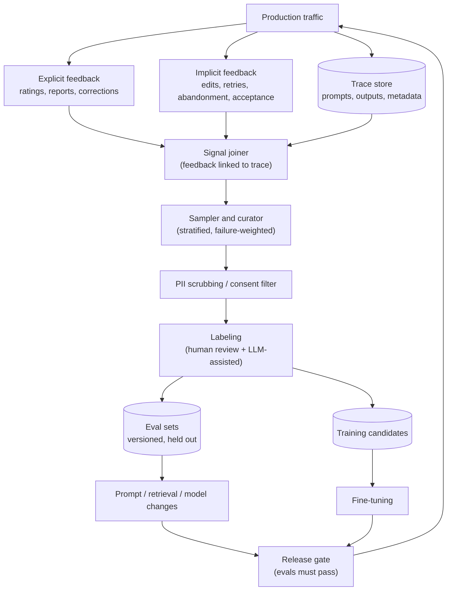

# Feedback And Data Flywheel

Last reviewed: 2026-09-21

## Problem

Every production LLM system generates the raw material for its own improvement: real queries, real outputs, and real user reactions. Most teams throw this away, then hand-write eval sets that drift from reality and guess at what to fix next.

A data flywheel closes the loop: capture feedback signals from production, convert traffic into eval sets and training data, and use those to make the system measurably better, which produces more usage and more signal. The concept is simple; the engineering is not. Feedback signals are sparse, biased, and noisy. Labels lie. Loops that train on their own outputs can degrade instead of improve. And user data carries privacy obligations that constrain every stage. This page covers the architecture that makes the loop work and the specific ways it corrupts itself.

## When To Use

Build the flywheel when:

- The system has enough traffic that sampled production data beats synthetic data, which happens earlier than teams expect, at hundreds of interactions per day, not millions
- You are past launch and the question has shifted from "does it work" to "what should we improve next"
- Quality problems are distributional: you need to know which query types fail, not whether a demo works
- You plan to fine-tune, build eval sets, or tune retrieval, all of which are downstream consumers of captured traffic

Deprioritize it when:

- The product is pre-launch and there is no traffic; hand-built evals are the only option and are fine
- Legal or contractual terms prohibit using customer data for improvement, and no consent mechanism exists yet; build the consent and retention story first, because retrofitting it is far harder
- The team cannot act on the signal; a feedback pipeline nobody reads is storage cost plus privacy liability, and nothing else

The minimum viable flywheel is small: log traces, add a thumbs-down button, and review the worst sessions weekly by hand. Every stage below scales that up; none of it replaces the weekly look at real failures.

## Architecture



## Data Flow

1. Every production request writes a trace: inputs, retrieved context, output, model and prompt versions, latency, cost.
2. Feedback events, explicit and implicit, are captured with the trace ID so signal joins to the exact interaction that caused it.
3. A sampler selects traces for review: all negative-feedback traces, a stratified random sample of the rest, and oversampled slices where the team suspects problems.
4. Selected traces pass through PII scrubbing and consent filtering before any human or training process sees them.
5. Labelers, human or LLM-assisted with human audit, grade outputs and write corrections or reference answers.
6. Graded examples flow into versioned eval sets and, separately, into training candidate pools.
7. Changes to prompts, retrieval, or models must pass the eval sets before release, and released changes generate new traffic, closing the loop.

The join in step 2 is where most implementations quietly fail. A thumbs-down that cannot be connected to the exact prompt version, retrieved chunks, and output that earned it is a mood indicator, not an engineering signal.

## Core Components

### Explicit Feedback Capture

Ratings, thumbs, report buttons, and free-text comments. Design realities:

- Response rates are low, typically under a few percent, and heavily biased: angry users and delighted users click, the middle does not
- Negative feedback is worth more than positive; a thumbs-down plus a "what went wrong" category (wrong, incomplete, refused, formatting, slow) is the highest-value widget per pixel
- Corrections beat ratings: a user editing the output into what they wanted hands you a labeled pair, input plus preferred output, which is directly usable for evals and preference tuning

Keep the widget cheap to use. Every added field cuts response rate, so put the taxonomy behind the click, not before it.

### Implicit Feedback Capture

Behavioral signals require no user effort and cover all traffic:

- Acceptance: user copied the answer, applied the suggestion, merged the generated code
- Edits: user modified the output before using it; edit distance is a graded quality signal
- Regeneration and retries: user asked again, rephrased, or hit retry, a strong negative
- Abandonment: user cancelled generation or left mid-response
- Follow-up sentiment: the next user message ("that's wrong", "perfect, thanks") classified into a quality signal by a small model
- Task completion downstream: the ticket got resolved, the draft got sent

Implicit signals are proxies and every one has a confound: a user may copy a wrong answer, or abandon a correct one because the phone rang. They work in aggregate and per-segment, not per-example, and their mapping to quality should itself be validated against a hand-labeled sample before anyone trains on them.

### Traffic-To-Eval Conversion

Production traffic is the best eval source available because it has the true query distribution, which hand-written sets never do. The conversion pipeline:

- Stratified sampling across intents, user segments, and difficulty, not uniform sampling, or the eval set becomes 80 percent easy common cases
- Failure oversampling: negative-feedback and low-implicit-score traces enter at a higher rate, because eval sets exist to catch failures
- Deduplication and near-duplicate clustering, so one viral query pattern does not become 30 eval rows
- Reference answer authoring: a human, aided by the model, writes what the output should have been; for subjective tasks, a rubric instead of a golden answer
- Versioning and freezing: an eval set is a versioned artifact; sets grow by release, never by silent mutation, or scores stop being comparable across time

Refresh matters. Production distribution drifts, and an eval set frozen at launch measures last year's product. A standing quota, for example 50 new curated cases per month with an equal number retired, keeps the set alive without unbounded growth.

### Label Quality

Labels are the ground truth everything downstream trusts, and they are wrong more often than teams assume.

- Measure inter-annotator agreement before scaling any labeling task; if two trained humans agree less than roughly 80 percent of the time, the task definition is broken, and no volume of labels fixes it. Sharpen the rubric first
- LLM-assisted labeling scales cheaply but inherits model biases: verbosity preference, self-agreement with outputs from the same model family, position bias in pairwise comparisons. Calibrate the LLM judge against a human-labeled gold set and re-check that calibration whenever the judge model or prompt changes
- Audit continuously: route a random few percent of LLM labels to humans forever, not just at setup
- Track label provenance: who or what labeled it, with which rubric version. When a rubric changes, old labels are not comparable and must be flagged, not silently mixed

A small set of excellent labels beats a large set of mediocre ones for both evals and fine-tuning; label quality is the input variable with the steepest downstream slope.

### Feedback Loops That Degrade Systems

The flywheel can spin backward. Known degradation loops:

- Training on the model's own accepted outputs narrows the distribution toward what the current model already does, entrenching its quirks and erasing diversity; each generation of this compounds
- Optimizing for engagement-flavored signals (thumbs up, session length) teaches sycophancy: agreeable, confident, validating outputs score better than correct ones. The signal improves while quality decays
- Selection feedback: the system's outputs shape which queries users send next (they stop asking what it fails at), so the captured distribution silently loses exactly the failures you need
- LLM judge and LLM generator sharing lineage: the judge rates the generator's style highly because it shares that style, inflating scores
- Popularity loops in retrieval: clicked results get boosted, get shown more, get clicked more, regardless of relevance

Defenses: always keep a human-labeled, non-model-derived gold set as the anchor that model-derived metrics are checked against; cap the fraction of training data that is model-generated; hold out a slice of traffic from all feedback-driven optimization as a control group; and monitor output diversity, not just quality scores, since collapsing diversity is the early symptom.

## Design Decisions

### Which Signals To Trust For Which Purpose

A useful hierarchy: corrections and human labels can drive training; explicit ratings can drive prioritization and eval sampling; implicit signals can drive monitoring and sampling but should not directly become training labels without human audit. Pushing a weaker signal into a stronger role is how degradation loops start.

### Sample Review vs Full Automation

Fully automated flywheels (implicit signal in, retrained model out) are where the degradation loops live. Fully manual review does not scale past a few hundred traces a week. The stable design is automated capture and sampling with human judgment at two points: label auditing and release gating. Automate the funnel, not the verdict.

### Centralized vs Per-Feature Feedback

One trace-and-feedback platform serving all AI features amortizes the pipeline and enables cross-feature analysis; per-feature capture ships faster for the first feature. Teams running more than two AI surfaces almost always regret per-feature capture within a year, because joining signals across bespoke schemas is rework forever.

### Where Privacy Enforcement Lives

Scrubbing at capture time (before storage) minimizes liability but destroys information you may legitimately need for debugging; scrubbing at use time (before labeling or training) preserves debugging ability but means raw PII sits in the trace store under access control. Most regulated deployments land on short-retention raw traces with strict access, plus aggressive scrubbing at the boundary where data leaves the operational context and enters the improvement context. That boundary is also where consent is checked.

## Failure Modes

- Feedback not joined to traces, producing dashboards of sentiment with no path to a fix
- Uniform sampling produces an eval set of easy cases that every candidate model aces while users keep failing on the hard tail
- Rating bias treated as ground truth: power users' preferences overwrite the silent majority's
- Eval set contamination: production traces enter both the training pool and the eval set, and scores inflate meaninglessly; enforce the split by trace ID at the pipeline level
- Rubric drift: labelers reinterpret the rubric over months and the metric moves with no system change
- Sycophancy optimization, as described above, visible as rising ratings with flat or falling task success
- Stale evals: the frozen set stops resembling traffic and release gates pass changes that fail current users
- The pipeline outlives its consumers: capture keeps running, storage and privacy exposure accrue, and no one has reviewed a batch in a quarter

## Evaluation Strategy

The flywheel needs evals of itself:

- Signal validity: correlate each implicit signal against human-labeled quality on a sample; publish the correlation and drop signals that fail
- Label quality: inter-annotator agreement, LLM-judge agreement with the human gold set, both tracked over time as control metrics
- Eval set representativeness: divergence between the eval set's intent and difficulty distribution and current traffic's, reviewed on a schedule
- Flywheel outcome: the point of the loop is improvement, so track whether releases gated by these evals actually move production metrics; a string of eval wins with flat production quality means the evals measure the wrong thing
- Control group: the traffic slice held out from feedback-driven changes provides the counterfactual that separates flywheel gains from ambient model improvements

## Observability

- Feedback rates by surface, segment, and version: a drop in feedback volume is itself a signal, often a broken widget
- Signal dashboards joined to prompt and model versions, so a regression shows up attributed to the release that caused it
- Sampler coverage: which traffic slices are entering review, and which have not been sampled in N weeks
- Labeling throughput, agreement rates, and backlog age
- Training-data lineage: every fine-tuning run and eval set version traceable to the trace IDs it contains, which is both a debugging tool and a compliance requirement when a user deletes their data
- Alerts on distribution shift between live traffic and the eval set beyond a threshold

## Cost And Latency

Capture is cheap and must be async; feedback logging adds no user-facing latency if it is fire-and-forget, and any design that puts trace writing on the request path has it backward.

The real costs are downstream: storage with retention (bounded by policy, typically 30 to 180 days for raw traces), human labeling (the dominant line item, commonly a few dollars per carefully labeled example when rubric design, agreement checks, and audit are included), and LLM-judge inference for scaled labeling (orders of magnitude cheaper per label, which is exactly why its calibration must be audited).

Budget rule: labeling spend should track the decisions it feeds. A team shipping monthly needs hundreds of fresh labels a month, not tens of thousands; buying labels faster than you ship changes is inventory, not improvement.

## Security Concerns

- Traces contain user data by definition, and the flywheel copies that data into review tools, labeling queues, eval sets, and training pools; each copy needs the same access control, retention, and deletion story as the original, and deletion must cascade through lineage
- Training on user data requires a legal basis: consent, contractual terms, or an opt-out honored at the pipeline boundary; enterprise contracts frequently prohibit it outright, so the consent filter must be per-tenant, enforced in the pipeline, and auditable
- Memorization risk: fine-tuning on raw user text can regurgitate one user's data to another; scrub PII from training candidates, deduplicate aggressively (repeated strings memorize hardest), and test tuned models with extraction probes before release
- Labelers see user content; contractor access needs NDAs, scoped tooling that redacts by default, and no bulk export
- Feedback endpoints are attacker-writable input: rating floods and poisoned corrections can steer sampling and, if unaudited, training. Rate-limit, weight by account trust, and keep humans on the path from feedback to training data
- Regulatory scope: under GDPR-class regimes, traces and derived datasets are personal data, subject to access and erasure requests; design the trace-ID-to-dataset lineage so an erasure request is a query, not a research project

## Implementation Sketch

```text
on_request(request, response, versions):
  trace_id = new_id()
  async_write(trace_store, {trace_id, request, retrieved_ctx,
                            response, versions, cost, latency})
  return trace_id                      # client attaches to feedback events

on_feedback(trace_id, event):          # explicit or implicit
  async_write(feedback_store, {trace_id, event.type, event.value, ts})

weekly_curation():
  negatives = feedback_store.traces_with(negative_signals, last_7d)
  sample = stratified_sample(trace_store, by=[intent, segment], last_7d)
  batch = dedupe(negatives + sample)
  batch = scrub_pii(batch)
  batch = filter(batch, tenant_allows_improvement_use)
  for t in batch:
    label = llm_judge(t, rubric_v)
    if label.confidence < T or random() < AUDIT_RATE:
      label = human_review_queue.push(t, label)
  route(labeled, eval_pool if fresh_eval_quota else train_pool,
        enforce_disjoint_by=trace_id)

release_gate(candidate):
  scores = run_evals(candidate, eval_sets.current + eval_sets.regression)
  require scores >= baselines
  require judge_calibration_check(gold_set) passed_this_month
  ship(candidate, holdout=CONTROL_SLICE)   # control traffic never feedback-tuned
```

## Further Reading

- [Hidden Technical Debt in Machine Learning Systems (NeurIPS 2015)](https://proceedings.neurips.cc/paper/2015/hash/86df7dcfd896fcaf2674f757a2463eba-Abstract.html)
- [Judging LLM-as-a-Judge with MT-Bench and Chatbot Arena](https://arxiv.org/abs/2306.05685)
- [Hamel Husain: Your AI Product Needs Evals](https://hamel.dev/blog/posts/evals/)
- [Chip Huyen: RLHF: Reinforcement Learning from Human Feedback](https://huyenchip.com/2023/05/02/rlhf.html)
- [OpenAI evaluation best practices](https://platform.openai.com/docs/guides/evaluation-best-practices)
