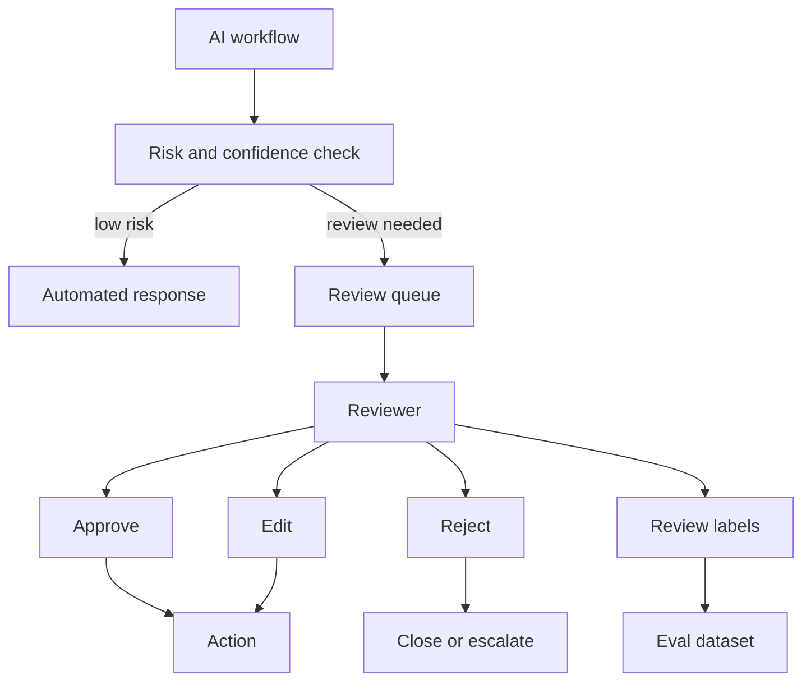

# Human Review Queue

Last reviewed: 2026-06-29

## Problem

Some AI decisions should not be fully automated. Human review is needed when risk is high, evidence is weak, policy requires judgment, or the model proposes a side effect.

A human review queue turns uncertainty and risk into an explicit workflow.

## When To Use

Use human review when:

- Actions are irreversible
- Financial, legal, medical, or safety risk exists
- The model lacks enough evidence
- User identity or authorization is uncertain
- A tool call changes external state
- A new AI feature is being rolled out

## Architecture

## Review Payload

A useful review item includes:

- User request
- AI proposed answer or action
- Risk label
- Retrieved evidence
- Tool-call proposal
- Policy checks
- Confidence or uncertainty signals
- Trace link
- Recommended reviewer action

## Design Decisions

### Pre-Action vs Post-Action Review

Pre-action review prevents harm but adds latency. Post-action review improves learning but may not prevent bad outcomes.

Use pre-action review for high-risk side effects.

### Reviewer Role

Different reviewers may be needed:

- Support agent
- Security reviewer
- Legal reviewer
- Domain expert
- Account owner

### Feedback Loop

Reviewer decisions should update eval datasets and policy rules. Otherwise, human review becomes manual labor without system improvement.

## Failure Modes

- Review queue becomes a bottleneck
- Reviewers lack enough context
- AI confidence is not calibrated
- Review labels are inconsistent
- Human edits are not captured for evals
- System routes too many low-risk cases to humans
- High-risk cases bypass review due to bad classifier

## Evaluation Strategy

Measure:

- Review precision: cases sent to review that truly needed review
- Review recall: risky cases that were caught
- Reviewer agreement
- Time to decision
- AI suggestion acceptance rate
- Post-review failure rate

## Observability

Log:

- Trigger reason
- Risk score or label
- Reviewer decision
- Edit distance between AI suggestion and final answer
- Time in queue
- Downstream outcome
- Whether the case entered an eval set

## Security Concerns

Reviewers should only see data they are authorized to access. A review queue can accidentally broaden access to sensitive user data.

Controls:

- Role-based reviewer assignment
- Redaction
- Audit logs
- Least-privilege queue views
- Sensitive action approval rules

## Further Reading

- [Agent Tool-Use System Design](./agent-tool-use.md)
- [Evaluation Pipeline Pattern](./eval-pipeline.md)
