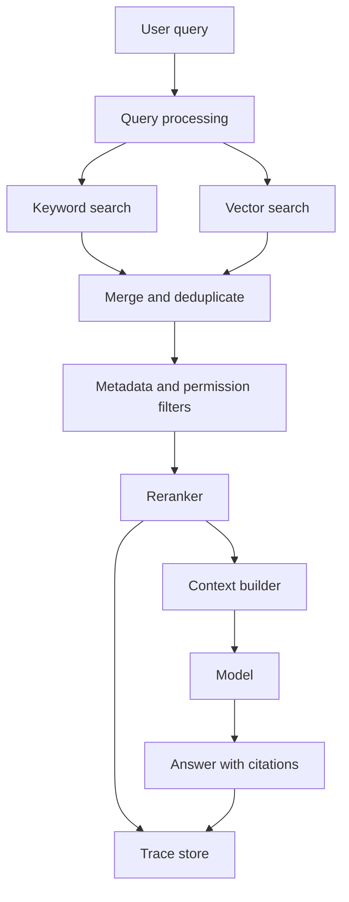

# Hybrid RAG And Reranking

Last reviewed: 2026-06-29

## Problem

Basic vector search is often not enough for production RAG. Enterprise queries include exact names, IDs, acronyms, error codes, product versions, policy terms, and semantic intent. A system that only uses dense embeddings may miss exact terms. A system that only uses keyword search may miss paraphrases.

Hybrid RAG combines lexical and semantic retrieval, then optionally reranks candidates before building model context.

## When To Use

Use this pattern when:

- Queries contain exact identifiers and semantic intent
- Documents are long, diverse, or messy
- Relevant chunks often appear in top 50 but not top 5
- Many chunks are similar and need finer relevance ordering
- Citations and faithfulness matter

Avoid it when:

- Corpus is tiny
- Simple keyword search already works
- Latency budget cannot absorb reranking
- You do not have retrieval evals to justify added complexity

## Architecture

## Data Flow

1. Normalize the query.
2. Run keyword search and vector search.
3. Merge results using reciprocal rank fusion or weighted scoring.
4. Deduplicate chunks and apply metadata filters.
5. Rerank the top candidates.
6. Select the final chunks for context.
7. Generate answer with citation metadata.
8. Trace every score and filtering decision.

## Core Components

### Keyword Retriever

Strong for:

- Product names
- Acronyms
- IDs
- Error messages
- Policy terms
- Exact phrase matches

### Vector Retriever

Strong for:

- Paraphrases
- Semantic similarity
- Conceptual questions
- Queries where users do not know the exact document wording

### Fusion Layer

The fusion layer merges ranked lists. It should preserve where each chunk came from and why it was included.

### Reranker

A reranker scores query-document relevance more precisely than first-stage retrieval. It usually runs on fewer candidates because it is slower or more expensive.

### Context Builder

The context builder enforces token budget, source diversity, citation metadata, and policy boundaries.

## Design Decisions

### Candidate Pool Size

If the candidate pool is too small, reranking cannot recover missing evidence. If it is too large, latency and cost rise.

Start with top 20 to 100 candidates and tune with evals.

### Rerank Before Or After Permission Filtering

For sensitive systems, filter permissions before reranking unless the reranker is allowed to see all candidate text. The safest default is to keep restricted chunks out of every model-visible step.

### Diversity vs Relevance

Rerankers can cluster near-duplicate chunks. Add source diversity when the answer benefits from multiple documents or when one document should not dominate context.

## Failure Modes

- Vector search misses exact terms
- Keyword search misses paraphrases
- Fusion overweights low-quality duplicate chunks
- Reranker improves relevance but increases latency beyond budget
- Relevant chunks are filtered out by bad metadata
- Context builder selects redundant chunks
- Reranker sees restricted content before permission enforcement
- Evaluation improves top-K metrics but answer faithfulness does not improve

## Evaluation Strategy

Measure retrieval separately from generation.

Retrieval metrics:

- Recall@K
- Mean reciprocal rank
- Precision@K
- Required source in final context
- Permission-filter correctness
- Duplicate rate

Generation metrics:

- Faithfulness to retrieved context
- Citation support
- Refusal when evidence is missing
- Answer correctness

Run ablations:

- Keyword only
- Vector only
- Hybrid without reranking
- Hybrid with reranking

Adopt reranking only when the quality gain justifies the latency and cost.

## Observability

Log:

- Query rewrite
- Keyword results and scores
- Vector results and scores
- Fusion method and scores
- Filtered candidates and reasons
- Reranker scores
- Final context chunks
- Citation usage
- Latency by stage

## Cost And Latency

Hybrid retrieval adds parallel search but can often stay fast. Reranking is usually the expensive step.

Optimization options:

- Run keyword and vector search in parallel
- Cache common query results
- Rerank only when first-stage confidence is low
- Use smaller rerankers for low-risk queries
- Skip reranking for exact-match queries

## Security Concerns

- Apply tenant and document permissions before context assembly
- Avoid sending restricted chunks to external rerankers unless approved
- Treat retrieved content as untrusted
- Trace source IDs separately from sensitive text when possible

## Further Reading

- [RAG System Design](./rag.md)
- [Google Cloud RAG reference architectures](https://docs.cloud.google.com/architecture/rag-reference-architectures)
- [LlamaIndex RAG documentation](https://docs.llamaindex.ai/en/stable/understanding/rag/)
