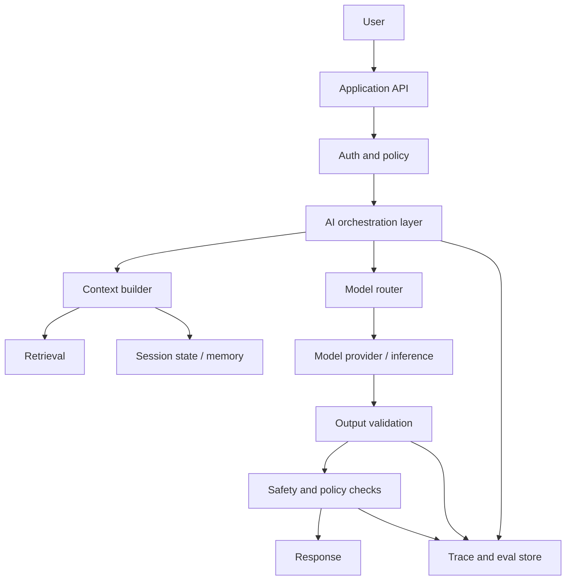

# LLM Application Architecture

Last reviewed: 2026-06-29

## Problem

An LLM feature is not just a model call. Production systems need orchestration, context assembly, validation, fallbacks, traces, evals, security checks, and release controls.

This pattern describes the common architecture for user-facing LLM applications.

## When To Use

Use this pattern for any feature where model output becomes product behavior:

- Chat assistants
- RAG systems
- AI search
- Support agents
- Code assistants
- Data analysis assistants
- Tool-using workflows

## Architecture

## Core Components

### Application API

Owns user identity, product permissions, request limits, and product-specific behavior.

### AI Orchestration Layer

Coordinates prompts, context, retrieval, tools, model routing, retries, fallbacks, validation, and traces.

### Context Builder

Decides what the model sees. It should enforce token limits, permissions, source priority, and instruction/data separation.

### Model Router

Selects model, provider, prompt version, and fallback path.

### Output Validator

Checks schema, citations, policy, refusal behavior, and tool-call arguments before the output affects the user or external systems.

### Trace Store

Captures enough information to debug and evaluate behavior.

## Design Decisions

### Keep Product Authority Outside The Model

The model can propose content or actions. The application owns authorization, side effects, and policy enforcement.

### Separate Instructions From Data

System instructions, user input, retrieved content, and tool outputs should be clearly separated. Retrieved content and user input are untrusted.

### Validate Before Acting

Validate structured outputs, citations, tool calls, and safety constraints before the response is shown or actions are executed.

### Version Everything That Affects Behavior

Track prompt, model, retrieval, tool, policy, and eval dataset versions.

## Failure Modes

- Model output is treated as trusted product logic
- Prompt changes ship without evals
- Context includes unauthorized data
- Structured output is parsed without validation
- Fallback model breaks behavior
- Traces omit retrieved context or tool calls
- Safety checks happen after side effects

## Evaluation Strategy

Evaluate:

- Task success
- Format and schema correctness
- Retrieval relevance
- Citation support
- Tool-call correctness
- Safety policy compliance
- Regression across prompt and model versions

## Observability

Minimum trace:

- Request ID
- User/tenant scope
- Prompt version
- Model version
- Route selected
- Retrieved context IDs
- Tool calls
- Output
- Validation result
- Token usage
- Latency by stage
- Feedback or review label

## Further Reading

- [Structured Outputs And Validation](./structured-outputs-validation.md)
- [Prompt And Model Versioning](./prompt-model-versioning.md)
- [AI Observability](./ai-observability.md)
- [OpenAI structured outputs](https://developers.openai.com/api/docs/guides/structured-outputs)
- [Anthropic structured outputs](https://platform.claude.com/docs/en/build-with-claude/structured-outputs)
