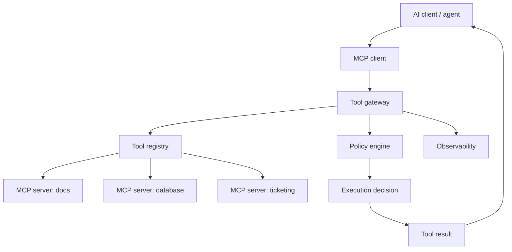

# MCP And Tool Gateway Pattern

Last reviewed: 2026-06-29

## Problem

AI applications increasingly need to connect to external tools, data sources, and workflows. Direct tool integrations can become inconsistent, unsafe, and hard to govern.

The Model Context Protocol, or MCP, provides a standard way for AI applications to connect to external systems. A tool gateway adds product-specific policy, permissions, validation, and observability around those tool connections.

## When To Use

Use this pattern when:

- Multiple tools or data sources need to be exposed to AI systems
- You need reusable integrations across clients or agents
- Tool permissions must be centrally governed
- Tool calls need audit logs
- You need to separate model reasoning from tool execution

Avoid it when:

- The product has one simple internal function
- Tool use is not exposed to model-driven workflows
- A direct typed API call is simpler and safer

## Architecture

## Core Components

### Tool Registry

Defines tool schemas, descriptions, owners, risk level, auth requirements, and side-effect level.

### Policy Engine

Checks:

- User permission
- Tenant policy
- Tool risk level
- Argument validity
- Approval requirements
- Rate limits

### Execution Layer

Runs tools, applies timeouts, retries safe operations, and records audit logs.

### Observability Layer

Captures tool-call traces, arguments, validation outcomes, latency, and errors.

## Design Decisions

### MCP Server vs Internal API

Use MCP when the integration should be reusable across AI clients. Use internal APIs when the integration is product-specific and deterministic.

### Tool Description Quality

Tool descriptions are part of the agent interface. Poor descriptions cause poor tool selection.

Include:

- What the tool does
- When to use it
- Required arguments
- What it returns
- Safety constraints

### Approval Boundary

Approval should happen outside the model. The model can propose, but policy decides.

## Failure Modes

- Tool descriptions cause overuse or misuse
- MCP server exposes too much authority
- Tool result leaks secrets into model context
- Agent calls tools in a loop
- Policy checks differ across clients
- Tool calls are not auditable
- Version changes break agent behavior

## Evaluation Strategy

Evaluate:

- Tool selection accuracy
- Argument correctness
- Policy-block correctness
- Approval routing
- Error recovery
- Stop behavior
- Sensitive-data handling

Use trace-based evals for tool workflows.

## Observability

Log:

- Tool list exposed to the model
- Tool version
- Proposed arguments
- Policy result
- Approval result
- Execution result
- Latency
- Error class
- Final user-visible output

## Security Concerns

Tool gateways should enforce:

- Least privilege
- Argument validation
- Rate limits
- Approval gates
- Output redaction
- Audit logs
- Tenant isolation
- Secret isolation

## Further Reading

- [Model Context Protocol documentation](https://modelcontextprotocol.io/docs/getting-started/intro)
- [OpenAI Agents SDK](https://developers.openai.com/api/docs/guides/agents)
- [Agent Tool-Use System Design](./agent-tool-use.md)
