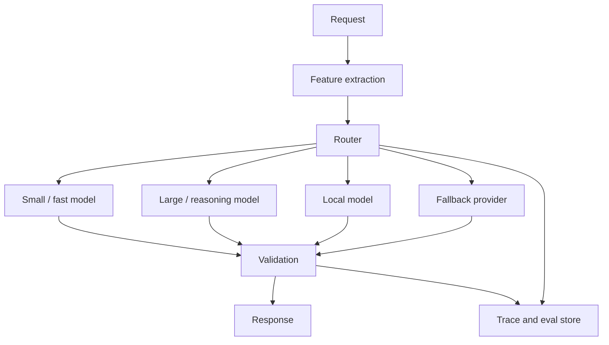

# Model Routing

Last reviewed: 2026-06-29

## Problem

Production AI systems rarely need one model for every request. Some requests are simple classification tasks. Some require long-context reasoning. Some need low latency. Some need higher accuracy. Some require a fallback when a provider fails.

Model routing chooses which model, prompt, or execution path should handle a request.

## When To Use

Use model routing when:

- Request complexity varies widely
- Cost matters at scale
- Latency targets differ by user flow
- Some tasks need specialized models
- You need provider fallback
- You want to run safety or formatting checks with smaller models

Avoid routing when:

- Traffic is low
- One model satisfies quality, latency, and cost constraints
- You do not have evals to compare routes
- Routing errors would be worse than using a stronger default model

## Architecture

## Routing Signals

Common signals:

- User intent
- Query complexity
- Required tools
- Required context length
- Safety risk
- Customer tier
- Latency budget
- Cost budget
- Provider health
- Historical success rate

## Routing Strategies

### Rule-Based Routing

Use explicit rules for obvious cases.

Example:

- Classification goes to a small model
- Legal-risk requests go to a stronger model plus human review
- Provider outage triggers fallback

### Classifier Routing

Use a cheap model or classifier to predict the route.

Useful when request types are not obvious from simple rules.

### Cascade Routing

Start with a cheaper model, then escalate when confidence is low or validation fails.

### Ensemble Or Voting

Run multiple models for high-risk tasks and compare outputs. This is expensive and should be limited to workflows where the value justifies the cost.

## Design Decisions

### Quality Gate

Every route needs an eval baseline. Do not route to a cheaper model unless it passes task-specific quality gates.

### Fallback Semantics

A fallback model may not behave exactly like the primary model. Treat fallback as a separate route with its own evals, prompts, and observability.

### User Experience

Routing should not expose inconsistent behavior to users. If a simpler route gives shorter or less capable answers, make sure that is acceptable for the task.

## Failure Modes

- Router sends complex requests to weak models
- Cost goes down while silent failure rate increases
- Fallback model breaks output format
- Provider-specific behavior leaks into product behavior
- Routing classifier drifts as traffic changes
- Safety-sensitive requests bypass stronger checks
- Teams cannot explain why a route was chosen

## Evaluation Strategy

Evaluate:

- Router accuracy
- Per-route task success
- Cost per successful task
- Latency per route
- Fallback behavior
- Validation failure rate
- Safety miss rate

Use canary traffic before broad rollout. Compare model routing against a strong single-model baseline.

## Observability

Log:

- Routing signals
- Route selected
- Model and prompt versions
- Confidence score, if used
- Validation result
- Fallback reason
- Cost and latency
- User feedback

## Cost And Latency

Routing is mainly a cost-control pattern. It can also reduce latency by sending simple tasks to faster models.

Do not count only model price. Count:

- Router call
- Main model call
- Retries
- Validation calls
- Fallback calls
- Human review triggered by low confidence

## Security Concerns

Routes can have different data policies. A local model, hosted model, and third-party provider may have different retention and compliance rules.

The router must respect:

- Data sensitivity
- Tenant policy
- Region restrictions
- Tool permissions
- Safety requirements

## Further Reading

- [OpenAI Agents SDK](https://developers.openai.com/api/docs/guides/agents)
- [Evaluation Pipeline Pattern](./eval-pipeline.md)
