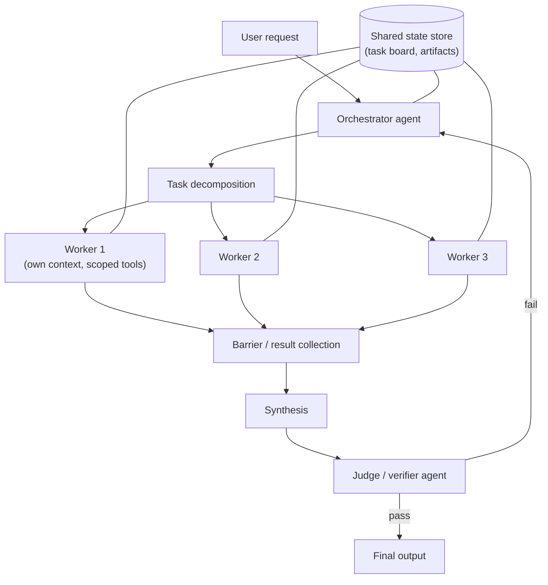

# Multi-Agent Orchestration

Last reviewed: 2026-09-21

## Problem

A single agent hits three walls as tasks grow: the context window fills with intermediate results, one model call cannot pursue independent lines of work in parallel, and one agent checking its own work inherits its own blind spots.

Multi-agent systems address these by splitting work across multiple model instances with separate contexts. The cost is real: coordination overhead, multiplied token spend, new failure modes between agents, and debugging that spans multiple transcripts. Most systems described as "multi-agent" in the wild would be faster, cheaper, and more reliable as a single agent with good tools. This page covers the coordination topologies that do pay for themselves, and how to decide.

## When To Use

Use multiple agents when:

- The task decomposes into subtasks that are genuinely independent and can run in parallel, such as researching five topics or reviewing twenty files
- Intermediate work would blow the context budget of a single agent, and a worker can compress its findings into a short report
- You need role separation for integrity: the agent that writes code should not be the only agent that judges the code
- Subtasks need different models, tools, or permissions, such as a cheap model for triage and an expensive one for synthesis
- Failure isolation matters: one worker crashing or hallucinating should not take down the whole task

A single agent is strictly better when:

- Subtasks depend on each other's full context, because handoffs between agents lose information at every boundary
- The task is sequential anyway, so parallelism buys nothing and coordination still costs
- Latency is dominated by one long critical path that splitting cannot shorten
- The workflow is fixed and known in advance; a deterministic pipeline of plain LLM calls beats agents negotiating with each other
- You have not yet exhausted single-agent improvements: better tools, better prompts, longer context, subtask checklists

The honest default is one agent. Add agents when you can name the specific wall you hit.

## Architecture



Common topologies, from most to least common in production:

- Orchestrator-worker: a lead agent decomposes the task, spawns workers with scoped briefs, and synthesizes their reports
- Pipeline with barriers: fixed stages where all of stage N must finish before stage N+1 starts
- Judge panel: several independent agents evaluate the same artifact and their verdicts are aggregated
- Adversarial pair: a generator and a critic in a bounded loop
- Shared-state swarm: peers coordinate through a common task board rather than through a leader; the hardest to control and rarely worth it

## Data Flow

Orchestrator-worker, the workhorse topology:

1. The orchestrator receives the task and writes a decomposition: subtask briefs with scope, expected output format, and budget.
2. Workers launch in parallel, each with a fresh context containing only its brief and its tools, not the full conversation.
3. Each worker runs its loop, writes large artifacts to shared storage, and returns a compact report.
4. A barrier collects reports. Failed or timed-out workers are retried once or their subtask is marked degraded.
5. The orchestrator synthesizes reports into a candidate output.
6. A verifier agent, with no stake in the drafting, checks the candidate against the original request.
7. On failure, the orchestrator re-dispatches targeted fixes, not the whole job, within a bounded number of rounds.

The critical detail is step 2: workers get briefs, not transcripts. The orchestrator's main skill is writing briefs specific enough that workers do not duplicate or contradict each other. Vague briefs are the top cause of multi-agent waste.

## Core Components

### Orchestrator

Owns decomposition, dispatch, budget allocation, and synthesis. It should be the strongest model in the system, because decomposition errors are multiplied by every worker that executes a bad plan. It should not do object-level work itself; an orchestrator that starts researching mid-dispatch loses track of its workers.

### Workers

Stateless from the system's perspective: brief in, report out. Give each worker only the tools its subtask needs, both to reduce misuse surface and to keep its decisions simple. Workers should return findings, not raw dumps; a worker that pastes twenty pages into its report pushes the compression problem onto the orchestrator, which is the expensive place to solve it.

### Barriers

A barrier is where parallel work rejoins. Design decisions: fixed timeout per worker, whether the barrier waits for all workers or proceeds at quorum, and what a missing report does to synthesis. Quorum barriers keep latency predictable at the cost of completeness; all-or-nothing barriers make one slow worker the tail latency of the whole system.

### Judge Panels

N independent agents score the same artifact against a rubric; aggregation is majority vote, mean score, or veto-on-any-fail depending on the risk profile. Panels reduce single-judge variance and bias, but judges sharing a base model share failure modes, so a panel of three identical models agreeing is weaker evidence than it looks. Diversity of model, prompt, or rubric per judge is what buys real independence.

### Adversarial Verification

A generator produces, a critic attacks: find the bug, break the argument, produce a counterexample. This outperforms "review your own work" because the critic's context contains none of the generator's reasoning and so cannot rationalize it. Bound the loop: two or three rounds captures most of the gain, and beyond that the pair tends to oscillate or converge on mutual agreement rather than correctness. Give the critic a concrete falsification task rather than "review this."

### Shared State

Agents coordinate through artifacts, not chat. A task board (subtask status, owner, result pointer) plus an artifact store (files, reports) is enough. Passing large content through conversation messages between agents burns tokens and mangles formatting; passing references to stored artifacts does not. Concurrent writes need either partitioned ownership (each worker owns its files) or optimistic locking; partitioned ownership is simpler and almost always sufficient.

## Design Decisions

### How Many Agents

Each agent adds a full context of overhead: system prompt, brief, tool definitions. Parallelism pays when subtasks are independent and each is substantial. Ten workers for ten one-paragraph subtasks costs ten system-prompt overheads to save nothing; three workers for three hours of independent research is a clear win. Size workers so the brief plus report overhead is small relative to the work.

### Static Pipeline vs Dynamic Orchestration

If the decomposition is the same for every request, hard-code it as a pipeline and skip the orchestrator model call entirely. Dynamic orchestration earns its cost only when the decomposition genuinely varies per request. Many systems can split the difference: a fixed pipeline whose one variable stage fans out dynamically.

### Homogeneous vs Heterogeneous Models

Cheap models as workers with a strong model as orchestrator and judge is the standard cost structure. It fails when worker quality drops below the threshold where the orchestrator can repair the output; at that point synthesis becomes regeneration and the savings invert. Run the cost comparison at equal end-to-end quality, not equal per-call price.

### Failure Isolation Boundaries

Decide per topology what one agent's failure does. Worker fails: retry once, then degrade the subtask and note the gap in synthesis. Judge fails: drop it from the panel and lower the quorum. Orchestrator fails: the job fails, which is why the orchestrator gets the reliable model and the checkpointed state. Persist the task board so a crashed job resumes from completed subtasks instead of restarting.

### Cost Explosion Control

Multi-agent systems fail financially before they fail functionally. Controls that need to exist before launch:

- Hard token budget per worker, enforced by the harness, not by asking the agent to be frugal
- A cap on recursion depth and on total agents per job, so workers cannot spawn workers unboundedly
- A cap on orchestrator-verifier retry rounds
- A per-job cost ceiling that aborts with partial results rather than running open-ended
- Alerting on cost per job drifting upward, which usually signals briefs getting vaguer or a loop getting longer

A useful planning number from production reports: an orchestrator-worker research job commonly burns 10x to 15x the tokens of a single-agent attempt at the same query. The output must be worth that multiple.

## Failure Modes

- Duplicated work: two workers with overlapping briefs research the same thing, and synthesis presents it as independent confirmation
- Contradiction at the barrier: workers return incompatible findings and the orchestrator averages them instead of resolving them
- Information loss at handoffs: a worker's crucial caveat is dropped from its report, or dropped by synthesis
- Groupthink panels: judges sharing a base model approve the same flawed output unanimously
- Adversarial collapse: the critic starts agreeing with the generator after one round, providing rubber-stamp verification
- Orchestrator drift: on long jobs the orchestrator loses track of the plan and re-dispatches completed subtasks
- Infinite delegation: an agent decides the task is best handled by spawning another agent, recursively
- Deadlock on shared state: two agents each wait for an artifact the other was supposed to produce
- Cost blowout with a plausible-looking output masking that most spend produced nothing used in the answer

## Evaluation Strategy

Evaluate three layers:

- Decomposition quality: given a task, are the orchestrator's briefs complete, disjoint, and correctly scoped? This can be judged directly against a rubric, without running workers, which makes it a cheap and high-leverage eval.
- Worker quality: eval each worker role in isolation with fixed briefs and golden expected findings, exactly as you would eval a single agent.
- End-to-end: task success, but always paired with a single-agent baseline on the same eval set. The multi-agent system must beat the single agent on quality by enough to justify its cost multiple, and this comparison should be re-run when models improve, because a model upgrade often erases the gap and the honest response is to delete agents.

Also eval the failure paths: kill a worker mid-job in a test harness and check the system degrades as designed rather than hanging or fabricating the missing subtask.

## Observability

- One trace per job with spans per agent, so the whole tree is visible in one view; correlate by job ID across every agent's logs
- Per-agent token usage, cost, latency, and tool calls, rolled up to cost per job
- The decomposition itself, logged verbatim, because most bad outcomes trace back to a bad brief
- Barrier events: which workers finished, timed out, or were retried
- Judge scores individually, not just the aggregate, so groupthink is visible
- Retry-round counts, as the leading indicator of loop pathology

The single most useful artifact for debugging is the task board history: what was dispatched, when, to whom, and what came back.

## Cost And Latency

Cost is roughly linear in agent count times per-agent context size, and the per-agent fixed overhead (system prompt, tool schemas, brief) is paid on every call of every agent loop iteration. Prompt caching on the shared prefix (system prompt and tool definitions) substantially cuts the fixed overhead and should be considered mandatory for worker fleets.

Latency: parallel fan-out shortens wall-clock time when subtasks are independent, often dramatically. The sequential parts, decomposition, synthesis, and verification, become the new critical path, and verification rounds add a full synthesis-judge cycle each. A quorum barrier and a hard worker timeout are the two levers that keep p95 predictable.

Budget rule of thumb: model the job as fixed overhead plus per-worker cost, then compare against the single-agent cost at equal quality. If you cannot measure equal quality, you are not ready to justify the topology.

## Security Concerns

- Compromise propagation: a worker that ingests a prompt injection can carry it into its report, and the orchestrator then treats attacker text as a trusted finding. Reports from workers that touched untrusted content should be handled as data, and synthesis prompts should delimit them accordingly.
- Privilege aggregation: no single agent needs write access to production, but if the orchestrator relays worker requests, the system as a whole may act with the union of all permissions. Enforce per-agent tool allowlists at the harness, and make destructive tools require a human gate regardless of which agent asks.
- Confused-deputy handoffs: a low-privilege agent asks a high-privilege agent to do something it could not do itself. Authorization checks must apply to the action, not to the requesting agent's message.
- Shared-state tampering: any agent that can write the task board can mark subtasks complete or alter briefs; scope write access by ownership.
- Audit: every action should be attributable to a specific agent, brief, and job, or incident response becomes archaeology across transcripts.

## Implementation Sketch

```text
run_job(task, budget):
  plan = orchestrator.decompose(task)          # briefs: scope, output schema, token cap
  board = state.create(job_id, plan)

  results = parallel_map(plan.subtasks, worker_run,
                         timeout=WORKER_TIMEOUT, retries=1,
                         quorum=plan.quorum)   # barrier

  for round in range(MAX_ROUNDS):
    draft = orchestrator.synthesize(task, results)
    verdict = verifier.check(task, draft)      # fresh context, no draft reasoning
    if verdict.pass:
      return draft
    fixes = orchestrator.plan_fixes(verdict.issues)
    results.update(parallel_map(fixes, worker_run, ...))

  return draft.with_warning(verdict.issues)    # bounded, never open loop

worker_run(brief):
  agent = spawn(model=brief.model, tools=allowlist(brief.role),
                max_tokens=brief.token_cap)
  artifacts = agent.execute(brief)             # large outputs go to artifact store
  return compact_report(artifacts)             # findings + pointers, not dumps
```

## Further Reading

- [Anthropic: How we built our multi-agent research system](https://www.anthropic.com/engineering/built-multi-agent-research-system)
- [Anthropic: Building effective agents](https://www.anthropic.com/engineering/building-effective-agents)
- [AutoGen: Enabling Next-Gen LLM Applications via Multi-Agent Conversation](https://arxiv.org/abs/2308.08155)
- [Judging LLM-as-a-Judge with MT-Bench and Chatbot Arena](https://arxiv.org/abs/2306.05685)
- [More Agents Is All You Need](https://arxiv.org/abs/2402.05120)
