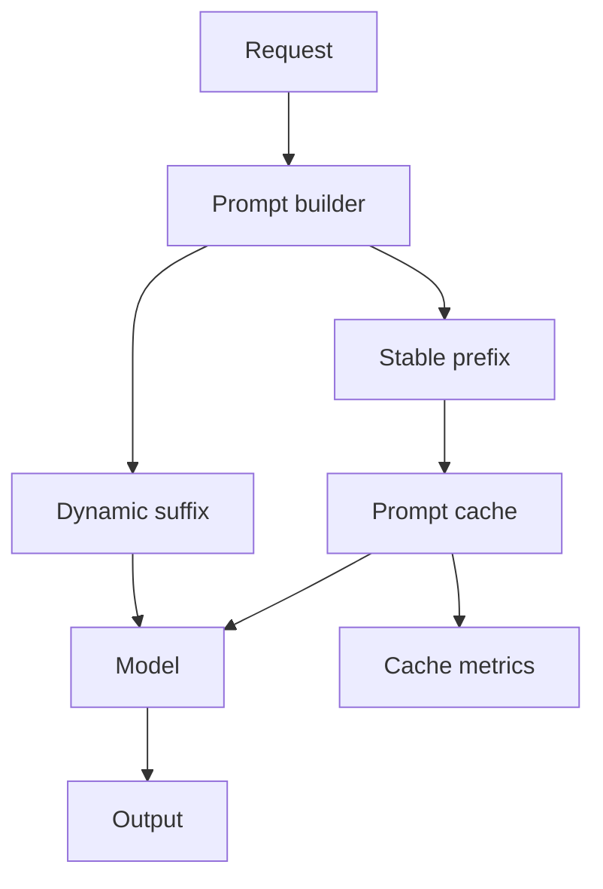

# Prompt Caching

Last reviewed: 2026-06-29

## Problem

Large repeated prompt prefixes increase cost and latency. Prompt caching can reduce both when requests share stable instructions, tool definitions, schemas, or long context prefixes.

Caching is useful, but it is not a substitute for context design.

## When To Use

Use prompt caching when:

- Requests share long stable prefixes
- System instructions and tool definitions are large
- Same document context is reused
- Latency and token cost matter
- Provider or inference stack supports caching

Avoid relying on it when:

- Prompts change frequently
- Context is highly user-specific
- Sensitive data cache policy is unclear
- You cannot observe cache hit rates or cost impact

## Architecture

## Design Decisions

### Stable Prefix Design

Put stable content first:

- System instructions
- Tool definitions
- Output schemas
- Long reusable context

Keep volatile user-specific content later.

### Cache Safety

Understand provider retention and isolation semantics before using caching for sensitive context.

### Measure Actual Hit Rate

Prompt caching only helps if prefixes repeat. Measure hit rate, latency, and cost before depending on it.

## Failure Modes

- Prompt changes break cache hit rate
- Dynamic content appears before stable prefix
- Sensitive content is cached without review
- Teams over-expand context because caching exists
- Cache metrics are unavailable

## Evaluation Strategy

Measure:

- Cache hit rate
- Latency reduction
- Cost reduction
- Quality impact
- Sensitive-data policy compliance

## Further Reading

- [OpenAI prompt caching](https://developers.openai.com/api/docs/guides/prompt-caching)
- [Cost And Latency Budgeting](./cost-latency-budgeting.md)
