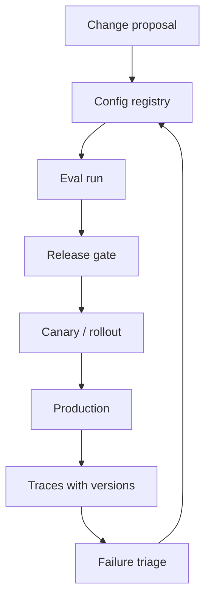

# Prompt And Model Versioning

Last reviewed: 2026-06-29

## Problem

AI system behavior changes when prompts, models, retrieval settings, tool descriptions, safety rules, or eval datasets change. Without versioning, teams cannot explain regressions or reproduce failures.

Prompt and model versioning makes AI behavior reviewable, testable, and rollback-friendly.

## When To Use

Use this pattern for every production AI feature.

It is required when:

- Prompts change frequently
- Multiple models or providers are used
- Evals gate releases
- Outputs affect users or workflows
- Incidents need reproduction

## Architecture

## What To Version

- Prompt text
- System and developer instructions
- Few-shot examples
- Model name and version
- Tool schemas and descriptions
- Retrieval config
- Reranker config
- Safety policy
- Structured output schema
- Eval dataset
- Scorer versions

## Design Decisions

### Config As Code

Store behavior-critical config in reviewable files or a registry with audit logs. Avoid silent dashboard-only changes for high-risk systems.

### Canary Before Full Rollout

Roll out prompt/model changes gradually. Compare quality, latency, cost, refusal rate, and user feedback.

### Rollback Criteria

Define rollback triggers before rollout:

- Eval score drop
- Safety failure
- Citation support regression
- Cost spike
- Latency regression
- User complaint spike

## Failure Modes

- Prompt hotfix breaks hidden use case
- Model alias changes behavior unexpectedly
- Eval dataset version is missing
- Traces do not record prompt version
- Fallback model uses incompatible schema
- Tool description change alters agent behavior
- Rollback restores prompt but not retrieval config

## Evaluation Strategy

Before release:

- Run smoke evals
- Run full regression evals for high-risk changes
- Compare against baseline
- Inspect changed failure examples
- Test fallback route

After release:

- Monitor canary slices
- Watch quality and safety signals
- Promote only after stable behavior

## Observability

Every trace should include:

- Prompt version
- Model version
- Retrieval config version
- Tool registry version
- Schema version
- Policy version
- Eval dataset version, if connected

## Further Reading

- [Evaluation Pipeline Pattern](./eval-pipeline.md)
- [AI Incident Response](./ai-incident-response.md)
