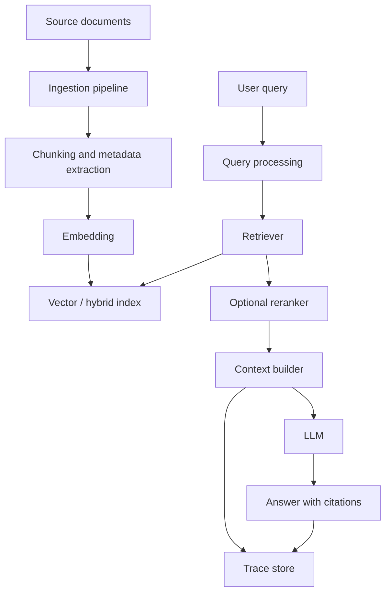

# RAG System Design

Last reviewed: 2026-05-11

## Problem

Language models do not automatically know private, fresh, or domain-specific information. Retrieval-augmented generation, or RAG, connects a model to external knowledge at request time.

RAG is useful when the system must answer from a changing knowledge base, cite sources, respect access control, or avoid putting all knowledge into model weights.

## When To Use

Use RAG when:

- Answers depend on private or frequently updated documents
- The product needs citations or evidence
- Data access must follow user permissions
- Fine-tuning would be too slow, expensive, or hard to update
- The task is knowledge lookup, synthesis, or grounded Q&A

Avoid basic RAG when:

- The task needs procedural skill more than knowledge
- The source data is small enough to fit directly in context
- The query needs exact transactional data from a database
- The documents are low quality or not authoritative
- The system cannot tolerate retrieval latency

## Architecture



## Data Flow

1. Ingest source documents.
2. Split documents into chunks.
3. Attach metadata such as source, owner, timestamp, permissions, and section path.
4. Generate embeddings.
5. Store chunks in a vector, keyword, or hybrid search index.
6. Process user query.
7. Retrieve candidate chunks.
8. Optionally rerank candidates.
9. Build model context.
10. Generate answer with citations.
11. Store trace, scores, and feedback.

## Core Components

### Ingestion

Ingestion should preserve document identity, hierarchy, and freshness. A RAG system that loses section titles, timestamps, owners, or permissions is hard to operate safely.

### Chunking

Chunking controls what the model can see. Bad chunking can split evidence away from its meaning or create large chunks that waste context.

Common strategies:

- Fixed-size chunks
- Semantic chunks
- Heading-aware chunks
- Parent-child chunks
- Table-aware chunks
- Code-aware chunks

### Retrieval

Retrieval can use:

- Keyword search
- Vector search
- Hybrid search
- Metadata filtering
- Query rewriting
- Multi-query retrieval

Hybrid retrieval is often a strong default because keyword search handles exact terms while vector search handles semantic similarity.

### Reranking

Reranking is useful when first-stage retrieval has high recall but weak ordering. It adds latency and cost, so it should be justified by eval improvement.

### Context Builder

The context builder decides which chunks enter the prompt, in what order, and with what citation metadata. It should enforce token limits and avoid mixing documents the user is not allowed to access.

## Design Decisions

### Vector Search vs Hybrid Search

Vector search is strong for semantic similarity. Keyword search is strong for exact names, IDs, error codes, and rare terms. Hybrid search is usually better for enterprise documents where exact terms matter.

### Chunk Size

Small chunks improve precision but can lose context. Large chunks preserve context but waste tokens and can bury the answer. Tune chunking with retrieval evals rather than intuition.

### Reranker Or No Reranker

Add a reranker when:

- Recall is acceptable but top results are poorly ordered
- The answer depends on subtle relevance
- The domain has many similar documents

Skip it when:

- Latency budget is tight
- First-stage retrieval is already strong
- The answer can be found through structured lookup

### Citations

Citations should point to source chunks used by the answer. Do not display citations that were retrieved but not actually used.

## Failure Modes

- Irrelevant chunks produce confident wrong answers
- Relevant chunks are retrieved but pushed out by token limits
- Chunking separates claims from definitions or tables
- Metadata filters are missing, causing access-control leaks
- Stale embeddings point to outdated content
- The model ignores retrieved evidence and answers from prior knowledge
- Citations are attached to unsupported claims
- Query rewriting changes user intent
- Reranking optimizes semantic similarity but misses factual support

## Evaluation Strategy

Evaluate RAG in layers.

### Retrieval Evals

Measure:

- Did retrieval return the required source?
- Was the required source in top K?
- Was the source ranked high enough to enter context?
- Did metadata filters enforce access rules?

### Generation Evals

Measure:

- Answer correctness
- Faithfulness to retrieved sources
- Citation support
- Refusal when evidence is missing
- Format correctness

### End-To-End Evals

Use representative questions from real users. Include impossible questions where the correct behavior is to say the answer is not in the knowledge base.

## Observability

Log:

- Query text
- Query rewrite, if used
- Retrieval method
- Retrieved chunk IDs, scores, and metadata
- Reranker scores
- Context sent to the model
- Model output
- Citations
- User feedback
- Latency and token usage by stage

Store enough information to reproduce failures without exposing sensitive data unnecessarily.

## Cost And Latency

RAG latency usually comes from:

- Embedding the query
- Search
- Reranking
- Model generation
- Long context windows

Control cost by limiting retrieved chunks, compressing context, caching common retrieval results, and using smaller models for query rewriting or classification.

## Security Concerns

RAG introduces indirect prompt injection: malicious instructions can appear inside retrieved documents. The system should treat retrieved content as untrusted data, not as instructions.

Security requirements:

- Enforce document-level and chunk-level permissions before retrieval or before context assembly
- Separate instructions from retrieved content
- Filter or label untrusted content
- Prevent retrieved content from overriding system policy
- Avoid logging sensitive documents into broad-access tracing systems

## Implementation Sketch

```text
ingest(document):
  sections = parse_with_structure(document)
  chunks = chunk_by_heading_and_size(sections)
  for chunk in chunks:
    metadata = {
      source_id,
      section_path,
      owner,
      permissions,
      updated_at
    }
    embedding = embed(chunk.text)
    index.upsert(chunk.id, embedding, chunk.text, metadata)

answer(user, query):
  filters = permissions_for(user)
  candidates = hybrid_search(query, filters, top_k=50)
  ranked = rerank(query, candidates, top_k=8)
  context = build_context(ranked)
  response = model.generate(system_prompt, query, context)
  trace(query, ranked, context, response)
  return response
```

## Further Reading

- [Google Cloud RAG reference architectures](https://docs.cloud.google.com/architecture/rag-reference-architectures)
- [OpenAI evaluation best practices](https://platform.openai.com/docs/guides/evaluation-best-practices)
- [LlamaIndex RAG documentation](https://docs.llamaindex.ai/en/stable/understanding/rag/)
- [ARES: Automated Evaluation Framework for Retrieval-Augmented Generation Systems](https://arxiv.org/abs/2311.09476)
