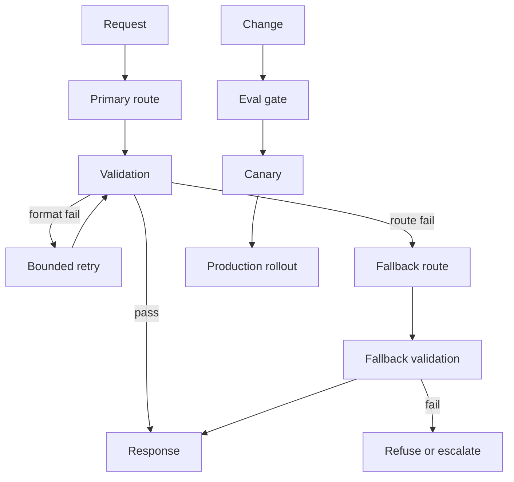

# Retries, Fallbacks, And Release Gates

Last reviewed: 2026-06-29

## Problem

AI systems fail because providers time out, outputs fail validation, tools break, retrieval misses, and new model versions regress behavior.

Retries, fallbacks, and release gates make failures explicit and controlled.

## When To Use

Use this pattern when:

- The feature is user-facing
- Output must follow a schema
- Multiple providers or models are available
- Releases change prompt, model, retrieval, or tool config
- Safety failures are costly

## Architecture

## Retry Strategy

Retry only when:

- Failure is transient
- Retry is safe
- There is a bounded retry count
- The retry path is observable

Do not retry unsafe tool writes without idempotency.

## Fallback Strategy

Fallbacks can use:

- Same model, simpler prompt
- Different model
- Different provider
- Cached answer
- Human escalation
- Safe refusal

Fallbacks need their own evals because they may not behave like the primary route.

## Release Gates

Gate releases on:

- Eval score thresholds
- Safety checks
- Structured output pass rate
- Citation support
- Latency and cost budgets
- Canary monitoring

## Failure Modes

- Retry loop hides systematic prompt failure
- Fallback model breaks schema
- Cached answer is stale
- Release gate ignores safety cases
- Canary traffic is not representative
- Human escalation lacks context
- Rollback does not restore all config versions

## Evaluation Strategy

Test:

- Provider timeout
- Invalid structured output
- Retrieval empty result
- Tool failure
- Safety failure
- Fallback route behavior
- Rollback path

## Observability

Log:

- Retry count
- Retry reason
- Fallback reason
- Route selected
- Gate result
- Canary cohort
- Rollback trigger

## Further Reading

- [Prompt And Model Versioning](./prompt-model-versioning.md)
- [Model Routing](./model-routing.md)
