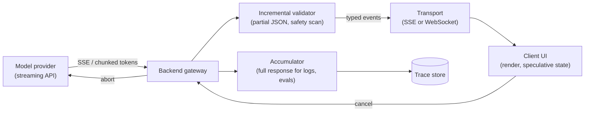

# Streaming And Partial Results

Last reviewed: 2026-09-21

## Problem

A model that takes 20 seconds to produce a full answer can show its first words in under a second. Whether users experience that request as fast or broken is almost entirely a delivery-architecture decision, not a model decision.

Streaming moves tokens from the model to the user as they are generated instead of waiting for completion. That single change touches every layer: the provider connection, your backend, the transport to the client, the UI, and, less obviously, your retry logic, your output validation, your safety filtering, and your billing accounting. Each of those was simpler when responses were atomic. This page covers what breaks when responses stop being atomic, and how to design for it.

## When To Use

Stream when:

- A human is watching the response render, which covers chat, copilots, and most assistants
- Responses regularly take more than 2 to 3 seconds to complete
- Users benefit from acting on early content, such as reading the first paragraph while the rest arrives
- You need cancellation, because users abandon long generations and you want to stop paying for them

Do not stream when:

- The consumer is another program that needs the complete, validated output before it can act, such as a pipeline stage or a batch job
- The output must pass validation or safety checks that can only run on the whole artifact, and showing content that might be retracted is unacceptable
- The response is short enough that streaming machinery costs more than it saves; a 40-token classification gains nothing
- The path involves intermediaries that buffer anyway, such as certain proxies or serverless platforms with response buffering, unless you fix the path first

Tool-using agents are a middle case: stream the assistant's prose to the user, but treat tool calls and their arguments as atomic units that execute only when complete.

## Architecture



The backend gateway is deliberately in the middle. Proxying the provider stream through your backend, rather than connecting clients to the provider, is what lets you accumulate the full response for logging, run incremental validation, inject your own event types, enforce auth, and cut the provider connection on cancel.

## Data Flow

1. Client opens a streaming connection to the backend and sends the request.
2. Backend calls the provider with streaming enabled and receives token deltas.
3. Each delta is appended to an accumulator, passed through incremental validators, and forwarded to the client as a typed event.
4. The client renders deltas immediately and updates any structured UI from the partial parse.
5. On completion, the backend receives the final event with stop reason and usage, persists the full response, and sends a terminal event to the client.
6. On cancel, the client signals the backend, the backend aborts the provider request, and the accumulated partial is persisted with a cancelled marker.
7. On mid-stream failure, the backend sends an error event carrying enough state for the client to retry or resume.

The terminal event in step 5 is not optional decoration. A stream that just stops is indistinguishable from a network failure; clients need an explicit done event with the stop reason to know the difference between finished, truncated by max tokens, halted by a safety filter, and dropped.

## Core Components

### Provider Stream Consumption

Providers deliver deltas over server-sent events. The consumer must handle: content deltas, tool-call argument deltas (which arrive as JSON fragments), the stop reason, usage totals that arrive only at the end, and heartbeat or ping events during long thinking pauses. Treat unknown event types as skippable rather than fatal; providers add event types over time.

### Transport To The Client

SSE is the default: one-directional, works over plain HTTP, survives proxies and load balancers better, reconnects natively via the `Last-Event-ID` mechanism, and is exactly shaped like the problem, server pushing tokens. WebSockets earn their extra operational complexity only when the client also streams upstream continuously, such as voice input, or when many concurrent streams share one connection. A common trap with both: buffering middleware. Nginx proxy buffering, some CDN defaults, and gzip on small chunks will batch your stream into one lump; flush explicitly and disable buffering on the streaming route.

Send typed events, not raw text: `delta`, `tool_call`, `citation`, `error`, `done`. A typed envelope costs a few bytes per event and makes every later feature, structured UI, mid-stream errors, resumption, possible without breaking clients.

### Structured Streaming And Partial JSON

When the model emits JSON, the client holds an unparseable prefix almost the entire time. Options, in increasing order of engineering effort:

- Wait for completion, no structured streaming; fine when the JSON is small
- Best-effort partial parsing: a repairing parser closes open strings, arrays, and objects to yield a usable prefix tree after every delta; the UI renders fields as they complete
- Schema-aware streaming: the backend parses incrementally and emits semantic events like `item_added` or `field_completed`, so clients never touch raw JSON

The design rule that keeps partial JSON sane: order the schema so fields stream in display order, and put large free-text fields last. A schema with `title` before `sections` before `summary` gives the UI something to show immediately; the same fields in reverse order stream nothing useful until nearly done. Never act on a partial value, only render it; a half-streamed `"amount": 1200` may be about to become `12000`.

### Speculative UI

The UI can commit to structure before content arrives: render the message bubble on submit, show skeletons for sections the schema promises, optimistically display the user action as done while the stream confirms it. This is standard optimistic-UI practice with one LLM-specific caveat: speculation must be cheaply reversible, because models renege. If the model was expected to produce three sections and stops after one, or a safety filter replaces the output, the UI must collapse the skeletons without leaving wreckage. Speculate on layout, not on content.

### Cancellation

Cancellation is a first-class feature, not an edge case; in chat products a significant share of long generations are abandoned. Requirements:

- The client can cancel via a visible stop control, and navigation or tab close triggers the same path
- The backend propagates the abort to the provider immediately, which stops token billing at most providers from that point
- The partial response is persisted and marked cancelled, both for the transcript (the user saw those tokens; the conversation history must include them or the next turn confuses the model) and for analytics
- Server-side deadlines exist independently of the client, so a wedged client cannot hold a generation open forever

The transcript point is subtle and important: if the user cancelled after two paragraphs and then replies, the model must see those two paragraphs as its own prior turn, truncation marker included, or its next answer will be incoherent with what the user read.

### Retry Semantics Mid-Stream

A failure after zero delivered tokens is a normal retry. A failure after 500 delivered tokens is not, because the user has read those tokens. Choices:

- Retry-and-replace: silently restart generation and overwrite the rendered partial. Simple, but the text visibly changes under the user, and the second generation will not match the first
- Retry-and-continue: re-prompt with the partial as an assistant prefix and ask the model to continue. Seamless when it works; risks a visible seam in style or a repeated half-sentence, so trim to the last complete sentence boundary before continuing
- Surface-and-offer: mark the response as interrupted and let the user tap retry. Honest, lowest complexity, and the right default for most products

Whatever the choice, retries must be idempotent on the write path: the trace store should end up with one canonical response per request ID, not one per attempt. Side effects are the hard constraint: if the stream drove tool executions, replaying the stream must not replay the tools, which is another reason tool calls execute only on complete arguments and are keyed by a deduplication ID.

## Design Decisions

### Perceived Latency vs Real Latency

Streaming does not reduce total generation time; it can slightly increase it. What it changes is the two numbers users actually feel: time to first token, and whether tokens arrive faster than reading speed, roughly 4 to 8 words per second. Once TTFT is low and throughput exceeds reading speed, further real-latency work is invisible to a reading user, and effort should move to TTFT: prompt caching to cut prefill, shorter system prompts, faster models for the first visible section, or an immediate acknowledgment event before the model responds. For machine consumers the opposite holds: only total latency matters, and streaming buys nothing.

### Where Validation Runs

Atomic responses validate once at the end. Streams choose per check: safety scanning incrementally on a sliding window (accepting that a violation may render briefly before retraction, or buffering N tokens to scan ahead of display), schema validation incrementally via the partial parser, and business rules usually only at completion. Decide explicitly which checks are allowed to retract already-rendered content and what the retraction UX is; a paragraph that vanishes needs a visible explanation.

### Backend Proxy vs Direct-To-Provider

Direct client connections to the provider shave one hop of TTFT and remove your backend from the streaming path, but forfeit server-side accumulation, cancellation control, response logging, and key secrecy. The proxy costs perhaps 10 to 50 ms and is the right call for nearly everyone; the direct path is defensible only for internal tools where the trace and auth story is handled elsewhere.

### Resumability

If a mobile client drops for two seconds, should it replay the whole response or resume at token 512? Resumability requires the backend to buffer the stream keyed by request ID and support offset reads, which SSE's `Last-Event-ID` maps onto naturally. It is real engineering; do it when mobile networks are a core audience, skip it when a clean retry is acceptable.

## Failure Modes

- Buffering middleware turns the stream into a single lump and nobody notices until a user on a slow generation reports a hang
- The stream dies without a terminal event and the UI spins forever; every path must end in `done` or `error`
- Partial JSON is acted on, not just rendered, and a truncated number or enum value drives a wrong action
- Cancelled partials are dropped from conversation history and the model's next turn contradicts text the user already read
- Retry-and-continue repeats or contradicts the delivered prefix at the seam
- Usage accounting reads the final-event totals only, so cancelled and failed streams record zero cost while the provider bills for generated tokens
- Safety filtering runs only at completion, and disallowed content streams to the screen for the full generation before being retracted
- Slow consumers without backpressure balloon backend memory, one buffered stream per stuck client
- Heartbeats are missing, so long tool calls or thinking pauses trip idle-connection timeouts in proxies

## Evaluation Strategy

Streaming correctness is mostly harness-testable without a model:

- Replay recorded provider streams through the pipeline and assert the accumulated result equals the concatenated deltas, byte for byte
- Fault injection: kill the provider stream at token N, at a JSON midpoint, and during a tool-call delta; assert the client receives a well-formed error event and the trace store holds a consistent record
- Partial-parser property tests: every prefix of every valid output must parse to a prefix-consistent tree, never throw
- Cancellation tests: cancel at various offsets, assert provider abort was issued, partial persisted, transcript coherent

Model-facing evals: retry-and-continue quality (does the continuation read as one response, judged by rubric), and TTFT plus inter-token latency distributions tracked as eval metrics across model and prompt versions, since a prompt change that doubles prefill shows up here first.

## Observability

Per stream, log: request ID, TTFT, inter-token latency percentiles, total duration, token counts including for cancelled streams, terminal state (done, cancelled, error, filtered), stop reason, and retry lineage linking attempts to the canonical response.

Monitor in aggregate: TTFT p50/p95, cancellation rate (a rising cancel rate is a quality or latency signal, users stop responses that start badly), mid-stream error rate, and stream duration versus token count outliers, which reveal stalls. Alert on terminal-event absence: streams that opened and never closed are the silent failure class.

## Cost And Latency

Streaming itself adds negligible token cost; the provider bill is the same tokens. The savings come from cancellation: aborting generations at the provider stops the meter, and in chat workloads with meaningful abandonment this is a real line item, easily 5 to 15 percent of output tokens.

Infrastructure cost shifts shape: many long-lived open connections instead of short request-response cycles. This punishes per-request serverless pricing and connection-capped proxies; a streaming-heavy product wants connection-oriented infrastructure sized on concurrent open streams, not requests per second. Memory per open stream is the accumulator plus buffers; cap accumulator size and stream durations so worst cases are bounded.

TTFT budget: prefill dominates, so long system prompts and large tool schemas are paid before the first visible token. Prompt caching is the single biggest TTFT lever on repeat traffic.

## Security Concerns

- The stream endpoint is long-lived and authenticated once at open; tokens that expire mid-stream should not kill an in-flight response, but reconnects must re-authenticate
- Direct-to-provider streaming from browsers exposes API keys or requires short-lived scoped tokens; the backend proxy avoids the issue
- Incremental safety scanning is weaker than whole-response scanning: an injection or policy violation can be split across deltas so no single window trips the filter. Run the whole-response check at completion as well, and treat the incremental scan as a latency optimization, not the enforcement point
- Cancelled and failed partials land in the trace store like any response; they contain the same sensitive content and need the same access controls and retention rules
- Cross-user stream isolation: request IDs and resumption offsets are capability handles; guessing another user's request ID must not replay their stream

## Implementation Sketch

```text
handle_stream(request):
  req_id = idempotency_key(request)
  provider = llm.stream(request.prompt, abort=request.abort_signal)
  acc = Accumulator()
  parser = PartialJsonParser(request.schema) if request.structured else None

  send(client, event="start", id=req_id)
  for delta in provider:
    acc.append(delta)
    if parser:
      tree = parser.feed(delta)             # never throws on prefixes
      send(client, event="state", data=tree.completed_fields())
    else:
      send(client, event="delta", data=delta.text)
    if safety.scan_window(acc.tail()) == VIOLATION:
      provider.abort()
      send(client, event="retract", reason="policy")
      break
    if client.cancelled:
      provider.abort()
      persist(req_id, acc.text, state="cancelled")   # stays in transcript
      send(client, event="done", state="cancelled")
      return

  final = provider.final()                  # stop_reason, usage
  safety.scan_full(acc.text)                # enforcement point
  persist(req_id, acc.text, final.usage, state=final.stop_reason)
  send(client, event="done", state=final.stop_reason)

on_provider_error(err, acc):
  persist(req_id, acc.text, state="error", attempt=n)
  send(client, event="error", delivered_tokens=acc.count, retryable=err.retryable)
  # client chooses: retry-and-continue from last sentence boundary, or surface
```

## Further Reading

- [Anthropic API: Streaming Messages](https://docs.anthropic.com/en/docs/build-with-claude/streaming)
- [OpenAI API: Streaming responses](https://platform.openai.com/docs/guides/streaming-responses)
- [MDN: Server-sent events](https://developer.mozilla.org/en-US/docs/Web/API/Server-sent_events)
- [MDN: The WebSocket API](https://developer.mozilla.org/en-US/docs/Web/API/WebSockets_API)
