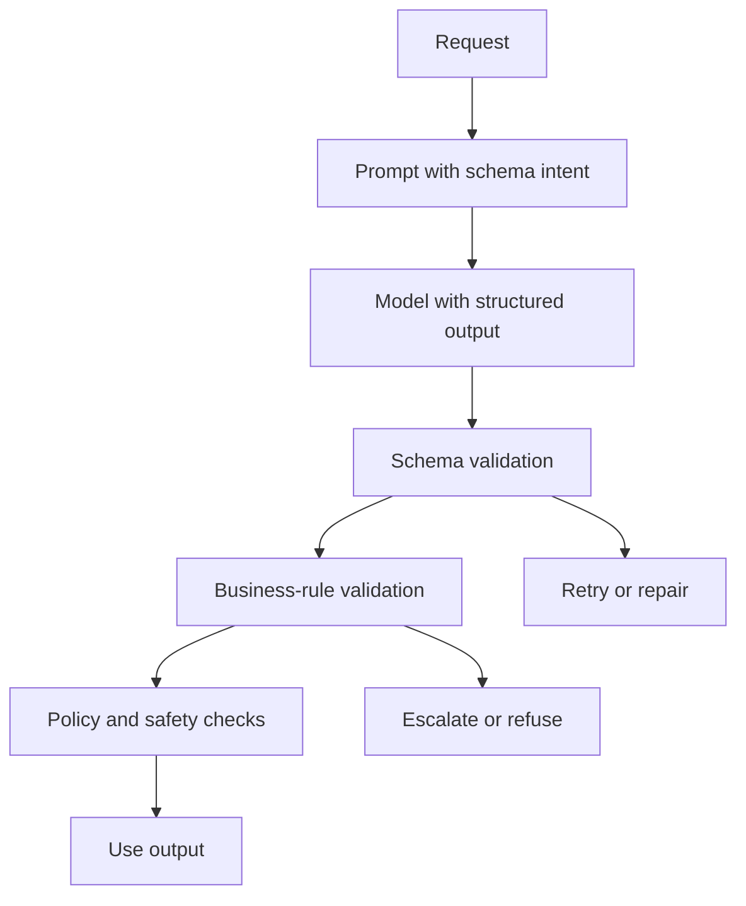

# Structured Outputs And Validation

Last reviewed: 2026-06-29

## Problem

AI output often needs to be consumed by software. Free-form text is fragile when downstream systems expect fields, enums, citations, tool arguments, or decisions.

Structured outputs reduce parsing risk, but they do not remove the need for business validation.

## When To Use

Use structured outputs when:

- Output drives product logic
- A workflow needs typed fields
- Tool arguments are generated by a model
- The response must follow a schema
- You need reliable eval scoring
- Human review requires consistent fields

## Architecture

## Validation Layers

### Schema Validation

Checks:

- Required fields
- Types
- Enums
- Object shape
- Array limits

### Business Validation

Checks:

- User owns referenced resource
- Amount is within allowed threshold
- Date range is valid
- Citation IDs exist
- Tool arguments are allowed

### Policy Validation

Checks:

- No restricted data
- No disallowed action
- Refusal required for unsupported request
- Human approval required

## Design Decisions

### JSON Mode vs Schema-Constrained Output

JSON mode can help produce valid JSON. Schema-constrained output is stronger because it attempts to enforce the specific schema. Still validate output in application code.

### Retry vs Refuse

Retry when the failure is format-related and safe. Refuse or escalate when the failure is semantic, policy-related, or safety-related.

### Strict vs Flexible Schemas

Strict schemas reduce ambiguity but can make the model fail on edge cases. Flexible schemas are easier to generate but harder to trust.

## Failure Modes

- Output passes schema but violates business policy
- Model fills required fields with fabricated values
- Enum choice is valid but wrong
- Citation IDs are valid but unsupported
- Retry loops increase cost
- Downstream code trusts model-generated IDs
- Schema changes are not versioned

## Evaluation Strategy

Measure:

- Schema pass rate
- Business validation pass rate
- Retry rate
- Refusal correctness
- Field-level accuracy
- Downstream task success
- Human correction rate

## Observability

Log:

- Schema version
- Validation failures
- Retry count
- Repair path
- Final structured output
- Downstream action
- Human edits

## Security Concerns

Structured output is not trusted output. Validate authorization and side-effect policy outside the model.

## Further Reading

- [OpenAI structured outputs](https://developers.openai.com/api/docs/guides/structured-outputs)
- [Anthropic structured outputs](https://platform.claude.com/docs/en/build-with-claude/structured-outputs)
- [Structured Output Validator Lab](../labs/structured-output-validator/README.md)
