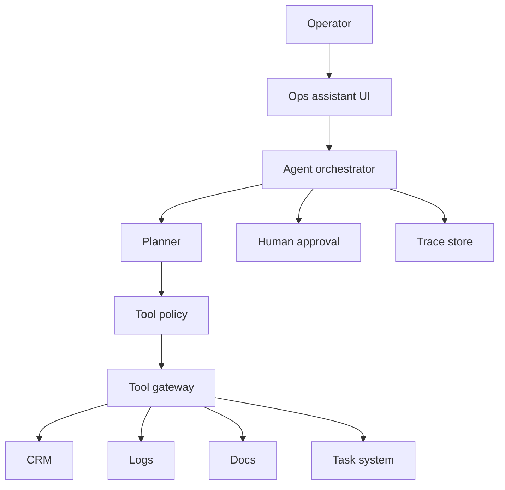

# Reference Architecture: Agentic Operations Assistant

Last reviewed: 2026-06-29

## Use Case

An internal assistant investigates customer or operational issues by reading systems, summarizing state, proposing actions, and creating tasks after approval.

## Architecture

## Key Decisions

- Start with a workflow for common investigations.
- Use agentic behavior only for open-ended diagnosis.
- Make tools least-privilege and typed.
- Require approval for writes.
- Set max steps, max cost, and max wall-clock time.

## Required Evals

- Tool selection
- Tool argument correctness
- Stop behavior
- Approval routing
- Error recovery
- Final summary quality
- Sensitive-data handling

## Failure Modes

- Agent loops through tools
- Wrong account is inspected
- Tool output is misinterpreted
- Write action executes without approval
- Trace cannot be replayed safely

## Related

- [Agent Tool-Use System Design](../patterns/agent-tool-use.md)
- [MCP And Tool Gateway Pattern](../patterns/mcp-tool-gateway.md)
- [Tool Policy Simulator Lab](../labs/tool-policy-simulator/README.md)
