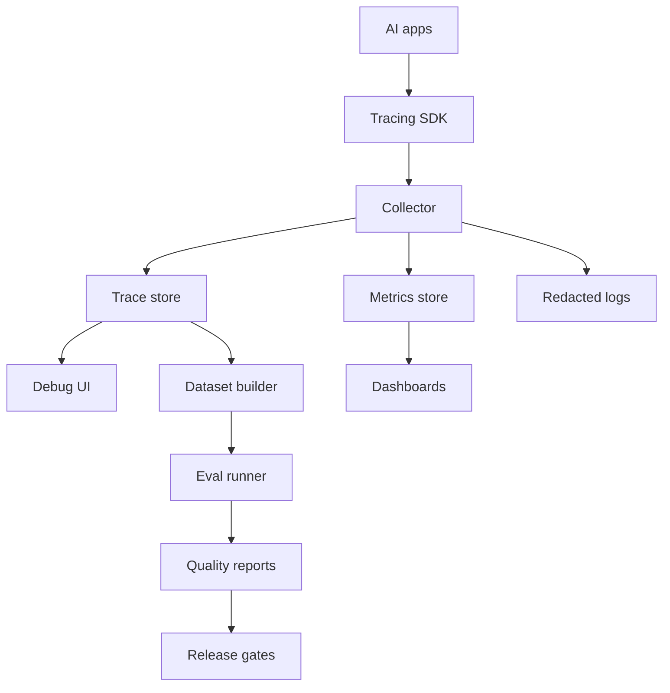

# Reference Architecture: AI Observability Stack

Last reviewed: 2026-06-29

## Use Case

A platform team needs to trace, evaluate, debug, and monitor AI features across multiple products.

## Architecture

## Trace Fields

- Request ID
- User or tenant scope
- Prompt version
- Model version
- Retrieval config
- Retrieved chunk IDs and scores
- Tool calls and results
- Validation results
- Output
- Token usage
- Latency by stage
- Feedback and review labels

## Key Decisions

- Store sensitive raw traces separately from broad-access metadata.
- Build eval datasets from reviewed production failures.
- Track cost per successful task.
- Use standard telemetry fields where possible, including OpenTelemetry GenAI conventions.

## Failure Modes

- Trace data leaks sensitive information
- Teams cannot reproduce failures
- Eval datasets drift away from production traffic
- Dashboards hide tail latency
- Cost is tracked per call but not per outcome

## Related

- [AI Observability](../patterns/ai-observability.md)
- [Evaluation Pipeline Pattern](../patterns/eval-pipeline.md)
- [OpenTelemetry GenAI semantic conventions](https://github.com/open-telemetry/semantic-conventions/tree/main/docs/gen-ai)
