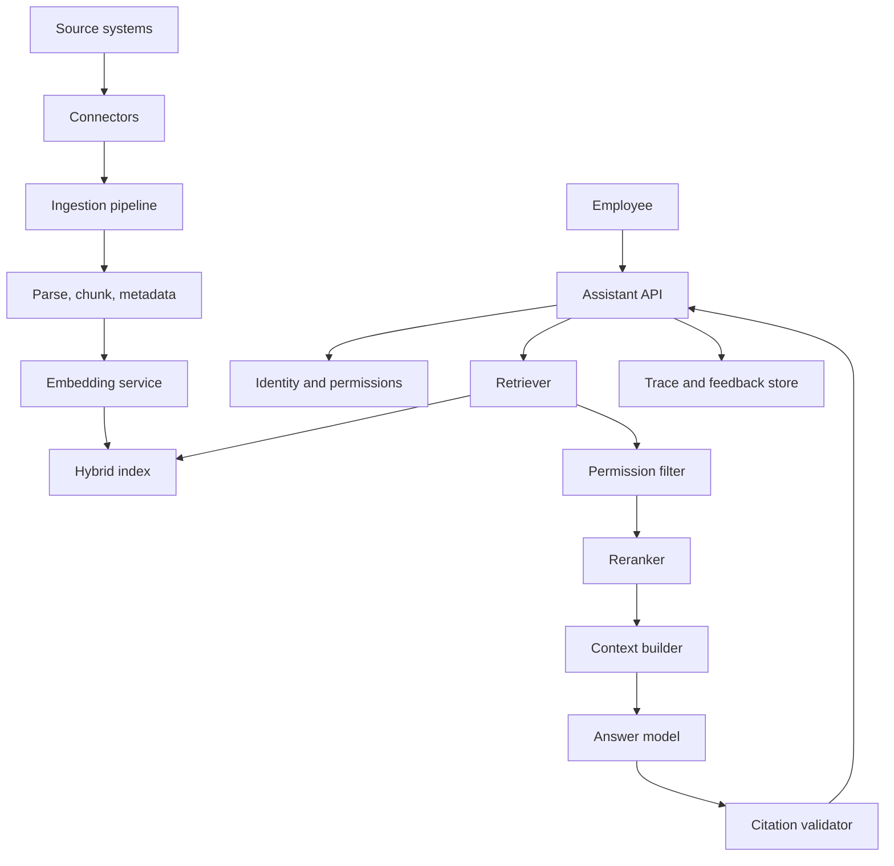

# Reference Architecture: Enterprise RAG Assistant

Last reviewed: 2026-06-29

## Use Case

An internal assistant answers employee questions from company documents while enforcing permissions and citing sources.

## Architecture

## Key Decisions

- Use RAG, not fine-tuning, for document knowledge.
- Use hybrid search for exact and semantic retrieval.
- Enforce permissions before context assembly.
- Add reranking after retrieval evals prove the need.
- Require citation support for factual claims.

## Required Evals

- Retrieval recall@K
- Permission-filter correctness
- Citation support
- Refusal on missing evidence
- Prompt injection resistance
- Freshness and deletion behavior

## Operational Concerns

- Connector failures
- Index freshness
- Document deletion
- Source conflicts
- Sensitive trace access
- Tenant isolation

## Related

- [RAG System Design](../patterns/rag.md)
- [Hybrid RAG And Reranking](../patterns/hybrid-rag-reranking.md)
- [Design Enterprise RAG](../assignments/design-enterprise-rag.md)
