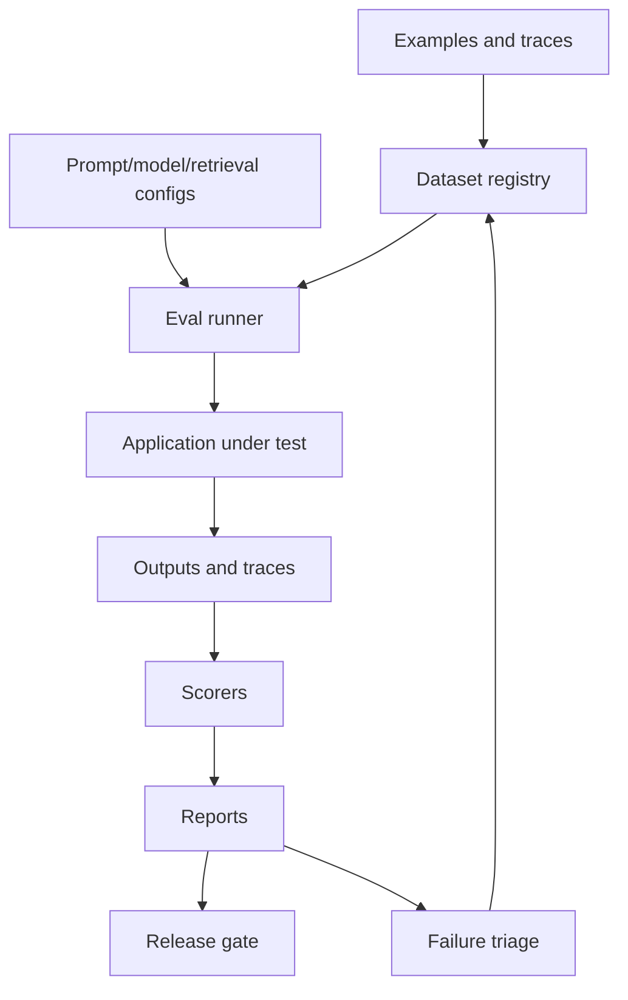

# Reference Architecture: Evaluation Platform

Last reviewed: 2026-06-29

## Use Case

Multiple AI product teams need a shared way to run offline evals, compare prompt/model changes, review failures, and gate releases.

## Architecture

## Core Components

- Dataset registry
- Config registry
- Eval runner
- Scorer library
- Human review UI
- Report dashboard
- Release gate integration
- Failure triage workflow

## Scorer Types

- Schema validation
- Exact match
- Rule checks
- Retrieval relevance
- Citation support
- LLM-as-judge
- Human review
- Safety and security checks

## Key Decisions

- Pin model, prompt, retrieval, and dataset versions.
- Keep smoke evals cheap and full evals scheduled.
- Separate high-risk blocking evals from informational metrics.
- Add production failures back into regression sets.

## Related

- [Evaluation Pipeline Pattern](../patterns/eval-pipeline.md)
- [Eval Set Runner Lab](../labs/eval-set-runner/README.md)
