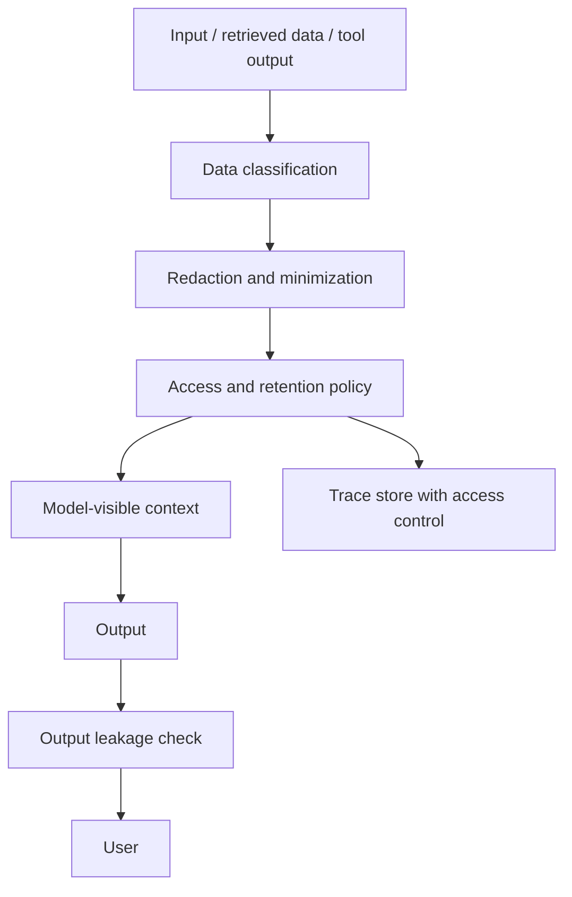

# Sensitive Data Leakage

Last reviewed: 2026-06-29

## Problem

AI systems can leak sensitive data through prompts, retrieved context, logs, model outputs, tool calls, fine-tuning datasets, eval datasets, or memory.

Data leakage is not one bug class. It is a system design failure across data flow, access control, observability, and retention.

## Leakage Paths

Common paths:

- User input includes secrets
- Retrieved documents include restricted information
- Tool outputs expose private records
- Prompt traces store raw sensitive context
- Model output reveals data from another tenant
- Fine-tuning data contains personal or proprietary examples
- Eval datasets are built from unredacted production traces
- Memory stores sensitive user information without policy

## Architecture Controls

## Design Principles

### Minimize Model-Visible Data

Only send data needed for the task. Do not put full records into context when fields or summaries are enough.

### Enforce Permissions Before Context Assembly

The model should never receive data the user is not allowed to see.

### Separate Trace Access From App Access

Engineers debugging the system should not automatically gain access to all user data.

### Treat Evals As Sensitive

Eval sets built from production failures often contain real user inputs and private documents. They need redaction, retention limits, and access controls.

## Failure Modes

- Cross-tenant retrieval leak
- Prompt traces expose customer data
- Support reviewer sees data outside their role
- Model summarizes restricted content into a public answer
- Logs store API keys or passwords
- Fine-tune memorizes sensitive examples
- Exported eval dataset contains real personal data

## Evaluation Strategy

Build leakage evals:

- User asks for another user's data
- Retrieved document contains restricted content
- Tool returns secret fields
- Prompt includes API key-like strings
- Output should redact private identifiers

Score:

- Was restricted data kept out of context?
- Did output filter catch sensitive fields?
- Did trace redaction work?
- Were access-denied cases handled cleanly?

## Observability

Log:

- Data classification labels
- Redaction decisions
- Permission checks
- Output filter results
- Trace access events
- Policy violations

Do not log the sensitive value just to prove it was sensitive.

## Further Reading

- [OWASP Top 10 for LLM Applications](https://owasp.org/www-project-top-10-for-large-language-model-applications/)
- [NIST AI Risk Management Framework](https://www.nist.gov/itl/ai-risk-management-framework)
