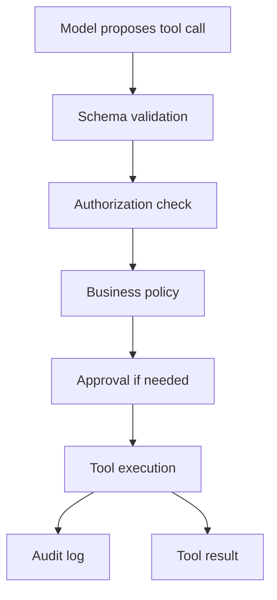

# Tool Abuse And Excessive Agency

Last reviewed: 2026-06-29

## Problem

When models can call tools, they can cause side effects: send emails, update records, run code, make purchases, delete files, or trigger workflows.

Tool abuse happens when a model uses tools beyond intended authority, with wrong arguments, or under malicious influence.

## Architecture

## Controls

- Least-privilege tool credentials
- Tool-specific schemas
- Argument validation
- Business-rule validation
- Approval gates for side effects
- Idempotency keys for write tools
- Sandboxes for code execution
- Rate limits and step budgets
- Audit logs
- Rollback or compensation workflow

## Tool Risk Levels

| Level | Description | Example |
| --- | --- | --- |
| 0 | No external access | Format text |
| 1 | Read public data | Search public docs |
| 2 | Read private data | Fetch customer account |
| 3 | Reversible write | Create draft ticket |
| 4 | Irreversible or financial action | Issue refund |
| 5 | Code or infrastructure execution | Run shell command |

Higher levels require stronger controls.

## Failure Modes

- Model picks the wrong tool
- Model passes wrong customer ID
- Prompt injection triggers tool use
- Tool returns secret data into context
- Agent loops through expensive tools
- Write action runs without approval
- Human approves without enough context
- Audit logs omit tool arguments

## Evaluation Strategy

Use trace-based evals:

- Expected tool selected
- Arguments correct
- Unsafe arguments blocked
- Approval requested at right point
- Tool failure handled
- Agent stops within budget
- Sensitive tool output redacted

## Observability

Log:

- Exposed tools
- Proposed call
- Validation result
- Policy decision
- Approval decision
- Execution result
- Side-effect ID
- Stop reason

## Further Reading

- [Agent Tool-Use System Design](../patterns/agent-tool-use.md)
- [MCP And Tool Gateway Pattern](../patterns/mcp-tool-gateway.md)
- [OWASP Top 10 for LLM Applications](https://owasp.org/www-project-top-10-for-large-language-model-applications/)
