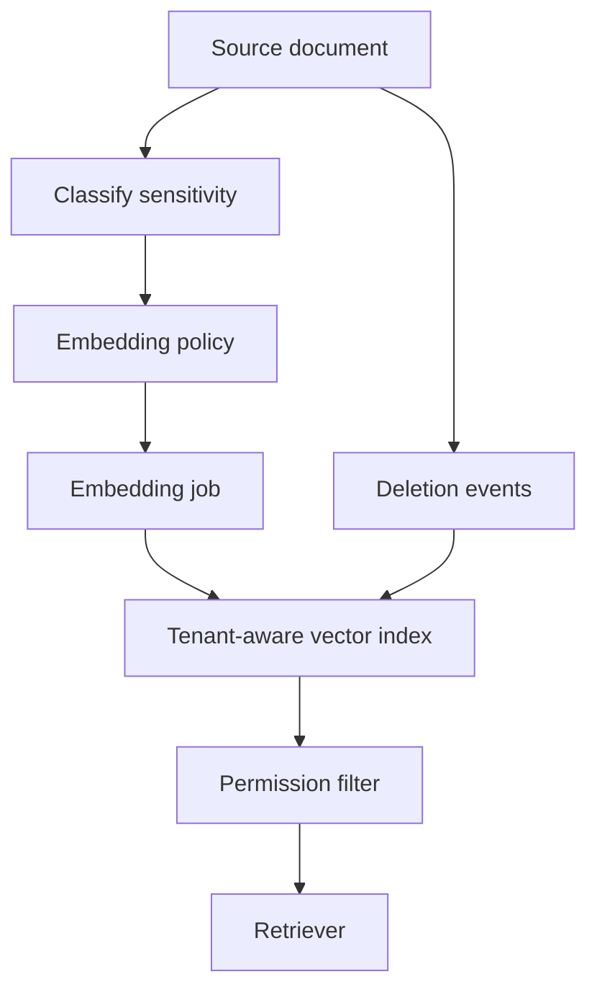

# Vector And Embedding Weaknesses

Last reviewed: 2026-06-29

## Problem

Vector indexes and embeddings introduce security and reliability risks that normal search systems may not expose in the same way.

Risks include data leakage, stale vectors, poisoning, weak deletion, cross-tenant retrieval, and semantic retrieval of unsafe content.

## Risk Areas

- Embedding sensitive text with unapproved providers
- Storing embeddings without tenant isolation
- Failing to delete vectors when source documents are deleted
- Poisoned documents influencing retrieval
- Cross-tenant nearest-neighbor leakage
- Metadata filters applied after unsafe retrieval steps
- Treating semantic similarity as factual support

## Architecture Controls

## Design Principles

### Preserve Source Identity

Every vector should map back to a source document, chunk, tenant, permission policy, and version.

### Treat Embeddings As Derived Sensitive Data

Embeddings may leak information or enable inference. Protect them according to the sensitivity of the source content.

### Build Deletion Paths

If the source document is deleted, its chunks and embeddings must be removed or invalidated.

### Filter Early

Apply tenant and permission filters before any model-visible context is built.

## Failure Modes

- Deleted document remains retrievable
- Embeddings from one tenant appear in another tenant's results
- Poisoned document ranks highly
- Source metadata is lost during ingestion
- Vector index backup outlives data retention policy
- Reranker sees restricted chunks

## Evaluation Strategy

Test:

- Tenant isolation
- Document deletion
- Permission filtering
- Poisoned document retrieval
- Stale document exclusion
- Source ID traceability

## Observability

Log:

- Source ID
- Chunk ID
- Embedding model version
- Index version
- Tenant ID
- Permission metadata
- Deletion status
- Retrieval filter decisions

## Further Reading

- [RAG System Design](../patterns/rag.md)
- [Hybrid RAG And Reranking](../patterns/hybrid-rag-reranking.md)
- [OWASP Top 10 for LLM Applications](https://owasp.org/www-project-top-10-for-large-language-model-applications/)
