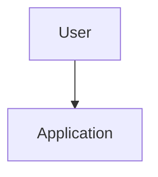

# Capstone Template

## System

Name the system you are designing.

## Problem

What problem does it solve?

## Users

Who uses it?

## Requirements

- Requirement 1
- Requirement 2
- Requirement 3

## Non-Goals

- Non-goal 1
- Non-goal 2

## Architecture

## Data Flow

1. Step one
2. Step two
3. Step three

## Model Strategy

Explain:

- Model choice
- Routing
- Fallbacks
- Structured output
- Versioning

## Retrieval Strategy

Explain:

- Sources
- Ingestion
- Chunking
- Indexing
- Retrieval
- Reranking
- Citations
- Freshness
- Permissions

## Tool Strategy

Explain:

- Tool registry
- Read tools
- Write tools
- Validation
- Approval
- Audit logs

## Evaluation Plan

Explain:

- Datasets
- Metrics
- Scorers
- Human review
- Regression tests
- Release gates

## Observability Plan

Explain:

- Traces
- Metrics
- Feedback
- Redaction
- Dashboards
- Alerting

## Security Review

Explain:

- Threat model
- Prompt injection controls
- Data leakage controls
- Tool safety controls
- Access control

## Cost And Latency Budget

| Step | Target latency | Cost driver |
| --- | ---: | --- |
| Example | 100 ms | Example |

## Rollout Plan

1. Internal test
2. Shadow mode
3. Limited beta
4. Gradual rollout
5. Full launch

## Failure Modes

- Failure mode 1
- Failure mode 2
- Failure mode 3

## Open Questions

- Question 1
- Question 2
