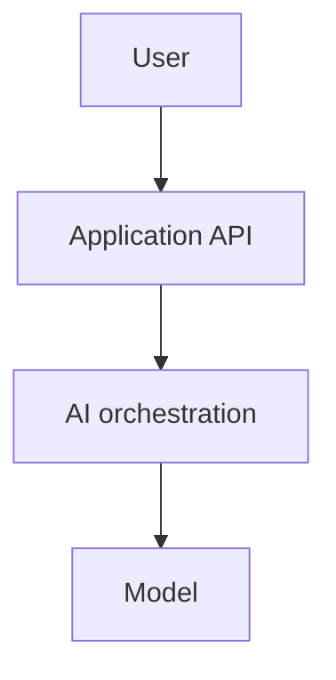

# Design Doc Template

## Problem

What user or business problem are we solving?

## Goals

- Goal 1
- Goal 2
- Goal 3

## Non-Goals

- Non-goal 1
- Non-goal 2

## Users And Constraints

Who uses this system, and what constraints matter?

Consider:

- Latency
- Cost
- Privacy
- Safety
- Scale
- Freshness
- Accuracy
- Auditability

## Architecture

## Data Flow

1. Step one
2. Step two
3. Step three

## Core Components

### Component 1

Responsibility:

Failure modes:

Observability:

### Component 2

Responsibility:

Failure modes:

Observability:

## Design Decisions

| Decision | Choice | Why | Alternative rejected |
| --- | --- | --- | --- |
| Example | Example | Example | Example |

## Evaluation Plan

Include:

- Offline evals
- Online evals
- Regression tests
- Human review
- Safety evals
- Release gates

## Observability Plan

Trace:

- Input
- Prompt or message version
- Retrieved context
- Tool calls
- Model output
- Scores
- User feedback
- Token usage
- Latency by stage

## Security Review

Cover:

- Authentication
- Authorization
- Data exposure
- Prompt injection
- Tool safety
- Logging and retention
- Human approval

## Cost And Latency Budget

| Step | Target latency | Cost driver |
| --- | ---: | --- |
| Example | 100 ms | Example |

## Rollout Plan

1. Internal testing
2. Shadow mode
3. Limited beta
4. Gradual rollout
5. Full release

## Open Questions

- Question 1
- Question 2

## Incident Response

What would trigger rollback, feature disablement, human review, or incident response?
